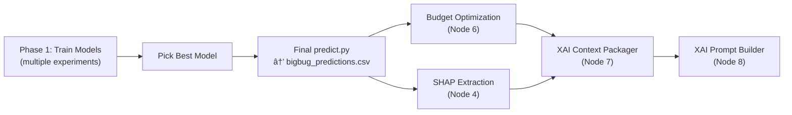
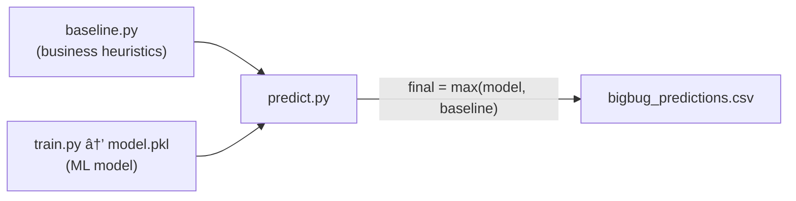

# Training Stage — Q&A

---

## Q1: How to prevent `bigbug_predictions.csv` from being overwritten across runs?

**Problem:** Currently [predict.py L164](file:///c:/Users/sithu/My%20Works/My%20Softwares/Competitions/DataStorm3_ML_DS/BigBugDataStorm/modelling/predict.py#L164) writes to a single file:

```python
output_path = os.path.join(OUTPUTS_DIR, f"{team_name}_predictions.csv")
```

Every `predict.py` run overwrites the same file. If run #7 out of 10 is the best, you've already lost it.

**Solution: Per-run predictions inside timestamped folders.**

The run tracking system (Q2 below) will save everything inside `modelling/artifacts/runs/{run_id}/`. Each run folder will contain:

```
modelling/artifacts/runs/
├── run_20260531_0100_catboost_strategyA/
│   ├── model.pkl
│   ├── predictions.csv              ← per-run copy
│   ├── cv_results.json
│   ├── feature_importance.png
│   └── run_config.json              ← exact params + features used
├── run_20260531_0200_xgboost_strategyA/
│   ├── ...
└── run_20260531_0330_catboost_strategyC/
    ├── ...
```

**Workflow when you've decided run #7 is the best:**

1. Look at `run_registry.csv` → find the `run_id` for the best run.
2. Run `predict.py --run-id run_20260531_XXXX` → it loads that specific `model.pkl` and writes the **final** `outputs/bigbug_predictions.csv`.
3. That final file is the only one that gets submitted.

> [!IMPORTANT]
> The final `outputs/bigbug_predictions.csv` is only written **once**, at the very end, after you've chosen your winner. During experimentation, each run saves its own `predictions.csv` inside its run folder.

---

## Q2: How to maintain a report of each run?

**Solution: `run_registry.csv` + per-run artifacts.**

### A. `run_registry.csv` — Master Experiment Log

Location: `modelling/artifacts/run_registry.csv`

Every time `train.py` runs, it **appends** one row:

| Column              | Example                                |
| ------------------- | -------------------------------------- |
| `run_id`            | `run_20260531_0100_catboost_strategyA` |
| `timestamp`         | `2026-05-31 01:00:12`                  |
| `algorithm`         | `catboost`                             |
| `strategy`          | `strategyA_no_leaks`                   |
| `cv_rmse_mean`      | `52.14`                                |
| `cv_rmse_std`       | `3.21`                                 |
| `cv_mae_mean`       | `28.67`                                |
| `cv_mae_std`        | `1.45`                                 |
| `n_features`        | `27`                                   |
| `n_train_samples`   | `19120`                                |
| `excluded_features` | `hist_p90,hist_max,jan_avg,...`        |
| `notes`             | `First run with gravity features`      |
| `gpu`               | `True`                                 |
| `duration_s`        | `12.3`                                 |

### B. Per-run folder — Detailed artifacts

Each `modelling/artifacts/runs/{run_id}/` folder contains:

- **`model.pkl`** — the trained model (loadable by `predict.py`)
- **`predictions.csv`** — predictions from this specific model
- **`cv_results.json`** — fold-by-fold RMSE/MAE
- **`feature_importance.png`** — top-30 feature importance chart
- **`run_config.json`** — full snapshot of parameters, feature list, excluded features, target formula

### C. How this works in practice

```
# Run experiment 1 (CatBoost, Strategy A)
python modelling/train.py --strategy strategyA --notes "Baseline with gravity"

# Run experiment 2 (XGBoost, Strategy A)
python modelling/train.py --algorithm xgboost --strategy strategyA

# Run experiment 3 (CatBoost, Strategy C with interaction features)
python modelling/train.py --strategy strategyC --notes "Added gravity×cooler interaction"

# Compare all runs
python -c "import pandas as pd; print(pd.read_csv('modelling/artifacts/run_registry.csv').sort_values('cv_rmse_mean'))"

# Pick the winner and generate final submission
python modelling/predict.py --run-id run_20260531_0330_catboost_strategyC
```

---

## Q3: Are Budget Optimization & XAI independent from model training?

**Yes, absolutely.** They are fully decoupled. Here's the dependency chain:



**Budget Optimization** only needs:

- `master_features.parquet` (already exists ✅)
- `bigbug_predictions.csv` (the **final** one from the chosen model)
- `sales_features.parquet` (already exists ✅)

**SHAP Extraction** only needs:

- The **final chosen** `model.pkl`
- `master_features.parquet`

> [!TIP]
> **Recommended workflow:**
>
> 1. Finish ALL model experiments first (Phase 1)
> 2. Pick the best run from `run_registry.csv`
> 3. Generate the final `bigbug_predictions.csv` with that model
> 4. Run SHAP extraction on that model → `shap_values.parquet`
> 5. Then proceed to Budget Optimization → XAI Pipeline
>
> This is exactly what the [pipeline_notes.md](file:///c:/Users/sithu/My%20Works/My%20Softwares/Competitions/DataStorm3_ML_DS/BigBugDataStorm/docs/pipeline_notes.md) Phases 1→2→3 layout intends.

---

## Q4: GPU Setup — Is there anything to configure?

### ✅ Your GPU is already fully set up. No additional work needed.

I verified this directly on your machine:

| Check              | Result                                                  |
| ------------------ | ------------------------------------------------------- |
| GPU detected       | **NVIDIA GeForce RTX 5070** (Blackwell)                 |
| Driver             | **591.91** (well above the 450.80 minimum)              |
| CUDA               | **13.1**                                                |
| VRAM               | **8 GB** (more than enough for 20K rows)                |
| CatBoost installed | **v1.2.10** (in your `venv`)                            |
| GPU init test      | **Passed** (`task_type="GPU"` initialised successfully) |

### What changes in `train.py`

Just one line — add `task_type="GPU"` to the CatBoost params. This can be done in `config.yaml`:

```yaml
modelling:
  catboost_params:
    iterations: 1289
    learning_rate: 0.0283
    depth: 5
    task_type: "GPU" # ← ADD THIS
    devices: "0" # ← ADD THIS (selects GPU 0)
    # ... rest unchanged
```

Or in code: the `cb_params` dict loaded from config will already include it.

> [!NOTE]
> **Expect slightly different results** from CPU training. GPU uses different floating-point arithmetic, so RMSE may differ by ±0.01-0.1 from your Colab runs. This is normal and expected.

> [!WARNING]
> CatBoost GPU does **not** support `Ordered` boosting mode. It will automatically fall back to `Plain` boosting on GPU. This may give slightly different (sometimes better) results vs CPU.

---

## Q5: Do we need to change the target variable for Round 2?

### Target Formula — No Change

I re-verified against the spec files. The target formula in [SPEC_train.md L40-44](file:///c:/Users/sithu/My%20Works/My%20Softwares/Competitions/DataStorm3_ML_DS/BigBugDataStorm/specs/modelling/SPEC_train.md#L40-L44) is:

```
pseudo_target = hist_p90_monthly × seasonality_multiplier_jan_2026 × (jan_2026_trading_days / 22.0)
```

This is **unchanged from Round 1**. The gravity features are **NOT** used in the target formula — they are only used in two other places:

1. **Training features** — fed into CatBoost as input columns (per [GRAVITY_MODEL.md L209-232](file:///c:/Users/sithu/My%20Works/My%20Softwares/Competitions/DataStorm3_ML_DS/BigBugDataStorm/specs/gold/GRAVITY_MODEL.md#L209-L232)). This means the model *learns from* gravity scores, but they don't define the target value it's trying to predict.

2. **Baseline safety floor (POI uplift factor)** — this needs a quick explanation:

### What is the Baseline and why do we need it?

The **baseline** is a completely separate prediction script ([baseline.py](file:///c:/Users/sithu/My%20Works/My%20Softwares/Competitions/DataStorm3_ML_DS/BigBugDataStorm/modelling/baseline.py)) that estimates each outlet's potential using **pure business heuristics** — no ML involved. It uses January-specific historical sales, recency momentum, seasonality, and a POI uplift factor.

**Where it sits in the pipeline:**



In [predict.py L101-103](file:///c:/Users/sithu/My%20Works/My%20Softwares/Competitions/DataStorm3_ML_DS/BigBugDataStorm/modelling/predict.py#L101-L103), the final prediction for every outlet is:
```python
df["Maximum_Monthly_Liters"] = df[["model_prediction", "baseline_potential_litres"]].max(axis=1)
```

**Why?** The ML model might predict a low value for an outlet that historically sells 500 litres/month in January. The baseline catches that and says "this outlet's floor is at least 500 based on its actual January history." The `max()` ensures we never submit a prediction below what real data tells us is possible.

**How gravity enters the baseline:** The baseline's POI uplift factor ([SPEC_baseline.md L169-186](file:///c:/Users/sithu/My%20Works/My%20Softwares/Competitions/DataStorm3_ML_DS/BigBugDataStorm/specs/modelling/SPEC_baseline.md#L169-L186)) gives a small boost (up to 1.25×) to outlets in high-traffic areas. This uses `composite_gravity_score` to say "an outlet near a bus terminal + school has more *potential* customers than its past sales suggest." But this only affects the **safety floor** — it has absolutely nothing to do with the training target formula.

### What Actually Changes: Feature Exclusions (Strategy A)

The real change is **removing features that leak the target**. Here's the exact diff between the current [train.py EXCLUDE_COLS (L63-80)](file:///c:/Users/sithu/My%20Works/My%20Softwares/Competitions/DataStorm3_ML_DS/BigBugDataStorm/modelling/train.py#L63-L80) and the [SPEC_train.md EXCLUDE_COLS (L87-111)](file:///c:/Users/sithu/My%20Works/My%20Softwares/Competitions/DataStorm3_ML_DS/BigBugDataStorm/specs/modelling/SPEC_train.md#L87-L111):

| Feature             | Round 1 (current code)     | Round 2 (spec) | Change                                               |
| ------------------- | -------------------------- | -------------- | ---------------------------------------------------- |
| `hist_p90_monthly`  | ❌ **Included as feature** | ✅ Excluded    | **NEW exclusion** — directly used in target formula! |
| `hist_max_monthly`  | ❌ **Included as feature** | ✅ Excluded    | **NEW exclusion** — highly correlated with target    |
| `jan_avg_volume`    | ❌ **Included as feature** | ✅ Excluded    | **NEW exclusion** — direct January proxy             |
| `ema_3m`            | ❌ **Included as feature** | ✅ Excluded    | **NEW exclusion** — recent sales ≈ near-target       |
| `jan_max_volume`    | ✅ Already excluded        | ✅ Excluded    | No change                                            |
| `hist_p75_monthly`  | ✅ Already excluded        | ✅ Excluded    | No change                                            |
| `hist_mean_monthly` | ✅ Already excluded        | ✅ Excluded    | No change                                            |
| `hist_std_monthly`  | ✅ Already excluded        | ✅ Excluded    | No change                                            |
| `total_volume`      | ✅ Already excluded        | ✅ Excluded    | No change                                            |
| `ema_6m`            | ✅ Already excluded        | ✅ Excluded    | No change                                            |
| `recent_3m_avg`     | ✅ Already excluded        | ✅ Excluded    | No change                                            |

**Summary: 4 features need to be newly added to `EXCLUDE_COLS` for Strategy A:**

```python
# Strategy A: NEW exclusions (add to EXCLUDE_COLS)
"hist_p90_monthly",    # ← directly used in target formula!
"hist_max_monthly",    # ← highly correlated with target
"jan_avg_volume",      # ← direct January proxy
"ema_3m",              # ← recent sales ≈ near-target
```

> [!IMPORTANT]
> The RMSE **will go up** after removing leak features — this is expected and correct. The Round 1 model (RMSE ~40) was essentially memorising `hist_p90_monthly` (which accounted for ~88% of feature importance per the [Colab experiments](file:///c:/Users/sithu/My%20Works/My%20Softwares/Competitions/DataStorm3_ML_DS/BigBugDataStorm/specs/modelling/SPEC_colab_experiments.md#L81)). A model with 55-65 RMSE that actually uses gravity/catchment features is far more valuable for the competition's "explain your predictions" requirement.

### Also: Baseline needs an update

The current [baseline.py L90-106](file:///c:/Users/sithu/My%20Works/My%20Softwares/Competitions/DataStorm3_ML_DS/BigBugDataStorm/modelling/baseline.py#L90-L106) uses `footfall_score` for POI uplift. But the [SPEC_baseline.md L169-186](file:///c:/Users/sithu/My%20Works/My%20Softwares/Competitions/DataStorm3_ML_DS/BigBugDataStorm/specs/modelling/SPEC_baseline.md#L169-L186) now uses `composite_gravity_score`. This should be updated when re-running the baseline:

```diff
- def _compute_poi_uplift(footfall_score: float) -> float:
+ def _compute_poi_uplift(composite_gravity_score: float) -> float:
```

---

