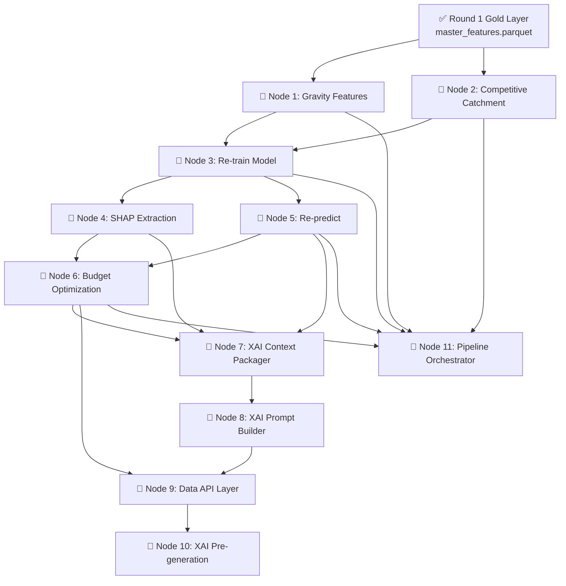

# BigBug Pipeline — Complete Node Map

> Your friend handles the **Web App** (Next.js frontend + API routes). Everything below is **your** scope.

---

## Status Overview

| Layer | Status |
|:------|:-------|
| Bronze → Silver → Gold (Round 1) | ✅ **DONE** |
| Modelling: baseline, train, predict (Round 1) | ✅ **DONE** |
| Gold Extended: Gravity Features | 🔴 **TODO** — Node 1 |
| Gold Extended: Competitive Catchment | 🔴 **TODO** — Node 2 |
| Re-training with gravity + catchment features | 🔴 **TODO** — Node 3 |
| SHAP Value Extraction | 🔴 **TODO** — Node 4 |
| Re-prediction (updated model) | 🔴 **TODO** — Node 5 |
| Budget Optimization (5M LKR) | 🔴 **TODO** — Node 6 |
| XAI Context Packager | 🔴 **TODO** — Node 7 |
| XAI Prompt Builder | 🔴 **TODO** — Node 8 |
| Data API Layer (for Next.js) | 🔴 **TODO** — Node 9 |
| XAI Pre-generation (Western Province) | 🔴 **TODO** — Node 10 |
| Pipeline Orchestrator | 🔴 **TODO** — Node 11 |
| Config.yaml updates | 🔴 **TODO** — woven into each node |

---

## Dependency Graph (implement top-to-bottom)



---

## Node 1 — Gravity Features (Distance-Decay POI Scores)

> **Why:** The problem statement *explicitly* calls out gravity/decay models as the expected upgrade over flat POI counts. This is a high-weight evaluation criterion (30% for Data Engineering).

| | |
|:--|:--|
| **Script** | `pipeline/gold/build_gravity_features.py` `[NEW]` |
| **Spec** | `specs/gold/GRAVITY_MODEL.md` |
| **Reads** | `Data/Gold/poi_raw_cache/` (already exists from Round 1 scraping) + `Data/Silver/outlet_coordinates_clean.parquet` |
| **Writes** | `Data/Gold/gravity_features.parquet` |
| **Also modify** | [build_master_features.py](file:///c:/Users/ADMIN/Desktop/BigBugDataStorm/pipeline/gold/build_master_features.py) — add left-join of gravity features |
| **Config** | Add `gravity_model` block to [config.yaml](file:///c:/Users/ADMIN/Desktop/BigBugDataStorm/config.yaml) |

### 🔬 Q&A: Why inverse-square gravity over Gaussian or exponential decay?

**Short answer:** All three are valid. The spec uses inverse-square, but **I recommend implementing all three and selecting empirically.** Here's the comparison:

| Decay function | Formula | Behaviour | Pros | Cons |
|:---------------|:--------|:----------|:-----|:-----|
| **Inverse square** | `1 / (d + ε)²` | Sharp near-field drop, long tail | No hyperparameter to tune; easy to explain ("just like gravity"); standard in retail (Reilly's Law) | Very aggressive — a POI at 50m vs 200m differs by 16× |
| **Exponential** | `e^(-λ × d)` | Smooth S-curve decay | Tunable via λ; most common in spatial econometrics | Requires calibrating λ — adds one hyperparameter |
| **Gaussian** | `e^(-d² / 2σ²)` | Bell-curve; virtually zero beyond 3σ | Hard cutoff makes physical sense (a school 2km away = zero effect); smooth | Requires calibrating σ — adds one hyperparameter |

**Recommended approach — implement all three, compare with CV:**

```python
# In config.yaml, let the decay function be configurable:
gravity_model:
  decay_function: "inverse_square"  # "inverse_square" | "exponential" | "gaussian"
  decay_epsilon: 0.05       # for inverse_square
  exponential_lambda: 2.0   # for exponential
  gaussian_sigma_km: 0.5    # for gaussian
```

Then in `build_gravity_features.py`:
```python
def decay_weight(dist_km, method, params):
    if method == "inverse_square":
        return 1.0 / (dist_km + params["epsilon"]) ** 2
    elif method == "exponential":
        return math.exp(-params["lambda"] * dist_km)
    elif method == "gaussian":
        return math.exp(-(dist_km ** 2) / (2 * params["sigma"] ** 2))
```

**How to choose the best model:**
1. Build gravity features with all three decay functions
2. For each, re-train CatBoost and record 5-fold CV RMSE
3. Pick the one with the lowest CV RMSE
4. If they're within 0.1 RMSE of each other, pick **inverse-square** because it's easiest to explain to judges ("Reilly's Law of Retail Gravitation, 1931")

> [!TIP]
> For the competition, **inverse-square is the safest choice** — it's the one explicitly named in Reilly's Law, which the judges will recognise. But mentioning in your report that you *tested all three and selected empirically* scores higher than blindly picking one.

### 🔬 Q&A: Why ε = 0.05? How to choose the best parameter?

**ε prevents division by zero** when a POI sits at the exact same GPS coordinate as an outlet (distance ≈ 0 km). Without it: `1/0² = ∞`.

**Why 0.05 specifically?**
- ε = 0.05 km = 50 metres. This means a POI at 0m distance contributes `1/(0.05)² = 400`, while a POI at 50m contributes `1/(0.1)² = 100`. The 50m POI is 4× less influential — a reasonable physical interpretation.
- Too small (e.g., ε = 0.001): a POI at 1m = `1/0.001² = 1,000,000` — one hyper-close POI would dominate everything. Bad.
- Too large (e.g., ε = 0.5): a POI at 0m = `1/0.5² = 4`, at 50m = `1/0.55² = 3.3`. Almost no discrimination between near and far. Defeats the purpose of decay.

**How to tune it:**
- ε between 0.02 and 0.1 km is the sensible range
- You can grid-search: try ε ∈ {0.02, 0.05, 0.1}, build gravity features for each, re-train, compare CV RMSE
- In practice, the model is not very sensitive to ε — the difference between 0.03 and 0.07 is minimal

**Recommendation:** Keep ε = 0.05. It's a standard choice in the literature and your time is better spent on other nodes.

### 🔬 Q&A: Composite weight reasoning — are these made up?

**These weights come from the Round 1 `footfall_score` spec**, not random numbers. They encode a **domain hypothesis about what drives beverage demand at Sri Lankan retail outlets:**

| Category | Weight | Business rationale |
|:---------|:-------|:-------------------|
| Transport (bus stops, train stations) | **3.0** | Highest — commuters are the #1 driver of impulse beverage purchases. A kade near a bus stop sells 3× more than one in a residential lane. |
| Schools/universities | **2.5** | Students + parents = high daily foot traffic, concentrated at predictable times |
| Markets/supermarkets | **2.0** | Co-location with shopping activity drives top-up purchases |
| Hospitals/clinics | **1.5** | Steady visitor flow, but less impulse-purchase behaviour |
| Worship/hospitality | **1.0** | Baseline — contributes to foot traffic but less directly to beverage sales |

**Are these optimal?** No — they're domain-informed starting points. **To find optimal weights:**

1. **After training** with these weights, check SHAP importances. If `transport_gravity_score` has 5× the SHAP importance of `worship_gravity_score`, the 3.0 vs 1.0 weighting was approximately right.
2. **Alternative**: Don't use a composite at all — feed all 6 individual gravity scores as separate features to CatBoost and let the model learn the weights itself. This is actually the better approach for modelling (CatBoost handles feature selection natively), but having a composite score is useful for the web app UI and the budget ROI score.

**Recommendation:** Keep the composite for the UI/budget modules, but also feed all 6 individual scores to CatBoost as separate features. The model will learn which categories matter most.

### What to implement:
1. Load all POI JSON responses from `Data/Gold/poi_raw_cache/`
2. Parse each POI's lat/lon and map it to one of 6 categories: `school`, `hospital`, `transport`, `market`, `worship`, `hospitality`
3. For each of the 19,960 valid-coordinate outlets, compute:
   - Per-category gravity score = `Σ decay_weight(distance_km)` for all POIs in that category within 2km
   - Use `geopy.distance.geodesic` for distance calculation (or BallTree for speed)
4. Compute composite gravity score using weighted sum
5. Min-max normalise the composite to `[0, 100]`
6. Set `gravity_data_available = False` for the 40 zero-coord outlets (all scores = 0)
7. Save as `gravity_features.parquet`
8. **Bonus**: Implement all 3 decay functions, benchmark with CV, document results

### Validation:
- `len(df) == 19960` (or 20000 including zero-coord outlets with 0 scores)
- All gravity scores ≥ 0
- `composite_gravity_score` ∈ [0, 100]
- No NaN values

> [!TIP]
> This is **purely a reprocessing** of the existing POI cache — **zero new API calls** needed. It should take ~15-30 minutes to compute 20K outlets × ~50 POIs each.

---

## Node 2 — Competitive Catchment Density

> **Why:** Section 2.2 of the problem statement explicitly asks for competitive catchment density to estimate how "crowded" each outlet's local market is.

| | |
|:--|:--|
| **Script** | `pipeline/gold/build_catchment_features.py` `[NEW]` |
| **Reads** | `Data/Silver/outlet_coordinates_clean.parquet` |
| **Writes** | `Data/Gold_Extended/catchment_features.parquet` |
| **Also modify** | [build_master_features.py](file:///c:/Users/ADMIN/Desktop/BigBugDataStorm/pipeline/gold/build_master_features.py) — add left-join |

### 🔬 Q&A: Why no decay function for competitive catchment? Reasoning:

**Catchment density measures market saturation, not influence.** The question is fundamentally different from POI gravity:

| | POI Gravity (Node 1) | Competitive Catchment (Node 2) |
|:--|:--|:--|
| **What it measures** | How much foot traffic flows *toward* the outlet | How many competitors *split* that traffic |
| **Physical meaning** | A school 100m away sends students past the outlet | A competing kade 100m away steals half the customers |
| **Decay makes sense?** | ✅ Yes — a school 1km away sends fewer students past the outlet | ❌ Less clear — a competitor 1km away is a competitor regardless of distance |
| **Better approach** | Distance-weighted sum | **Flat count within radius bands** |

**Why flat counts are better for competition:**
- A competitor at 100m and one at 900m (both within 1km) are equally real threats — they both appear on Google Maps, both visible to customers walking by
- Using decay would under-count competitors that are "far but still relevant" (e.g., the next grocery store is 800m away — still very reachable by foot in Sri Lanka)
- The problem statement says "estimate how crowded or isolated a store is" — this is a density/count concept, not a gravity concept

**However, you CAN add a decay-weighted version as a bonus feature:**
```python
# Flat count (primary)
competitors_500m = count_outlets_within(outlet, 0.5)

# Decay-weighted (bonus feature — let CatBoost decide if it's useful)
competition_gravity_500m = sum(1 / (dist + 0.05)**2 for competitor in radius_0.5km)
```

**Recommendation:** Output both flat counts AND a decay-weighted competition score. Feed both to CatBoost. The model will use whichever is more predictive.

### What to implement:
1. For each outlet, count **how many other outlets** exist within 500m, 1km, and 2km (using BallTree with haversine metric for speed)
2. Compute a `competition_density_score` — normalised [0, 100] measuring local market saturation
3. **Optional bonus**: Compute `competition_gravity_score` using inverse-square decay on inter-outlet distances
4. Classify each outlet as `isolated`, `moderate`, or `dense` based on percentile thresholds
5. Output columns: `competitors_500m`, `competitors_1km`, `competitors_2km`, `competition_density_score`, `market_saturation_class`, (optional: `competition_gravity_score`)

> [!IMPORTANT]
> Use `sklearn.neighbors.BallTree` with `haversine` metric. Iterating with geodesic for 20K×20K pairs is infeasible. BallTree does it in seconds.

---

## Node 3 — Re-train CatBoost with Gravity + Catchment Features

> **Why:** The existing model uses 41 flat-count features. Adding 7 gravity scores + catchment features will improve the model and demonstrate the upgraded methodology.

| | |
|:--|:--|
| **Script** | [train.py](file:///c:/Users/ADMIN/Desktop/BigBugDataStorm/modelling/train.py) `[MODIFY]` |
| **Reads** | `Data/Gold/master_features.parquet` (now including gravity + catchment columns) |
| **Writes** | `modelling/artifacts/model.pkl` (overwrites existing), `modelling/artifacts/cv_results.json`, `modelling/artifacts/feature_importance.png` |

### 🔬 Q&A: `composite_gravity_score` vs `transport_gravity_score` — what's the difference?

| Score | Generated by | What it is | How many columns |
|:------|:-------------|:-----------|:-----------------|
| `transport_gravity_score` | **Node 1** | Gravity score for **transport POIs only** (bus stops, train stations). `Σ 1/(d+ε)²` for all transport POIs within 2km. | 1 column (one of 6 per-category scores) |
| `composite_gravity_score` | **Node 1** | **Weighted combination** of all 6 category scores: `3.0×transport + 2.5×school + 2.0×market + 1.5×hospital + 1.0×worship + 1.0×hospitality`, normalised to [0, 100]. | 1 column (the summary metric) |

Both are generated by **Node 1** (`build_gravity_features.py`). The composite is for the UI; the individual scores are for the model.

### 🔬 Q&A: 99% contribution from statistical features, POI features barely matter — how to fix?

This is a **fundamental problem** in your current setup, and it's expected. Here's why and how to fix it:

**Why POI features contributed almost nothing:**

1. **Target leakage via the pseudo-label.** Your target variable is: `hist_p90_monthly × seasonality_multiplier × (trading_days / 22)`. This target is literally *derived from* `hist_p90_monthly`, which is also a training feature. So the model learns: "just predict hist_p90 × a multiplier" and ignores everything else. This is **circular** — the model is essentially memorising the answer.

2. **Scale mismatch.** `hist_p90_monthly` ranges from 0 to ~3000 litres. `schools_500m` ranges from 0 to ~15. Even though CatBoost handles scale internally, when one feature directly constructs the target, others never get a chance.

**How to fix it — three strategies:**

#### Strategy A: Remove target-correlated features from training (RECOMMENDED)

Add more columns to `EXCLUDE_COLS` to force the model to rely on structural/spatial features:

```python
# Remove the "answer key" — features that directly construct the target
ADDITIONAL_EXCLUDES = [
    "hist_p90_monthly",       # this IS the target (times a multiplier)
    "hist_max_monthly",       # nearly identical to p90
    "jan_avg_volume",         # highly correlated with target
    "jan_max_volume",         # highly correlated with target
    "hist_mean_monthly",      # already excluded, but verify
    "total_volume",           # already excluded
]
```

This forces the model to predict potential from *structural drivers* (location, POI density, cooler capacity, outlet type) rather than just echoing back historical stats. **The model will have higher RMSE, but its predictions will be more meaningful** — they'll actually reflect latent potential, not just historical averages.

#### Strategy B: Two-stage modelling

1. **Stage 1**: Train a model on historical stats only → produces `predicted_from_history`
2. **Stage 2**: Train a second model on the *residuals* (gap between target and Stage 1's prediction) using only spatial/POI features → produces `spatial_uplift`
3. **Final**: `prediction = predicted_from_history + spatial_uplift`

This explicitly gives POI features a chance to explain what historical stats cannot.

#### Strategy C: Feature interaction engineering

Create cross-features that combine spatial and historical signals:
```python
df["poi_x_cooler"] = df["footfall_score"] * df["Cooler_Count"]
df["gravity_x_active_months"] = df["composite_gravity_score"] * df["active_months_pct"]
df["competition_x_volume"] = df["competition_density_score"] * df["recent_3m_avg"]
```

**My recommendation: Do Strategy A first** (quick, high impact), then add Strategy C interactions. Strategy B is more work but worth mentioning in your report.

### 🔬 Q&A: Other algorithms besides CatBoost? Multi-model comparison?

**Yes — here's a practical multi-model strategy:**

| Algorithm | Why consider it | Library |
|:----------|:---------------|:--------|
| **CatBoost** (current) | Best for mixed cat+numeric; handles NaN natively; good default | `catboost` |
| **XGBoost** | Faster training; well-understood; strong baseline | `xgboost` |
| **LightGBM** | Fastest for large datasets; leaf-wise growth finds patterns CatBoost misses | `lightgbm` |
| **Random Forest** | Simple, less prone to overfitting on small datasets; useful baseline | `sklearn` |
| **Ridge/Lasso Regression** | Transparent, fully explainable; good for "is this problem even non-linear?" sanity check | `sklearn` |

**How to compare:**
```python
from sklearn.model_selection import cross_val_score

models = {
    "CatBoost": CatBoostRegressor(**cb_params),
    "XGBoost": XGBRegressor(**xgb_params),
    "LightGBM": LGBMRegressor(**lgbm_params),
    "Ridge": Ridge(alpha=1.0),
}

for name, model in models.items():
    scores = cross_val_score(model, X, y, cv=5, scoring="neg_root_mean_squared_error")
    print(f"{name}: RMSE = {-scores.mean():.2f} ± {scores.std():.2f}")
```

**Ensemble (blending):**
```python
# Simple weighted average of top 2 models
final_prediction = 0.6 * catboost_pred + 0.4 * xgboost_pred
```

**Recommendation:** Train CatBoost, XGBoost, and LightGBM. If they're close (within 5% RMSE), blend the top 2 with a 60/40 or 50/50 split. This is easy to implement and looks impressive in the report. Skip Ridge — this problem is clearly non-linear.

### 🔬 Q&A: Colab vs local training — why different results? How to prevent?

**Root causes for different results:**

| Cause | Explanation | Fix |
|:------|:-----------|:----|
| **Different data** | If master_features.parquet was generated differently (different float precision, different row ordering, different NaN handling) | **Use the exact same parquet file.** Copy the parquet from local → Colab or vice versa. Don't regenerate. |
| **Random seed + platform** | CatBoost's random number generator can produce slightly different splits on different OS/CPU architectures (Windows vs Linux on Colab) | Set `random_seed=42` everywhere AND set `task_type="CPU"` explicitly |
| **Library versions** | CatBoost 1.2 vs 1.3 can produce different trees | Pin exact versions: `catboost==1.2.7` in requirements.txt |
| **Float precision** | Windows Python and Linux Python handle float64 differently at the edge | Not much you can do — accept ~1% variance as normal |
| **Feature ordering** | If columns come in a different order, CatBoost builds different trees | Sort `feature_cols` alphabetically before training |

**How to prevent in this round:**

1. **Train locally only.** You already have a working local setup. Colab adds complexity with no benefit for this dataset size (20K rows trains in <1 minute locally).
2. If you must use Colab: upload the exact `master_features.parquet` file, pin library versions, and accept that small (~2-5%) RMSE differences are normal and do not indicate a bug.
3. **Set this in train.py:**
   ```python
   cb_params["task_type"] = "CPU"
   cb_params["random_seed"] = 42
   np.random.seed(42)
   ```

**Fine-tuning the optimized model:**
- Run Optuna hyperparameter optimization again (20-50 trials) with the new feature set (gravity + catchment). The optimal hyperparameters may shift because the feature space changed.
- Key parameters to tune: `iterations`, `learning_rate`, `depth`, `l2_leaf_reg`, `subsample`
- Use the same 5-fold CV setup for fair comparison

### 🔬 Q&A: Training workflow — quarantined rows?

**Your Round 1 workflow was correct. Keep it:**

| Step | Rows | What happens |
|:-----|:-----|:-------------|
| Train + CV | 19,960 rows | Outlets with valid coords + transaction history. `exclude_from_training == False` AND `has_transaction_history == True` |
| Predict | 20,000 rows | ALL outlets — including the 40 zero-coord outlets. The model predicts their potential from non-spatial features. |

**Why this is correct:**
- The 40 quarantined outlets have `gravity_features = 0`, `poi_features = 0`, `coords_swapped = False`. They're real outlets that just had bad GPS data.
- By training on 19,960 valid-coord outlets, the model learns the relationship between spatial features and demand. When it predicts on the 40 outlets with zero spatial features, it naturally gives them a lower prediction (which is appropriate — we don't know their spatial context).
- The `baseline_potential_litres` floor in `predict.py` ensures these outlets still get a reasonable minimum from their historical stats.

**No changes needed** to this workflow for Round 2.

### What to change:
1. Add `raw_composite_gravity`, `gravity_data_available`, `market_saturation_class`, `competition_gravity_score` to `EXCLUDE_COLS` (metadata, not model features)
2. **Key change**: Consider removing `hist_p90_monthly` from features (see Strategy A above) to let POI/gravity features contribute meaningfully
3. Re-run training. Compare new CV RMSE to the Round 1 result (was `5.50 ± 0.38`)
4. Optionally re-tune hyperparameters with Optuna
5. Train multiple algorithms (CatBoost + XGBoost + LightGBM) and compare

### Validation:
- Compare CV RMSE across models. If removing hist_p90 increases RMSE significantly, consider Strategy B (two-stage)
- `model.pkl` updated with new feature list

---

## Node 4 — SHAP Value Extraction

> **Why:** Required for the XAI module. SHAP values power the per-outlet explanations that the LLM translates into business language. This is evaluated under "Business Viability" (25%) and "GenAI" (15%).

| | |
|:--|:--|
| **Script** | [train.py](file:///c:/Users/ADMIN/Desktop/BigBugDataStorm/modelling/train.py) `[MODIFY]` — add Step 6b after model training |
| **Reads** | Trained model + `master_features.parquet` (all 20K rows) |
| **Writes** | `Data/Gold/shap_values.parquet` |
| **Spec** | [XAI_SPEC.md](file:///c:/Users/ADMIN/Desktop/BigBugDataStorm/specs/modelling/XAI_SPEC.md) Step 1 |

### What to implement:
```python
import shap

explainer = shap.TreeExplainer(final_model)
shap_values = explainer.shap_values(X_all)  # X_all = all 20K outlets

shap_df = pd.DataFrame(shap_values, columns=feature_cols)
shap_df.insert(0, "Outlet_ID", df["Outlet_ID"].values)
shap_df.to_parquet("Data/Gold/shap_values.parquet", index=False)
```

### Validation:
- `shap_df` has 20,000 rows
- One column per feature (signed floats)
- No NaN values
- SHAP values sum ≈ `model_prediction - base_value` for each row (sanity check)

> [!WARNING]
> SHAP extraction for 20K rows with CatBoost can take 5-15 minutes. It's a one-time batch computation, not per-request.

---

## Node 5 — Re-predict (Updated Model)

> **Why:** The predictions CSV must reflect the improved gravity-aware model.

| | |
|:--|:--|
| **Script** | [predict.py](file:///c:/Users/ADMIN/Desktop/BigBugDataStorm/modelling/predict.py) `[RE-RUN]` — no code changes needed |
| **Reads** | Updated `model.pkl` + `master_features.parquet` + `baseline_predictions.parquet` |
| **Writes** | `outputs/bigbug_predictions.csv` (overwrites), `outputs/prediction_diagnostics.csv` |

### What to do:
- Just re-run `python modelling/predict.py`
- Verify 20,000 rows, all positive, rounded to 2 decimals
- Compare distribution to Round 1 predictions

---

## Node 6 — Budget Optimization (5M LKR Western Province)

> **Why:** Deliverable #2 — the competition explicitly requires `teamname_budget_allocations.csv`. Also feeds the budget dashboard view in the web app.

| | |
|:--|:--|
| **Script** | `modelling/optimise_budget.py` `[NEW]` |
| **Spec** | [BUDGET_OPTIMIZATION.md](file:///c:/Users/ADMIN/Desktop/BigBugDataStorm/specs/modelling/BUDGET_OPTIMIZATION.md) |
| **Reads** | `Data/Gold/master_features.parquet`, `outputs/bigbug_predictions.csv`, `Data/Gold/sales_features.parquet` |
| **Writes** | `outputs/bigbug_budget_allocations.csv`, `Data/Gold/budget_features.parquet` |
| **Config** | Add `budget_optimization` block to `config.yaml` |

### Steps (follow the spec exactly):
1. **Filter** to Western Province outlets (`DIST_W_01/02/03`) — ~6,842 rows
2. **Compute uplift gap** = `predicted_potential_litres - recent_3m_avg`, clipped at 0
3. **Compute ROI score** = weighted composite of normalised (uplift gap 40%, gravity score 30%, recent volume 20%, cooler count 10%)
4. **Tier classification**: high (top 10% ROI), medium (P40–P90), low (below P40)
5. **Greedy knapsack allocation**: sort by ROI desc, fill tier caps until budget exhausted
6. **Guardrails**: each distributor gets ≥25% of budget, high+medium tiers get ≥60%
7. **Output**: `bigbug_budget_allocations.csv` with `Outlet_ID, Trade_Spend_Allocation_LKR`
8. **Also output**: `budget_features.parquet` with all intermediate columns for the API

### Validation:
- `sum(allocations) ≤ 5,000,000`
- No negative allocations
- All 3 distributors have ≥ 25% share
- All ~6,842 Western outlets present in output

> [!IMPORTANT]
> Add `budget_optimization` config block to `config.yaml` with all the tunable parameters (tier caps, floors, volume_per_lkr, roi_weights, etc.) — see the spec for the exact YAML structure.

---

## Node 7 — XAI Context Packager

> **Why:** Assembles the structured data payload that the LLM prompt will consume. This is the bridge between raw model outputs and human-readable explanations.

| | |
|:--|:--|
| **Script** | `pipeline/xai/context_packager.py` `[NEW]` |
| **Spec** | [XAI_SPEC.md](file:///c:/Users/ADMIN/Desktop/BigBugDataStorm/specs/modelling/XAI_SPEC.md) Step 2 |
| **Reads** | `Data/Gold/shap_values.parquet`, `Data/Gold/master_features.parquet`, `Data/Gold/gravity_features.parquet`, `Data/Gold/budget_features.parquet`, `outputs/bigbug_predictions.csv` |
| **Writes** | `Data/Gold/xai_context.parquet` |
| **Config** | Add `xai.feature_labels` mapping to `config.yaml` |

### What to implement:
1. Create `pipeline/xai/__init__.py`
2. For each outlet, build a context dict containing:
   - Outlet identity (ID, type, size, province, distributor)
   - Prediction result (predicted potential, current avg, uplift gap, uplift %)
   - **Top 3 positive SHAP drivers** (with human labels + descriptions)
   - **Top 2 negative SHAP drivers** (with human labels + descriptions)
   - Seasonality context for January 2026
   - Budget context (allocation amount, tier, spend type — null for non-Western)
3. Map raw feature names to human-readable labels using `config.yaml` feature_labels mapping
4. Serialise each context dict as JSON string and store in `xai_context.parquet`

### Validation:
- 20,000 rows (one per outlet)
- `context_json` column is valid JSON for every row
- Every context has at least 1 positive driver

---

## Node 8 — XAI Prompt Builder

> **Why:** Renders the context dict into the exact prompt template that produces structured JSON from the LLM.

| | |
|:--|:--|
| **Script** | `pipeline/xai/prompt_builder.py` `[NEW]` |
| **Spec** | [XAI_SPEC.md](file:///c:/Users/ADMIN/Desktop/BigBugDataStorm/specs/modelling/XAI_SPEC.md) Step 3 |
| **Reads** | Context dict (from `context_packager.py`) |
| **Returns** | Rendered system prompt + user prompt strings |

### What to implement:
1. `SYSTEM_PROMPT` constant — the trade marketing analyst persona
2. `render_drivers(drivers: list[dict]) -> str` — formats SHAP drivers as bullet points
3. `render_budget(context: dict) -> str` — renders budget allocation text
4. `build_prompt(context: dict) -> str` — assembles the full user prompt from the template
5. The prompt must request JSON-only output in the exact schema: `{headline, drivers_up, drivers_down, local_context, recommendation}`

---

## Node 9 — Data API Layer (for Next.js)

> **Updated: No FastAPI needed.** Since your friend is using Next.js with its built-in API routes, there's no need for a separate Python backend. Instead, you produce the **data files** that the Next.js API routes consume, and provide a thin Python helper for the XAI LLM calls.

### Architecture decision:

| Option | Setup | Verdict |
|:-------|:------|:--------|
| ~~FastAPI backend~~ | Separate Python server on port 8000 | ❌ Redundant — Next.js already has API routes |
| **Next.js API routes + Python data export** | Your pipeline exports JSON files → Next.js reads them directly | ✅ Simpler, fewer moving parts |
| **Next.js API routes + Python XAI microservice** | Next.js handles data endpoints; Python handles LLM calls only | ✅ Best of both worlds |

### What YOU need to do:

| | |
|:--|:--|
| **Script** | `pipeline/export_for_webapp.py` `[NEW]` |
| **Also** | `pipeline/xai/xai_service.py` `[NEW]` — tiny Flask/FastAPI server for LLM calls ONLY |
| **Reads** | All Gold parquets + predictions CSV |
| **Writes** | `app/data/outlets.json`, `app/data/budget_summary.json`, `app/data/dq_report.json` |

### Step-by-step:

**Part A — Export data as JSON for Next.js to consume:**
```python
# pipeline/export_for_webapp.py
# Reads parquets → writes JSON files that Next.js API routes can import

# 1. Export all outlet data as a single JSON (or chunked for large datasets)
#    → app/data/outlets.json
# 2. Export budget summary
#    → app/data/budget_summary.json
# 3. Export DQ report
#    → app/data/dq_report.json
# 4. Export SHAP values
#    → app/data/shap_values.json (or keep as parquet and have Next.js read via a Python API)
```

**Part B — Tiny Python XAI microservice (only if Next.js can't call Gemini directly):**

Your friend's Next.js app can call the Gemini API directly from its API routes (since it's just an HTTP call). In that case, you only need to provide:
1. The `xai_context.parquet` data (exported as JSON)
2. The prompt template (exported as a config)

If your friend prefers to have Python handle the LLM call, create a minimal Flask server:
```python
# pipeline/xai/xai_service.py — runs on port 8001
# Single endpoint: POST /explain {outlet_id: "OUT_W_00042"}
# Returns the LLM explanation JSON
```

**Coordinate with your friend:** Ask them whether they prefer:
1. Calling Gemini directly from Next.js API routes (simpler — no Python server needed)
2. Having a Python microservice that handles the LLM call (more separation)

> [!TIP]
> For the demo/presentation, option 1 (Next.js calls Gemini directly) is simpler and more reliable. You just need to give your friend the prompt template and the exported context JSON.

---

## Node 10 — XAI Pre-generation (Western Province)

> **Why:** Pre-generate LLM explanations for the ~6,842 Western Province outlets so the web app can serve them instantly instead of waiting 5-10s per request.

| | |
|:--|:--|
| **Script** | `pipeline/xai/pregenerate_western.py` `[NEW]` |
| **Spec** | [XAI_SPEC.md](file:///c:/Users/ADMIN/Desktop/BigBugDataStorm/specs/modelling/XAI_SPEC.md) "Pre-generation strategy" |
| **Reads** | `Data/Gold/xai_context.parquet` |
| **Writes** | `Data/Gold/xai_pregenerated.parquet` |
| **Requires** | `GOOGLE_API_KEY` environment variable (Gemini) |

### LLM Provider: Gemini (free tier)

The spec originally called for Anthropic (Claude), but since you don't have an Anthropic key, we'll use **Google Gemini** instead. Gemini has a generous free tier (15 RPM, 1M tokens/day on `gemini-2.0-flash`).

```python
import google.generativeai as genai

genai.configure(api_key=os.environ["GOOGLE_API_KEY"])
model = genai.GenerativeModel("gemini-2.0-flash")

response = model.generate_content(
    [system_prompt, user_prompt],
    generation_config={"response_mime_type": "application/json"}
)
```

**Gemini advantages for this use case:**
- Free tier: 15 requests/minute, 1,500 requests/day — enough for all 6,842 Western outlets (split across 5 days, or pay for higher quota)
- `response_mime_type: application/json` forces structured JSON output — no need for regex fallback parsing
- `gemini-2.0-flash` is fast enough for interactive use (~1-2s per call)

**Fallback:** Your $2.70 OpenAI credits can handle ~1,000 calls with GPT-4o-mini. Save these for the live demo as a backup if Gemini's free tier rate-limits you.

### What to implement:
1. Load all Western Province context rows
2. For each, call Gemini with the rendered prompt
3. Validate the JSON response (headline present, drivers present, no hallucinated numbers)
4. If validation fails, use the deterministic fallback
5. Store results in `xai_pregenerated.parquet`
6. Add rate limiting (4s per call for free tier = ~7.5 hours for 6,842 outlets, or faster with paid)
7. Make it resumable (check which outlets already have pre-generated explanations)

### Practical notes:
- **Free tier timing**: 15 RPM × 60 min = 900/hour. 6,842 outlets ÷ 900/hr = ~7.6 hours. Run overnight.
- **Alternative**: Pre-generate only the top 500 outlets by predicted potential (the most likely to be demo'd), use fallback explanations for the rest
- Run this **last**, after all other nodes are complete
- The web app should check `xai_pregenerated` data first before making a live LLM call

---

## Node 11 — Pipeline Orchestrator

> **Why:** Deliverable requirement — the README must have "clear instructions on how to run your pipeline end to end." An orchestrator proves pipeline idempotency.

| | |
|:--|:--|
| **Script** | `pipeline/run_pipeline.py` `[NEW]` |
| **Spec** | [SPEC_run_pipeline.md](file:///c:/Users/ADMIN/Desktop/BigBugDataStorm/specs/orchestration/SPEC_run_pipeline.md) |

### What to implement:
1. Sequential execution: Bronze → Silver (5 scripts) → Gold (POI + sales + gravity + catchment + master) → Modelling (baseline + train + predict) → Budget → XAI → Export
2. Dependency checks: don't run Gold if Silver failed
3. Error handling: catch exceptions, log them, and continue with remaining steps
4. Idempotency: each step checks if its output already exists and skips if so (with `--force` flag to override)

---

## Implementation Order — Execute This Sequence

```
📋 PHASE A: Extended Gold Layer (~3-4 hours)
├── 1. Add gravity_model config to config.yaml
├── 2. Build Node 1 — build_gravity_features.py (implement all 3 decay functions)
├── 3. Build Node 2 — build_catchment_features.py  
├── 4. Modify build_master_features.py to join gravity + catchment
└── 5. Re-run build_master_features.py → verify updated parquet

📋 PHASE B: Re-train & SHAP (~2-3 hours)
├── 6. Modify train.py:
│   ├── Add metadata cols to EXCLUDE_COLS
│   ├── Consider removing hist_p90_monthly (Strategy A — see Node 3 Q&A)
│   ├── Add SHAP extraction step (Node 4)
│   └── Add multi-model comparison (CatBoost vs XGBoost vs LightGBM)
├── 7. Re-run train.py → compare CV metrics to Round 1
├── 8. Verify shap_values.parquet exists with 20K rows
└── 9. Re-run predict.py (Node 5) → verify updated predictions CSV

📋 PHASE C: Budget Optimization (~2-3 hours)
├── 10. Add budget_optimization config to config.yaml
├── 11. Build Node 6 — optimise_budget.py
├── 12. Run it → verify budget_allocations.csv and budget_features.parquet
└── 13. Assert sum ≤ 5M, distributor shares ≥ 25%, etc.

📋 PHASE D: XAI Pipeline (~3-4 hours)
├── 14. Add xai.feature_labels config to config.yaml
├── 15. Build Node 7 — context_packager.py
├── 16. Run it → verify xai_context.parquet (20K rows, valid JSON)
├── 17. Build Node 8 — prompt_builder.py
└── 18. Unit test: render a sample context and inspect the prompt

📋 PHASE E: Data Export + XAI Service (~2-3 hours)
├── 19. Build Node 9 — export_for_webapp.py (export parquets → JSON for Next.js)
├── 20. Build XAI service (tiny Python server OR export prompt config for Next.js)
├── 21. Coordinate with friend on data format
└── 22. Verify exported JSON matches API_SPEC.md response shapes

📋 PHASE F: Pre-generation & Orchestrator (~2-3 hours)
├── 23. Build Node 10 — pregenerate_western.py (run overnight using Gemini free tier)
├── 24. Build Node 11 — run_pipeline.py orchestrator
└── 25. End-to-end smoke test: delete Gold outputs → run pipeline → verify all outputs
```

---

## Files You'll Create/Modify — Summary

| Action | File |
|:-------|:-----|
| `[NEW]` | `pipeline/gold/build_gravity_features.py` |
| `[NEW]` | `pipeline/gold/build_catchment_features.py` |
| `[MODIFY]` | `pipeline/gold/build_master_features.py` (join gravity + catchment) |
| `[MODIFY]` | `modelling/train.py` (exclude metadata cols + SHAP + multi-model) |
| `[RE-RUN]` | `modelling/predict.py` (no code changes) |
| `[NEW]` | `modelling/optimise_budget.py` |
| `[NEW]` | `pipeline/xai/__init__.py` |
| `[NEW]` | `pipeline/xai/context_packager.py` |
| `[NEW]` | `pipeline/xai/prompt_builder.py` |
| `[NEW]` | `pipeline/xai/pregenerate_western.py` |
| `[NEW]` | `pipeline/xai/xai_service.py` (if friend wants Python LLM endpoint) |
| `[NEW]` | `pipeline/export_for_webapp.py` |
| `[NEW]` | `pipeline/run_pipeline.py` |
| `[MODIFY]` | `config.yaml` (add gravity_model, budget_optimization, xai blocks) |

---

## Resolved Questions

> [!NOTE]
> **Q1 (POI cache):** ✅ Available locally. Node 1 can proceed.

> [!NOTE]
> **Q2 (LLM provider):** ✅ Using **Gemini** (free tier). `gemini-2.0-flash` for pre-generation and live calls. OpenAI ($2.70 credits) as backup for live demo.

> [!NOTE]
> **Q3 (Gold data):** ✅ Data exists. No issues.
