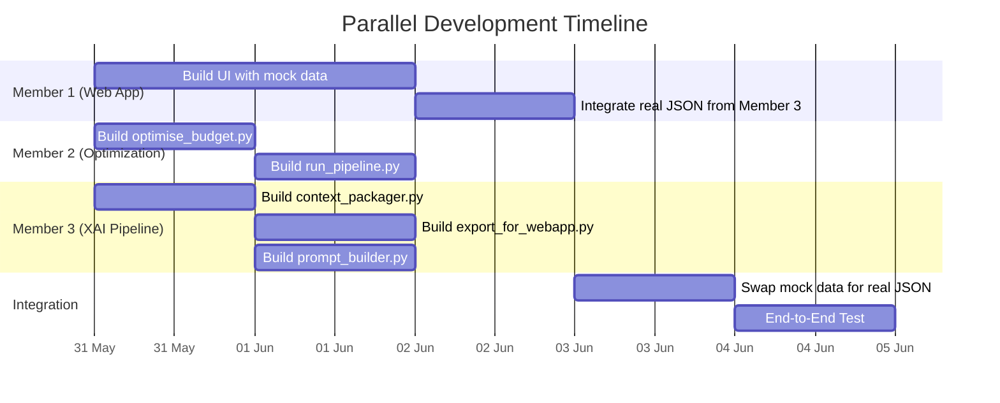
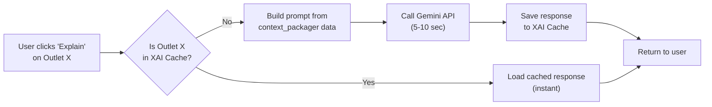

# BigBugDataStorm — Parallel Execution Strategy & Full Implementation Plan

## Current Status

**Round 2, Phase 1 (Advanced Features & Modeling)** is complete. Predictions are generated in `outputs/round2/bigbug_predictions.csv`. SHAP values are in `Data/Gold/shap_values.parquet`. The remaining work is **Phases 2, 3, and 4**.

---

## Parallel Paths Strategy (3-Member Allocation)

Since Phase 1 output data is ready, the remaining phases have minimal sequential dependencies. Here is how to split work across three parallel streams:



---

### Member 1: Web App Developer (Next.js Frontend)

**Status:** Can work entirely in parallel starting NOW.

**Current Setup:** Member 1 is currently using mock JSON data and a local SQLite database. Some data is fetched from this mock DB, and some is written to it.

**Tasks:**
- Continue building the frontend UI components against the schema defined in `specs/webapp/API_SPEC.md`.
- Build the map interface, outlet explorer table, budget dashboards, and AI insight cards using mock data.
- Implement the **on-demand XAI caching** pattern (see XAI Strategy section below).
- Replace mock JSON with real data from Member 3's `export_for_webapp.py` output when ready.

#### Database & API Strategy (Localhost → Production)

**How should the database and API calls work?**

Here's the recommended architecture for both localhost and production:

**Localhost (Development):**

| Layer | Technology | Details |
|-------|-----------|---------|
| Frontend | Next.js (React) | Pages, components, filters |
| API | Next.js API Routes (`/api/outlets`, `/api/explain/{id}`, `/api/budget/summary`) | Server-side logic in `app/api/` |
| Data Source | **Static JSON files** on disk (`app/data/outlets.json`, `app/data/budget_summary.json`) | Generated by Member 3's `export_for_webapp.py` |
| XAI Cache | **SQLite** (via `better-sqlite3`) | Stores LLM responses per outlet to avoid re-calling Gemini. Located at `app/data/xai_cache.db` |
| LLM | Gemini API (free tier) | Called on-demand per outlet, cached in SQLite |

The API routes read from the JSON files and query SQLite for cached XAI explanations. This is simple, fast, and requires zero external infrastructure.

**Production (Vercel):**

| Layer | Technology | Details |
|-------|-----------|---------|
| Frontend | Next.js on Vercel | Auto-deployed from git |
| API | Next.js API Routes (Serverless Functions) | Same code, different runtime |
| Data Source | **Vercel Blob Storage** or **bundled JSON in `/public`** | Upload `outlets.json` to Vercel Blob, or bundle it in the repo |
| XAI Cache | **Vercel KV (Redis)** or **Vercel Postgres** | Replaces SQLite since Vercel's serverless functions have an ephemeral filesystem |
| LLM | Gemini API | Same, uses `GEMINI_API_KEY` env var on Vercel |

For the hackathon, keep the JSON files inside the repo under `app/data/` or `public/data/`. Vercel will deploy these as static assets. You only need Vercel KV/Postgres if you want the XAI cache to persist between deployments. For a demo, a fresh cache is acceptable.

**Transition Checklist:**
1. `outlets.json` and `budget_summary.json` → move to `public/data/` (Vercel serves these as static files).
2. SQLite XAI cache → replace with Vercel KV (`@vercel/kv`) — a 3-line code change in the API route.
3. `GEMINI_API_KEY` → add as an environment variable in the Vercel dashboard.
4. Deploy: `vercel --prod`.

---

### Member 2: Data Scientist / ML Engineer (Budget Optimization)

**Status:** Can start immediately. Uses predictions from Phase 1.

**Tasks:**
- **Phase 2:** Develop `optimise_budget.py` — implement the Pareto-based tiered budget allocation.
- Output `budget_features.parquet` and `bigbug_budget_allocations.csv` to `Data/Optimizations/`.
- **Phase 4 (Part 2):** Develop `run_pipeline.py` (the master orchestrator) after all components are merged.

#### Budget Optimization Strategy — Expert Analysis

**Should we allocate at least Rs 1.50 to every outlet? Is the Pareto Principle a better approach?**

**Short answer: Yes, use a Pareto-inspired tiered allocation. Spreading Rs 1.50 to 6,000+ outlets is commercially meaningless.**

Here is the business-grounded reasoning:
- **Rs 1.50 per outlet buys nothing.** The minimum actionable marketing intervention (e.g., a small point-of-sale poster) costs at least Rs 500–1,000.
- **Dilution destroys ROI.** Marketing budgets have diminishing returns at the micro level but increasing returns when concentrated on high-impact targets.
- **The competition statement says:** *"maximize the **additional sales volume** gained compared to normal historical sales patterns"* — this rewards concentration on high-uplift outlets, not equal distribution.

**Recommended Strategy — Pareto-Based Tiered Allocation:**

Apply the **80/20 principle** with three tiers:

| Tier | Selection Criteria | % of Budget | Allocation Per Outlet | Spend Type |
|------|-------------------|-------------|----------------------|------------|
| **Tier 1 (Top 15%)** — ~1,000 outlets | Highest `uplift_gap_litres` AND `roi_score` | **50%** (2.5M LKR) | ~Rs 2,500 each | Cooler grants, branded merchandising |
| **Tier 2 (Next 25%)** — ~1,500 outlets | Medium uplift, strong `footfall_score` | **35%** (1.75M LKR) | ~Rs 1,167 each | Promotional discounts, POS materials |
| **Tier 3 (Next 25%)** — ~1,500 outlets | Low uplift but positive ROI | **15%** (0.75M LKR) | ~Rs 500 each | Light promotional materials |
| **No allocation** — remaining ~2,800 outlets | Near-zero uplift or already maxed out | **0%** | Rs 0 | No intervention needed |

**Constraints to implement in `optimise_budget.py`:**
1. **Total budget constraint:** `sum(allocations) == 5,000,000 LKR` (hard cap, no overshoot).
2. **Minimum actionable spend:** No outlet receives less than **Rs 500** — if the algorithm wants to give less, give Rs 0 instead. Anything below Rs 500 is wasted.
3. **Maximum per-outlet cap:** No single outlet gets more than **Rs 15,000** (prevents over-concentration).
4. **ROI score formula:** `roi_score = uplift_gap_litres × footfall_score / (1 + competition_density_score)` — rewards outlets with high untapped potential in high-traffic, low-competition areas.
5. **Coverage constraint:** At least **40%** of Western Province outlets must receive _some_ allocation (ensures geographic spread and prevents complaints from excluded distributors).

**The ROI Composite Score calculation:**

```
uplift_gap = predicted_potential - current_avg_monthly
roi_score  = uplift_gap × (footfall_score / 100) × (1 / (1 + competition_density))
```

Outlets are sorted by `roi_score` descending, then allocated top-down using a greedy knapsack until the 5M budget is exhausted.

---

### Member 3: Data / LLM Engineer (XAI Pipeline & Data Export)

**Status:** Can start immediately. Can use a dummy budget dataset until Member 2 finishes.

**Output location:** `Data/Optimizations/`

**Tasks:**
- **Phase 3:** Develop `context_packager.py` — assemble outlet identity, prediction, top SHAP drivers, and budget data into a JSON context string per outlet.
- Develop `prompt_builder.py` — render context payloads into structured Gemini prompts.
- Develop `export_for_webapp.py` — export parquets into JSON files for Member 1's Next.js app.
- Integrate with Member 1's on-demand XAI caching approach.

---

## Phase Explanations (Full Concept for All Team Members)

### Phase 2: Budget Optimization

**Goal:** Allocate 5M LKR across Western Province outlets to maximize incremental sales volume.

**How it works:**
1. Load `master_features.parquet` and `bigbug_predictions.csv`.
2. Filter to Western Province outlets only (~6,000+).
3. Calculate `uplift_gap_litres = predicted_potential - hist_mean_monthly` for each outlet.
4. Compute the `roi_score` using the formula above.
5. Sort outlets by `roi_score` descending.
6. Apply the greedy knapsack algorithm: walk down the ranked list, assigning budget from Tier 1 → Tier 2 → Tier 3 until the 5M is exhausted.
7. Output:
   - `bigbug_budget_allocations.csv` → submission file (`Outlet_ID`, `Trade_Spend_Allocation_LKR`).
   - `budget_features.parquet` → rich dataset with `roi_score`, `allocation_tier`, `recommended_spend_type` for the web app.

### Phase 3: XAI Pipeline & Data Export

**Goal:** Make model predictions explainable in business language and export everything for the web app.

**`context_packager.py`:**
- For each outlet, assemble a context dict containing:
  - Outlet identity (ID, type, size, province, distributor)
  - Prediction (`predicted_potential_litres`, `uplift_gap_litres`)
  - Top 5 SHAP drivers (positive and negative) from `shap_values.parquet`
  - Budget allocation (from `budget_features.parquet`)
  - Local environment signals (footfall, gravity, competition)
- Output: `xai_context.parquet` (one row per outlet, with a `context_json` column).

**`prompt_builder.py`:**
- Takes the context JSON and renders it into a structured LLM prompt like:
  ```
  You are a beverage trade marketing analyst. Analyze this outlet and explain
  why it received its predicted sales potential score in simple business language.

  Outlet: OUT_W_00042 (Grocery, Medium, Western Province)
  Predicted Potential: 1,240.50 L/month | Current Avg: 820.30 L/month
  Top positive drivers: transport_gravity_score (SHAP +182.40), footfall_score (+134.20)
  Top negative drivers: hist_cv (SHAP -45.80), consecutive_zero_months (-38.10)
  Budget allocated: Rs 45,000 (Tier: High)
  ...
  ```

**`export_for_webapp.py`:**
- Reads `master_features.parquet`, `budget_features.parquet`, `xai_context.parquet`.
- Outputs `outlets.json` and `budget_summary.json` matching the schema in `specs/webapp/API_SPEC.md`.

---

## XAI Strategy: On-Demand Caching (NOT Pre-generation)

### Why NOT pre-generate for all 6,000+ outlets?

1. **Gemini Free Tier Rate Limits:** The free tier allows ~15 RPM and ~1,500 RPD. At 15 RPM, generating 6,000 outlets takes ~400 minutes (~6.5 hours). This is infeasible in a single session.
2. **The problem statement says:** *"embed a Dynamic Explainability (XAI) module"* — indicates on-demand generation.
3. **Not all outlets will be viewed.** During the demo, judges will only click a few outlets.

### Recommended Architecture: On-Demand + Cache



**How it works:**
1. User clicks "Generate Analysis" on an outlet in the web app.
2. The Next.js API route (`/api/explain/[outlet_id]`) checks the SQLite cache.
3. **Cache HIT:** Return the cached LLM response instantly.
4. **Cache MISS:** Build prompt using `context_packager` data → call Gemini → save to SQLite → return to user.
5. Subsequent clicks are instant.

**Rate limit mitigation:**
- Cache ensures each outlet is only generated **once**, ever.
- Pre-warm 10–20 interesting outlets before the live demo.

---

## Verification Plan

### Per-Member Verification

| Member | What to verify | How |
|--------|---------------|-----|
| **Member 1** | UI renders all filters, map, budget dashboard, XAI cards | Browser test at `localhost:3000` |
| **Member 2** | Budget sums to exactly 5,000,000 LKR, no outlet < Rs 500 | Assertion checks in `optimise_budget.py` |
| **Member 3** | `outlets.json` matches `specs/webapp/API_SPEC.md` schema | Schema validation script |

### Integration Testing
1. Member 3 runs `export_for_webapp.py` with Member 2's real `budget_features.parquet`.
2. Member 1 replaces mock JSON with the real files.
3. Test the flow: filter → click outlet → generate XAI → verify cache works.

### End-to-End Pipeline
- Run `run_pipeline.py` from Bronze to JSON export.
- Verify `bigbug_budget_allocations.csv` has the correct schema.
