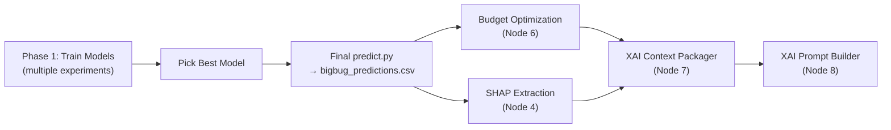
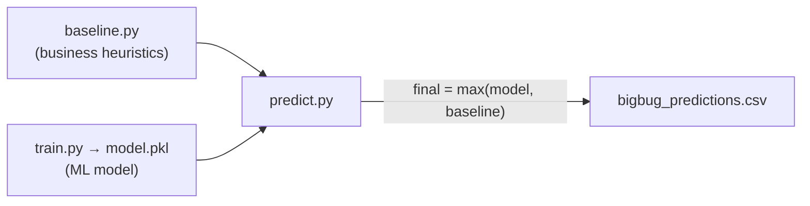

# Training Stage — Q&A

---

## Q1: How to prevent `bigbug_predictions.csv` from being overwritten across runs?

**Problem:** Currently [predict.py L164](file:///c:/Users/sithu/My%20Works/My%20Softwares/Competitions/DataStorm3_ML_DS/BigBugDataStorm/modelling/predict.py#L164) writes to a single file:

```python
output_path = os.path.join(OUTPUTS_DIR, f"{team_name}_predictions.csv")
```

Every `predict.py` run overwrites the same file. If run #7 out of 10 is the best, you've already lost it.

**Solution: Per-run predictions inside timestamped folders.**

The run tracking system (Q2 below) will save everything inside `modelling/artifacts/runs/{run_id}/`. Each run folder will contain:

```
modelling/artifacts/runs/
├── run_20260531_0100_catboost_strategyA/
│   ├── model.pkl
│   ├── predictions.csv              ← per-run copy
│   ├── cv_results.json
│   ├── feature_importance.png
│   └── run_config.json              ← exact params + features used
├── run_20260531_0200_xgboost_strategyA/
│   ├── ...
└── run_20260531_0330_catboost_strategyC/
    ├── ...
```

**Workflow when you've decided run #7 is the best:**

1. Look at `run_registry.csv` → find the `run_id` for the best run.
2. Run `predict.py --run-id run_20260531_XXXX` → it loads that specific `model.pkl` and writes the **final** `outputs/bigbug_predictions.csv`.
3. That final file is the only one that gets submitted.

> [!IMPORTANT]
> The final `outputs/bigbug_predictions.csv` is only written **once**, at the very end, after you've chosen your winner. During experimentation, each run saves its own `predictions.csv` inside its run folder.

---

## Q2: How to maintain a report of each run?

**Solution: `run_registry.csv` + per-run artifacts.**

### A. `run_registry.csv` — Master Experiment Log

Location: `modelling/artifacts/run_registry.csv`

Every time `train.py` runs, it **appends** one row:

| Column              | Example                                |
| ------------------- | -------------------------------------- |
| `run_id`            | `run_20260531_0100_catboost_strategyA` |
| `timestamp`         | `2026-05-31 01:00:12`                  |
| `algorithm`         | `catboost`                             |
| `strategy`          | `strategyA_no_leaks`                   |
| `cv_rmse_mean`      | `52.14`                                |
| `cv_rmse_std`       | `3.21`                                 |
| `cv_mae_mean`       | `28.67`                                |
| `cv_mae_std`        | `1.45`                                 |
| `n_features`        | `27`                                   |
| `n_train_samples`   | `19120`                                |
| `excluded_features` | `hist_p90,hist_max,jan_avg,...`        |
| `notes`             | `First run with gravity features`      |
| `gpu`               | `True`                                 |
| `duration_s`        | `12.3`                                 |

### B. Per-run folder — Detailed artifacts

Each `modelling/artifacts/runs/{run_id}/` folder contains:

- **`model.pkl`** — the trained model (loadable by `predict.py`)
- **`predictions.csv`** — predictions from this specific model
- **`cv_results.json`** — fold-by-fold RMSE/MAE
- **`feature_importance.png`** — top-30 feature importance chart
- **`run_config.json`** — full snapshot of parameters, feature list, excluded features, target formula

### C. How this works in practice

```
# Run experiment 1 (CatBoost, Strategy A)
python modelling/train.py --strategy strategyA --notes "Baseline with gravity"

# Run experiment 2 (XGBoost, Strategy A)
python modelling/train.py --algorithm xgboost --strategy strategyA

# Run experiment 3 (CatBoost, Strategy C with interaction features)
python modelling/train.py --strategy strategyC --notes "Added gravity×cooler interaction"

# Compare all runs
python -c "import pandas as pd; print(pd.read_csv('modelling/artifacts/run_registry.csv').sort_values('cv_rmse_mean'))"

# Pick the winner and generate final submission
python modelling/predict.py --run-id run_20260531_0330_catboost_strategyC
```

---

## Q3: Are Budget Optimization & XAI independent from model training?

**Yes, absolutely.** They are fully decoupled. Here's the dependency chain:



**Budget Optimization** only needs:

- `master_features.parquet` (already exists ✅)
- `bigbug_predictions.csv` (the **final** one from the chosen model)
- `sales_features.parquet` (already exists ✅)

**SHAP Extraction** only needs:

- The **final chosen** `model.pkl`
- `master_features.parquet`

> [!TIP]
> **Recommended workflow:**
>
> 1. Finish ALL model experiments first (Phase 1)
> 2. Pick the best run from `run_registry.csv`
> 3. Generate the final `bigbug_predictions.csv` with that model
> 4. Run SHAP extraction on that model → `shap_values.parquet`
> 5. Then proceed to Budget Optimization → XAI Pipeline
>
> This is exactly what the [pipeline_notes.md](file:///c:/Users/sithu/My%20Works/My%20Softwares/Competitions/DataStorm3_ML_DS/BigBugDataStorm/docs/pipeline_notes.md) Phases 1→2→3 layout intends.

---

## Q4: GPU Setup — Is there anything to configure?

### ✅ Your GPU is already fully set up. No additional work needed.

I verified this directly on your machine:

| Check              | Result                                                  |
| ------------------ | ------------------------------------------------------- |
| GPU detected       | **NVIDIA GeForce RTX 5070** (Blackwell)                 |
| Driver             | **591.91** (well above the 450.80 minimum)              |
| CUDA               | **13.1**                                                |
| VRAM               | **8 GB** (more than enough for 20K rows)                |
| CatBoost installed | **v1.2.10** (in your `venv`)                            |
| GPU init test      | **Passed** (`task_type="GPU"` initialised successfully) |

### What changes in `train.py`

Just one line — add `task_type="GPU"` to the CatBoost params. This can be done in `config.yaml`:

```yaml
modelling:
  catboost_params:
    iterations: 1289
    learning_rate: 0.0283
    depth: 5
    task_type: "GPU" # ← ADD THIS
    devices: "0" # ← ADD THIS (selects GPU 0)
    # ... rest unchanged
```

Or in code: the `cb_params` dict loaded from config will already include it.

> [!NOTE]
> **Expect slightly different results** from CPU training. GPU uses different floating-point arithmetic, so RMSE may differ by ±0.01-0.1 from your Colab runs. This is normal and expected.

> [!WARNING]
> CatBoost GPU does **not** support `Ordered` boosting mode. It will automatically fall back to `Plain` boosting on GPU. This may give slightly different (sometimes better) results vs CPU.

---

## Q5: Do we need to change the target variable for Round 2?

### Target Formula — No Change

I re-verified against the spec files. The target formula in [SPEC_train.md L40-44](file:///c:/Users/sithu/My%20Works/My%20Softwares/Competitions/DataStorm3_ML_DS/BigBugDataStorm/specs/modelling/SPEC_train.md#L40-L44) is:

```
pseudo_target = hist_p90_monthly × seasonality_multiplier_jan_2026 × (jan_2026_trading_days / 22.0)
```

This is **unchanged from Round 1**. The gravity features are **NOT** used in the target formula — they are only used in two other places:

1. **Training features** — fed into CatBoost as input columns (per [GRAVITY_MODEL.md L209-232](file:///c:/Users/sithu/My%20Works/My%20Softwares/Competitions/DataStorm3_ML_DS/BigBugDataStorm/specs/gold/GRAVITY_MODEL.md#L209-L232)). This means the model *learns from* gravity scores, but they don't define the target value it's trying to predict.

2. **Baseline safety floor (POI uplift factor)** — this needs a quick explanation:

### What is the Baseline and why do we need it?

The **baseline** is a completely separate prediction script ([baseline.py](file:///c:/Users/sithu/My%20Works/My%20Softwares/Competitions/DataStorm3_ML_DS/BigBugDataStorm/modelling/baseline.py)) that estimates each outlet's potential using **pure business heuristics** — no ML involved. It uses January-specific historical sales, recency momentum, seasonality, and a POI uplift factor.

**Where it sits in the pipeline:**



In [predict.py L101-103](file:///c:/Users/sithu/My%20Works/My%20Softwares/Competitions/DataStorm3_ML_DS/BigBugDataStorm/modelling/predict.py#L101-L103), the final prediction for every outlet is:
```python
df["Maximum_Monthly_Liters"] = df[["model_prediction", "baseline_potential_litres"]].max(axis=1)
```

**Why?** The ML model might predict a low value for an outlet that historically sells 500 litres/month in January. The baseline catches that and says "this outlet's floor is at least 500 based on its actual January history." The `max()` ensures we never submit a prediction below what real data tells us is possible.

**How gravity enters the baseline:** The baseline's POI uplift factor ([SPEC_baseline.md L169-186](file:///c:/Users/sithu/My%20Works/My%20Softwares/Competitions/DataStorm3_ML_DS/BigBugDataStorm/specs/modelling/SPEC_baseline.md#L169-L186)) gives a small boost (up to 1.25×) to outlets in high-traffic areas. This uses `composite_gravity_score` to say "an outlet near a bus terminal + school has more *potential* customers than its past sales suggest." But this only affects the **safety floor** — it has absolutely nothing to do with the training target formula.

### What Actually Changes: Feature Exclusions (Strategy A)

The real change is **removing features that leak the target**. Here's the exact diff between the current [train.py EXCLUDE_COLS (L63-80)](file:///c:/Users/sithu/My%20Works/My%20Softwares/Competitions/DataStorm3_ML_DS/BigBugDataStorm/modelling/train.py#L63-L80) and the [SPEC_train.md EXCLUDE_COLS (L87-111)](file:///c:/Users/sithu/My%20Works/My%20Softwares/Competitions/DataStorm3_ML_DS/BigBugDataStorm/specs/modelling/SPEC_train.md#L87-L111):

| Feature             | Round 1 (current code)     | Round 2 (spec) | Change                                               |
| ------------------- | -------------------------- | -------------- | ---------------------------------------------------- |
| `hist_p90_monthly`  | ❌ **Included as feature** | ✅ Excluded    | **NEW exclusion** — directly used in target formula! |
| `hist_max_monthly`  | ❌ **Included as feature** | ✅ Excluded    | **NEW exclusion** — highly correlated with target    |
| `jan_avg_volume`    | ❌ **Included as feature** | ✅ Excluded    | **NEW exclusion** — direct January proxy             |
| `ema_3m`            | ❌ **Included as feature** | ✅ Excluded    | **NEW exclusion** — recent sales ≈ near-target       |
| `jan_max_volume`    | ✅ Already excluded        | ✅ Excluded    | No change                                            |
| `hist_p75_monthly`  | ✅ Already excluded        | ✅ Excluded    | No change                                            |
| `hist_mean_monthly` | ✅ Already excluded        | ✅ Excluded    | No change                                            |
| `hist_std_monthly`  | ✅ Already excluded        | ✅ Excluded    | No change                                            |
| `total_volume`      | ✅ Already excluded        | ✅ Excluded    | No change                                            |
| `ema_6m`            | ✅ Already excluded        | ✅ Excluded    | No change                                            |
| `recent_3m_avg`     | ✅ Already excluded        | ✅ Excluded    | No change                                            |

**Summary: 4 features need to be newly added to `EXCLUDE_COLS` for Strategy A:**

```python
# Strategy A: NEW exclusions (add to EXCLUDE_COLS)
"hist_p90_monthly",    # ← directly used in target formula!
"hist_max_monthly",    # ← highly correlated with target
"jan_avg_volume",      # ← direct January proxy
"ema_3m",              # ← recent sales ≈ near-target
```

> [!IMPORTANT]
> The RMSE **will go up** after removing leak features — this is expected and correct. The Round 1 model (RMSE ~40) was essentially memorising `hist_p90_monthly` (which accounted for ~88% of feature importance per the [Colab experiments](file:///c:/Users/sithu/My%20Works/My%20Softwares/Competitions/DataStorm3_ML_DS/BigBugDataStorm/specs/modelling/SPEC_colab_experiments.md#L81)). A model with 55-65 RMSE that actually uses gravity/catchment features is far more valuable for the competition's "explain your predictions" requirement.

### Also: Baseline needs an update

The current [baseline.py L90-106](file:///c:/Users/sithu/My%20Works/My%20Softwares/Competitions/DataStorm3_ML_DS/BigBugDataStorm/modelling/baseline.py#L90-L106) uses `footfall_score` for POI uplift. But the [SPEC_baseline.md L169-186](file:///c:/Users/sithu/My%20Works/My%20Softwares/Competitions/DataStorm3_ML_DS/BigBugDataStorm/specs/modelling/SPEC_baseline.md#L169-L186) now uses `composite_gravity_score`. This should be updated when re-running the baseline:

```diff
- def _compute_poi_uplift(footfall_score: float) -> float:
+ def _compute_poi_uplift(composite_gravity_score: float) -> float:
```

---

## Q6: 10 Training Scenarios — Detailed Transition Guide

### Code Preservation Strategy

> [!IMPORTANT]
> **No code file is ever overwritten between scenarios.** All scenario differences are controlled via:
>
> 1. **CLI arguments** (`--strategy`, `--algorithm`, `--notes`) passed to `train.py`
> 2. **Config overrides** in `train.py` that select different `EXCLUDE_COLS` lists and feature sets based on the `--strategy` flag
> 3. **Per-run folders** save the exact `run_config.json` (features used, params, strategy name) so any run can be reproduced
>
> You run the **same `train.py` file** for all scenarios. The strategy flag controls which features are included/excluded. No code changes needed between runs.

### How it works inside `train.py`

The updated `train.py` will contain a strategy registry:

```python
STRATEGIES = {
    "round1_baseline": {
        "exclude": [...],  # Original Round 1 exclusions
        "interaction_features": False,
    },
    "strategyA": {
        "exclude": [...],  # + hist_p90, hist_max, jan_avg, ema_3m
        "interaction_features": False,
    },
    "strategyC": {
        "exclude": [...],  # Same as A, but interaction features ON
        "interaction_features": True,
    },
    # ... etc
}
```

Running different scenarios:

```bash
python modelling/train.py --strategy strategyA --algorithm catboost
python modelling/train.py --strategy strategyA --algorithm xgboost
python modelling/train.py --strategy strategyC --algorithm catboost
```

---

### The 10 Scenarios

#### Scenario 1: Round 1 Baseline (Reference Run)

| Item                  | Detail                                                                                                                                                                                                                       |
| --------------------- | ---------------------------------------------------------------------------------------------------------------------------------------------------------------------------------------------------------------------------- |
| **Purpose**           | Establish the baseline RMSE with the Round 1 model on the **updated** `master_features.parquet` (which now includes gravity + catchment columns)                                                                             |
| **Strategy**          | `round1_baseline`                                                                                                                                                                                                            |
| **Algorithm**         | CatBoost (GPU)                                                                                                                                                                                                               |
| **Excluded features** | Same as current [train.py L63-80](file:///c:/Users/sithu/My%20Works/My%20Softwares/Competitions/DataStorm3_ML_DS/BigBugDataStorm/modelling/train.py#L63-L80) — keeps `hist_p90`, `hist_max`, `jan_avg`, `ema_3m` as features |
| **New features used** | Gravity scores + catchment features are auto-included (they're in `master_features.parquet`)                                                                                                                                 |
| **Target**            | `hist_p90_monthly × seasonality × trading_days`                                                                                                                                                                              |
| **Custom scripts**    | None                                                                                                                                                                                                                         |
| **Code/data changes** | None — just run with the strategy flag                                                                                                                                                                                       |
| **Expected RMSE**     | ~40 (similar to Colab experiments, since leak features dominate)                                                                                                                                                             |

```bash
python modelling/train.py --strategy round1_baseline --notes "Reference: R1 features on updated master_features"
```

**Transition to Scenario 2:** No changes needed, just switch the flag.

---

#### Scenario 2: Strategy A — Remove Target Leakage (CatBoost)

| Item                  | Detail                                                                                                                     |
| --------------------- | -------------------------------------------------------------------------------------------------------------------------- |
| **Purpose**           | Force the model to learn from structural/spatial features by removing the "answer key"                                     |
| **Strategy**          | `strategyA`                                                                                                                |
| **Algorithm**         | CatBoost (GPU)                                                                                                             |
| **Excluded features** | All of Scenario 1 + `hist_p90_monthly`, `hist_max_monthly`, `jan_avg_volume`, `ema_3m`                                     |
| **New features used** | Gravity (6 individual + composite), catchment (3 radii + density + saturation class), POI flat counts, structural features |
| **Target**            | Same formula (no change)                                                                                                   |
| **Custom scripts**    | None                                                                                                                       |
| **Code/data changes** | None — strategy flag controls exclusions                                                                                   |
| **Expected RMSE**     | 55-65 (higher because leak features removed, but this is correct)                                                          |

```bash
python modelling/train.py --strategy strategyA --notes "Strategy A: no leak features, CatBoost GPU"
```

**Transition to Scenario 3:** Just switch `--algorithm`.

---

#### Scenario 3: Strategy A — XGBoost Comparison

| Item                  | Detail                                                                                                      |
| --------------------- | ----------------------------------------------------------------------------------------------------------- |
| **Purpose**           | Compare XGBoost against CatBoost on the same feature set (proves systematic algorithm evaluation)           |
| **Strategy**          | `strategyA`                                                                                                 |
| **Algorithm**         | XGBoost (GPU)                                                                                               |
| **Excluded features** | Same as Scenario 2                                                                                          |
| **Target**            | Same formula                                                                                                |
| **Custom scripts**    | None — `train.py` handles XGBoost via `--algorithm xgboost`                                                 |
| **Code/data changes** | XGBoost requires label-encoding categoricals — `train.py` does this automatically when algorithm ≠ catboost |
| **Dependencies**      | `pip install xgboost` (add to `requirements.txt`)                                                           |
| **Expected RMSE**     | 55-65 (similar to CatBoost, may be slightly better/worse)                                                   |

```bash
pip install xgboost
python modelling/train.py --strategy strategyA --algorithm xgboost --notes "XGBoost GPU comparison"
```

**Transition to Scenario 4:** Just switch `--algorithm`.

---

#### Scenario 4: Strategy A — LightGBM Comparison

| Item                  | Detail                                                                                                                                                                           |
| --------------------- | -------------------------------------------------------------------------------------------------------------------------------------------------------------------------------- |
| **Purpose**           | Third algorithm comparison (LightGBM already installed)                                                                                                                          |
| **Strategy**          | `strategyA`                                                                                                                                                                      |
| **Algorithm**         | LightGBM (GPU)                                                                                                                                                                   |
| **Excluded features** | Same as Scenario 2                                                                                                                                                               |
| **Target**            | Same formula                                                                                                                                                                     |
| **Custom scripts**    | None                                                                                                                                                                             |
| **Code/data changes** | LightGBM requires `astype("category")` for categoricals — `train.py` handles automatically                                                                                       |
| **Dependencies**      | Already installed (`lightgbm==4.3.0` in [requirements.txt](file:///c:/Users/sithu/My%20Works/My%20Softwares/Competitions/DataStorm3_ML_DS/BigBugDataStorm/requirements.txt#L26)) |
| **Expected RMSE**     | 55-65                                                                                                                                                                            |

```bash
python modelling/train.py --strategy strategyA --algorithm lightgbm --notes "LightGBM GPU comparison"
```

> [!NOTE]
> LightGBM GPU requires the `lightgbm` package built with GPU support. The pip version may be CPU-only. If GPU fails, it'll fall back to CPU (still fast for 20K rows). We'll test this during the first run.

**Transition to Scenario 5:** Switch to `strategyC`.

---

#### Scenario 5: Strategy C — Feature Interactions (CatBoost)

| Item                    | Detail                                                                                                                                                                                                       |
| ----------------------- | ------------------------------------------------------------------------------------------------------------------------------------------------------------------------------------------------------------ |
| **Purpose**             | Test if cross-features improve the model — per [modelling_strategy.md #6](file:///c:/Users/sithu/My%20Works/My%20Softwares/Competitions/DataStorm3_ML_DS/BigBugDataStorm/docs/modelling_strategy.md#L36-L38) |
| **Strategy**            | `strategyC`                                                                                                                                                                                                  |
| **Algorithm**           | CatBoost (GPU)                                                                                                                                                                                               |
| **Excluded features**   | Same as Strategy A                                                                                                                                                                                           |
| **Additional features** | Auto-generated interaction features:                                                                                                                                                                         |
|                         | `gravity_x_cooler = composite_gravity_score × Cooler_Count`                                                                                                                                                  |
|                         | `gravity_x_active_months = composite_gravity_score × active_months_pct`                                                                                                                                      |
|                         | `catchment_x_cooler = competition_density_score × Cooler_Count`                                                                                                                                              |
|                         | `transport_x_school = transport_gravity_score × school_gravity_score`                                                                                                                                        |
| **Target**              | Same formula                                                                                                                                                                                                 |
| **Custom scripts**      | None — `train.py` auto-creates interaction columns when `--strategy strategyC`                                                                                                                               |
| **Code/data changes**   | No parquet changes. `train.py` computes interactions on-the-fly in memory                                                                                                                                    |
| **Expected RMSE**       | Slightly lower than Scenario 2 if interactions help                                                                                                                                                          |

```bash
python modelling/train.py --strategy strategyC --algorithm catboost --notes "Strategy C: interaction features"
```

**Transition to Scenario 6:** Switch strategy flag.

---

#### Scenario 6: Strategy A + Only Gravity Features (No Flat POI Counts)

| Item                  | Detail                                                                                                                |
| --------------------- | --------------------------------------------------------------------------------------------------------------------- |
| **Purpose**           | Test if gravity scores can fully replace flat POI counts (cleaner model, less multicollinearity)                      |
| **Strategy**          | `strategyA_gravity_only`                                                                                              |
| **Algorithm**         | CatBoost (GPU)                                                                                                        |
| **Excluded features** | Strategy A exclusions + all 18 flat POI count columns (`schools_500m` through `hospitality_2000m`) + `footfall_score` |
| **Features kept**     | 6 individual gravity scores + `composite_gravity_score` + catchment features + structural                             |
| **Target**            | Same formula                                                                                                          |
| **Custom scripts**    | None                                                                                                                  |
| **Code/data changes** | None                                                                                                                  |
| **Expected RMSE**     | Similar to Scenario 2 — if gravity scores capture the same signal as flat counts                                      |

```bash
python modelling/train.py --strategy strategyA_gravity_only --notes "Gravity only, no flat POI counts"
```

**Transition to Scenario 7:** Switch strategy flag.

---

#### Scenario 7: Strategy A + Only Flat POI Counts (No Gravity)

| Item                  | Detail                                                                         |
| --------------------- | ------------------------------------------------------------------------------ |
| **Purpose**           | Ablation test — prove that gravity features add value over Round 1 flat counts |
| **Strategy**          | `strategyA_flat_only`                                                          |
| **Algorithm**         | CatBoost (GPU)                                                                 |
| **Excluded features** | Strategy A exclusions + all 7 gravity columns + `raw_composite_gravity`        |
| **Features kept**     | 18 flat POI counts + `footfall_score` + catchment + structural                 |
| **Target**            | Same formula                                                                   |
| **Custom scripts**    | None                                                                           |
| **Code/data changes** | None                                                                           |
| **Expected RMSE**     | Higher than Scenario 2 (proving gravity adds value)                            |

```bash
python modelling/train.py --strategy strategyA_flat_only --notes "Ablation: flat POI only, no gravity"
```

> [!TIP]
> **Scenarios 6 vs 7 vs 2** form an ablation study. If Scenario 2 (both) beats Scenario 6 (gravity only) and Scenario 7 (flat only), it proves both feature sets contribute unique signal. This is excellent for the judges.

**Transition to Scenario 8:** Switch strategy flag.

---

#### Scenario 8: Strategy A + Tuned Epsilon (ε = 0.02)

| Item                  | Detail                                                                                                                                                                                                                    |
| --------------------- | ------------------------------------------------------------------------------------------------------------------------------------------------------------------------------------------------------------------------- |
| **Purpose**           | Test if a tighter epsilon gives better discrimination — per [modelling_strategy.md #9](file:///c:/Users/sithu/My%20Works/My%20Softwares/Competitions/DataStorm3_ML_DS/BigBugDataStorm/docs/modelling_strategy.md#L54-L56) |
| **Strategy**          | `strategyA`                                                                                                                                                                                                               |
| **Algorithm**         | CatBoost (GPU)                                                                                                                                                                                                            |
| **Excluded features** | Same as Scenario 2                                                                                                                                                                                                        |
| **Target**            | Same formula                                                                                                                                                                                                              |
| **Custom scripts**    | **Yes — must re-run `build_gravity_features.py`** with `decay_epsilon: 0.02`                                                                                                                                              |
| **Code/data changes** | **Parquet change required:**                                                                                                                                                                                              |
|                       | 1. Edit `config.yaml`: change `gravity_model.decay_epsilon` from `0.05` to `0.02`                                                                                                                                         |
|                       | 2. Re-run `python pipeline/gold/build_gravity_features.py` → regenerates `gravity_features.parquet`                                                                                                                       |
|                       | 3. Re-run `python pipeline/gold/build_master_features.py` → regenerates `master_features.parquet`                                                                                                                         |
|                       | 4. Then train                                                                                                                                                                                                             |
| **Expected RMSE**     | May improve if closer POIs deserve more extreme weighting                                                                                                                                                                 |

```bash
# Step 1: Update config.yaml (decay_epsilon: 0.05 → 0.02)
# Step 2: Rebuild gravity features
python pipeline/gold/build_gravity_features.py
python pipeline/gold/build_master_features.py
# Step 3: Train
python modelling/train.py --strategy strategyA --notes "Epsilon=0.02 gravity rebuild"
```

> [!WARNING]
> **This scenario modifies `gravity_features.parquet` and `master_features.parquet`.** After testing, you MUST revert `config.yaml` back to `decay_epsilon: 0.05` and re-run the gravity + master feature pipeline to restore the original data for other scenarios. Alternatively, back up the parquets before changing epsilon.

**Transition to Scenario 9:** Revert config, rebuild parquets, then switch strategy.

---

#### Scenario 9: Optuna Hyperparameter Re-tuning (CatBoost)

| Item                  | Detail                                                                                                                                                                                                                                                                         |
| --------------------- | ------------------------------------------------------------------------------------------------------------------------------------------------------------------------------------------------------------------------------------------------------------------------------ |
| **Purpose**           | The Round 1 Optuna params were tuned with leak features. The optimal params will be different without them — per [modelling_strategy.md #5](file:///c:/Users/sithu/My%20Works/My%20Softwares/Competitions/DataStorm3_ML_DS/BigBugDataStorm/docs/modelling_strategy.md#L32-L34) |
| **Strategy**          | `strategyA` (or whichever performed best in Scenarios 2-7)                                                                                                                                                                                                                     |
| **Algorithm**         | CatBoost (GPU)                                                                                                                                                                                                                                                                 |
| **Excluded features** | Same as the best strategy                                                                                                                                                                                                                                                      |
| **Target**            | Same formula                                                                                                                                                                                                                                                                   |
| **Custom scripts**    | **Yes — `modelling/optuna_tune.py`** (new script)                                                                                                                                                                                                                              |
| **Code/data changes** | New script that runs 50 Optuna trials, saves the best params, then trains with them                                                                                                                                                                                            |
| **Expected RMSE**     | 2-5% lower than the un-tuned version of the same strategy                                                                                                                                                                                                                      |

```bash
# Step 1: Run Optuna tuning (50 trials, ~5-10 min on GPU)
python modelling/optuna_tune.py --strategy strategyA --n-trials 50

# Step 2: Train with the best found params
python modelling/train.py --strategy strategyA --use-optuna-params --notes "Optuna re-tuned (50 trials)"
```

**Transition to Scenario 10:** Decide on the best single-model result first.

---

#### Scenario 10: Model Ensemble (Blending)

| Item                  | Detail                                                                                                                                                                                                                            |
| --------------------- | --------------------------------------------------------------------------------------------------------------------------------------------------------------------------------------------------------------------------------- |
| **Purpose**           | Blend the 2-3 best single models for a final RMSE improvement — per [modelling_strategy.md #7](file:///c:/Users/sithu/My%20Works/My%20Softwares/Competitions/DataStorm3_ML_DS/BigBugDataStorm/docs/modelling_strategy.md#L46-L48) |
| **Strategy**          | N/A (uses predictions from multiple prior runs)                                                                                                                                                                                   |
| **Algorithm**         | Weighted average of 2-3 models                                                                                                                                                                                                    |
| **Custom scripts**    | **Yes — `modelling/ensemble.py`** (new script)                                                                                                                                                                                    |
| **Code/data changes** | New script that:                                                                                                                                                                                                                  |
|                       | 1. Loads `predictions.csv` from 2-3 selected run folders                                                                                                                                                                          |
|                       | 2. Blends them: e.g. `0.5 × CatBoost + 0.3 × XGBoost + 0.2 × LightGBM`                                                                                                                                                            |
|                       | 3. Applies the baseline floor (same `max(blend, baseline)` logic)                                                                                                                                                                 |
|                       | 4. Saves the blended result as a new run in `run_registry.csv`                                                                                                                                                                    |
| **Expected RMSE**     | 2-5% lower than the best single model                                                                                                                                                                                             |

```bash
# Step 1: Identify the 2-3 best runs from the registry
python -c "import pandas as pd; print(pd.read_csv('modelling/artifacts/run_registry.csv').sort_values('cv_rmse_mean').head(5))"

# Step 2: Run ensemble blending
python modelling/ensemble.py \
  --runs run_20260531_0100_catboost_strategyA,run_20260531_0200_xgboost_strategyA \
  --weights 0.6,0.4 \
  --notes "CatBoost 60% + XGBoost 40% blend"
```

---

### Scenario Summary Table

| #   | Strategy                 | Algorithm | Key Difference                 | Custom Scripts   | Data Rebuild? |
| --- | ------------------------ | --------- | ------------------------------ | ---------------- | ------------- |
| 1   | `round1_baseline`        | CatBoost  | Reference (leak features kept) | None             | No            |
| 2   | `strategyA`              | CatBoost  | **Remove 4 leak features**     | None             | No            |
| 3   | `strategyA`              | XGBoost   | Algorithm comparison           | None             | No            |
| 4   | `strategyA`              | LightGBM  | Algorithm comparison           | None             | No            |
| 5   | `strategyC`              | CatBoost  | + Interaction features         | None             | No            |
| 6   | `strategyA_gravity_only` | CatBoost  | Drop flat POI counts           | None             | No            |
| 7   | `strategyA_flat_only`    | CatBoost  | Drop gravity scores            | None             | No            |
| 8   | `strategyA`              | CatBoost  | ε = 0.02 gravity rebuild       | None             | **Yes** ⚠️    |
| 9   | Best from 2-7            | CatBoost  | Optuna re-tuning               | `optuna_tune.py` | No            |
| 10  | Ensemble                 | Blend     | Weighted model average         | `ensemble.py`    | No            |

### Recommended Execution Order

```
Scenario 1 → 2 → 3 → 4 → 5 → 6 → 7 → [Compare 2-7] → 9 → 10
                                          ↓
                                    (Only if time permits)
                                          8
```

> [!TIP]
> Scenarios 1-7 require **zero code changes** between runs — just different CLI flags. Scenario 8 needs a data rebuild (revert after). Scenarios 9-10 each need one small new script.
