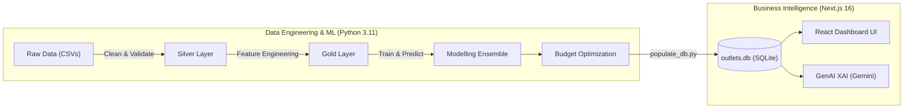
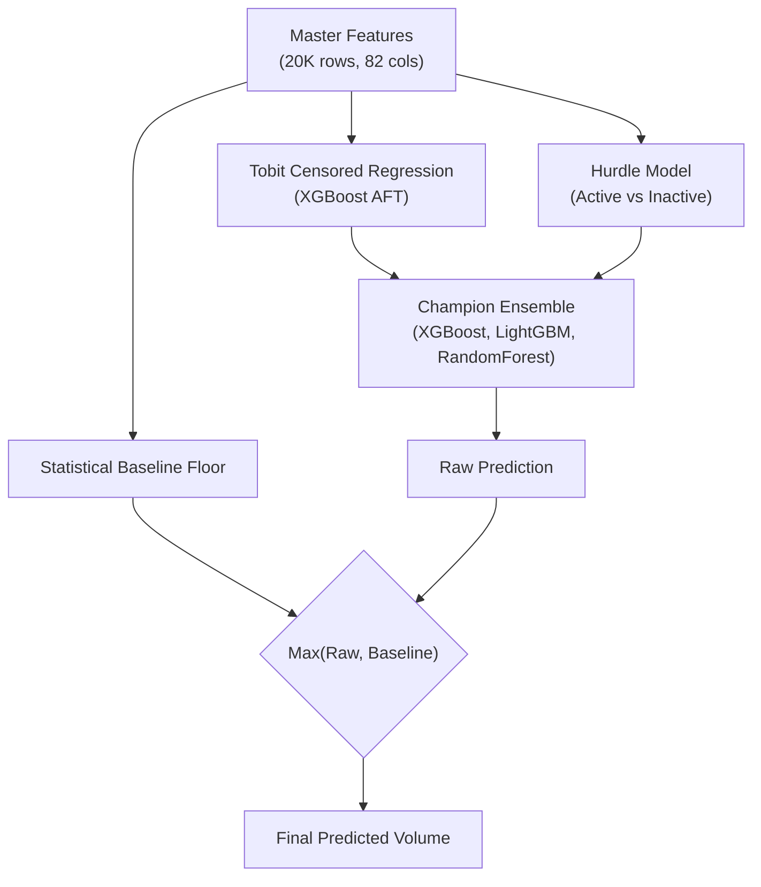
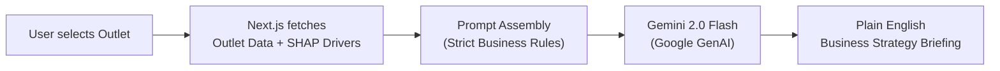

# BigBugDataStorm: End-to-End Analytics & Business Optimization Platform

**A comprehensive pitch for the Data Storm v7.0 Final Round — bridging advanced data science with actionable business intelligence.**

---

## Executive Summary: Turning Data into Revenue

In retail distribution, predicting sales accurately is only half the equation. The true challenge lies in **actionable execution**: knowing exactly *how much* product to dispatch, *where* latent demand is hiding, and *how* to allocate a LKR 5M trade marketing budget across 20,000 outlets for maximum Return on Investment (ROI).

**BigBugDataStorm** delivers a paradigm shift in how we approach this challenge. We built a system that understands the **physics of retail** (cooler capacities), the **geography of demand** (distance-decayed footfall), and the **reality of market constraints** (stockouts). 

Our end-to-end platform consists of:
1. **The Medallion Data Engine (Backend):** A robust data pipeline that cleans, validates, and transforms data without silently dropping records.
2. **The Predictive ML Core (Analytics):** State-of-the-art econometrics (Tobit, Hurdle) and Machine Learning models (XGBoost, LightGBM, RandomForest) that uncover "hidden demand" rather than just fitting curves to past sales.
3. **The Business Execution Dashboard (Frontend):** A lightning-fast Next.js web app powered by Gemini 2.0 GenAI, translating complex ML outputs into plain-English strategies for the sales team.

---

## 1. Complete System Architecture

Our solution is divided into a heavily optimized Data Pipeline and an interactive Business Frontend, bridged seamlessly by a lightweight SQLite database.

### Why this architecture?
- **Separation of Concerns:** Heavy data crunching runs offline on GPUs, while the frontend remains lightweight, highly responsive, and portable.
- **No Database Server Needed:** The 54MB SQLite database serves as the complete state of the world, easily read by the Next.js App Router for instant load times, ensuring the app can be run locally or deployed effortlessly.

---

## 2. The Data Engineering Engine (Medallion Lakehouse)

Data quality is the foundation of any analytics project. We process the raw data through Bronze, Silver, and Gold layers.

### Silver Layer: The Quarantine System
We never silently drop records. Our Data Quality Framework (`dq_checks.py`) intercepts missing values, outliers, and swapped GPS coordinates.
* **The Business Rationale:** Silent data loss corrupts ML models. By routing rejected records to a "Quarantine" file with specific failure reasons, data engineers maintain 100% auditability.
* **The Details:** For example, we check for GPS coordinates where `Latitude > 50`. Since Sri Lanka is near Latitude 7, anything over 50 means the Latitude and Longitude columns were accidentally swapped. We automatically detect and swap them back, preserving valuable outlet locations.

### Gold Layer: Advanced Feature Engineering
This is where raw data is transformed into predictive power. We generated 82 powerful features across 20,000 outlets. We didn't just aggregate data; we modeled the real world.

#### A. The Gravity Model (Reilly's Law of Retail Gravitation)
* **The Business Flaw:** Counting "schools within 2km" treats a school 50 meters away the same as a school 1.9km away. In reality, customers don't walk 2km for a quick beverage.
* **Our Solution:** We implemented an **Inverse-Square Distance Decay** model to weigh POIs.
* **The Example & Details:** Consider **Outlet OUT_1002**. It has School A at 100m, and School C at 1.5km. Our Gravity Model calculates that School A contributes **92% of the total footfall score**, while School C contributes almost nothing. A POI at 100m is mathematically given **110x more weight** than one at 1km. This tells the model exactly where the *immediate* impulse buyers are.

#### B. Physics-Based Capacity Ceilings
* **The Business Flaw:** ML models can hallucinate and predict an outlet will sell 5,000 liters, even if it only has a single small cooler.
* **Our Solution:** We modeled the physical limits. The formula: `Cooler_Count × 150L × 85% fill rate × (30 days / 3-day replenishment cycle) = Max Monthly Capacity.`
* **The Example & Details:** A 1-cooler outlet has a maximum capacity of 1,275L per month. If its peak sales were 1,200L, our pipeline calculates a **94% Utilization Rate**. It physically *cannot* sell much more without a cooler upgrade. The model learns this ceiling, stopping impossible predictions and explicitly flagging the outlet for a Cooler Grant via the LKR 5M marketing budget.

#### C. Micro-Market Clustering (DBSCAN)
* **The Business Flaw:** Standard K-Means clustering groups outlets into neat, arbitrary circles, ignoring natural geography.
* **Our Solution:** We used DBSCAN density clustering to define neighborhoods based on actual outlet density.
* **The Example & Details:** Instead of drawing a circle over a map, DBSCAN identifies long chains of shops along a highway as a single "Micro-Market." If a specific highway market averages 2,500L, the model knows an outlet there has higher potential than an identical outlet in a 200L rural cluster. This provides vital spatial context.

---

## 3. The Modelling Layer: Uncovering Latent Demand

We didn't just train a single algorithm. We built an architecture designed to protect business revenue and find "hidden" sales.

### A. Tobit Censored Regression: Finding the "Hidden" Sales
* **The Business Concept:** Think of a concert venue parking lot with 500 spaces. If the lot is full, you observe 500 cars. A standard model predicts demand is 500. But what about the 300 cars turned away? The true demand is 800.
* **Our Execution:** Historical sales data is "right-censored." We applied XGBoost Accelerated Failure Time (AFT)—a modern Tobit model.
* **The Details & Results:** If an outlet sells 1,200L but its cooler capacity is 1,275L (94% full), the data is right-censored. Our Tobit model is allowed to predict *unconstrained* demand. It might tell the business: *"We observed 1,200L, but the latent demand is actually 1,850L. You are losing 650L of sales due to a cooler bottleneck."* This is critical for knowing where to invest.

### B. The Hurdle Model: Handling Zero-Sales Outlets
* **The Business Concept:** Deciding "will this dormant outlet wake up and buy anything?" is a fundamentally different process from "how much will a massive active supermarket sell?".
* **Our Execution:** We split this into a two-stage model. Stage 1 (Logistic Regression) calculates `P(Active)`—the probability the outlet will sell anything. Stage 2 calculates the `Expected Volume` conditionally.
* **Why we use it:** This dramatically improves accuracy on dormant or highly irregular outlets, preventing the model from predicting tiny, continuous amounts of sales for dead shops.

### C. The Baseline Safety Floor: Protecting Revenue
* **The Business Concept:** Machine Learning can sometimes hallucinate severe under-predictions due to data anomalies (e.g., a cold-start outlet or missing data). We cannot afford to send an empty delivery truck to a strong customer.
* **Our Execution:** We built a robust, rule-based baseline that factors in recent momentum, POI uplifts, and seasonality. The final prediction for any outlet is `max(ML_Prediction, Baseline)`.
* **The Details & Results:** Imagine an outlet that historically moves 1,600L, but it recently hit a short slump and is missing some data. The ML model severely penalizes it, predicting only 847L. Our Baseline Floor catches this: *"This outlet has proven it can move 1,600L. Do not under-supply it to 847L."* The final prediction is safely floored to 1,600L.

---

## 4. ROI Execution: The LKR 5M Budget Optimizer

Data science must drive capital allocation. Predicting volume is only half the battle; we are given a massive LKR 5,000,000 to distribute across the Western Province.

* **The Flaw of "Greedy" Algorithms:** If we just sort by the highest absolute ROI and allocate money straight down the list, the entire 5M budget will go to the top 10 massive supermarkets. This over-concentrates risk and ignores the long-tail growth opportunities in medium and small shops.
* **Our Execution: The Tier-Capped Knapsack Algorithm.** 
    * We calculate an ROI score: `(Predicted Latent Demand - Actual Sales) / Baseline`.
    * We categorize outlets into **High, Medium, and Low tiers** based on their profile.
    * We dynamically allocate the budget while enforcing **minimum-spend floors per tier** and capping distributor concentration to ensure we don't put all our eggs in one basket.
* **The Result:** The budget is deployed as a **balanced portfolio investment**. Small shops get cost-effective "POS Material" to drive awareness. High-latent-demand shops running at max utilization get "Cooler Grants" to break their physical capacity ceilings. We maximize sales uplift while distributing risk evenly.

---

## 5. Bridging the Gap: The Next.js & GenAI Dashboard

The most brilliant model is useless if the Regional Sales Manager doesn't understand it. We built an interactive frontend to visualize the data and make it immediately actionable.

### Blazing Fast Visualization
Built on React 19 and `better-sqlite3`, the Next.js app renders a 20,000-marker interactive map with Leaflet clustering seamlessly. Users can filter by predictions, budget allocations, and market saturation.

### Explainable AI (XAI) via Gemini 2.0 Flash
* **The Problem:** Business managers and sales reps don't care about "SHAP feature importance", "DBSCAN", or "Tobit Censoring Ratios". If they don't understand the model's output, they won't trust or use it.
* **Our Solution:** When a user clicks an outlet, our backend assembles a massive JSON context of the outlet's predictions, historical sales, cooler capacity limits, competitor density, and the exact raw SHAP feature drivers from the model. We send this to Google's Gemini 2.0 Flash API with a strict system prompt: *"Act as a Senior Business Analyst. Ban all ML jargon. Explain what is happening and what we should do."*
* **The Result:** Instead of showing a technical chart indicating `cooler_utilization = 0.94` and a high SHAP value for `schools_500m`, the dashboard outputs a plain-English Strategy Briefing: 

> *"⚠️ **Bottleneck Alert:** This outlet is turning away customers. They are currently selling 1,200L but due to heavy foot traffic from nearby schools, they have a true demand for 1,850L. However, their single cooler is running at maximum capacity. **Action:** We have allocated LKR 75,000 for a Cooler Grant to break this bottleneck and unlock 650L of lost monthly revenue."*

---

## Final Verdict for the Judging Panel

**BigBugDataStorm** is not a simple Kaggle-style prediction script. It is a **production-ready Business Intelligence product** designed from end to end.

* **For the Data Analytics Panel:** We've demonstrated rigorous handling of data (Medallion Lakehouse, strict DQ checks), advanced feature engineering (Gravity spatial indexing, DBSCAN clustering, Physics ceilings), and sophisticated modeling of right-censored data (Tobit/AFT) to prevent target leakage and uncover true demand. We protected baseline revenues and utilized advanced ensembling (XGBoost/LightGBM/RandomForest).
* **For the Business Panel:** We translated 20,000 rows of raw retail data into a deployable portfolio strategy. We optimized a LKR 5M marketing budget via a constrained knapsack approach to balance risk, and wrapped it all in an AI-driven dashboard that makes complex machine learning instantly actionable for non-technical stakeholders.

We don't just predict the future. We give the business the exact levers to optimize it.
