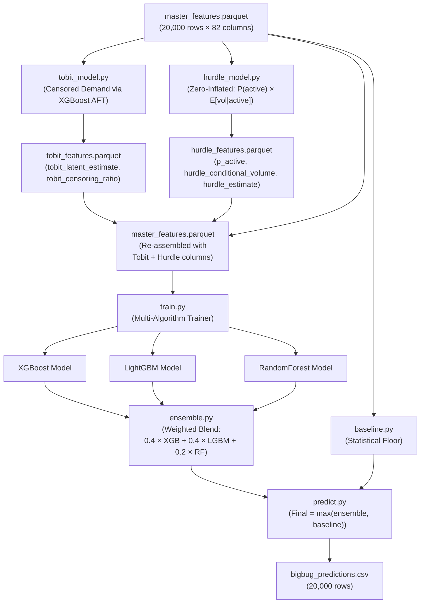
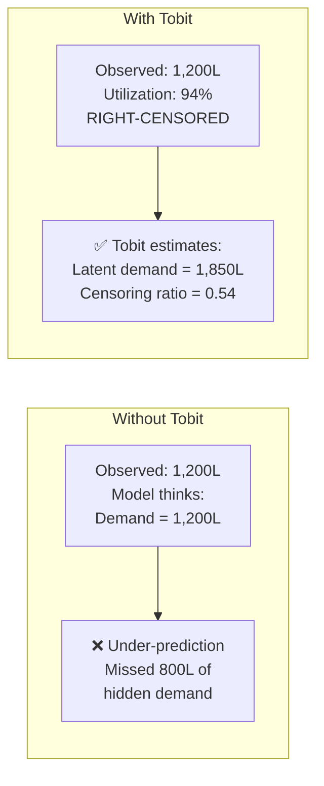
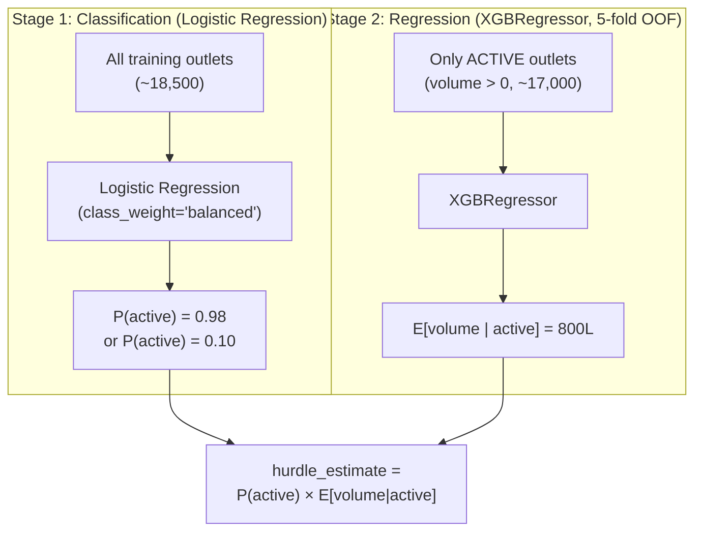
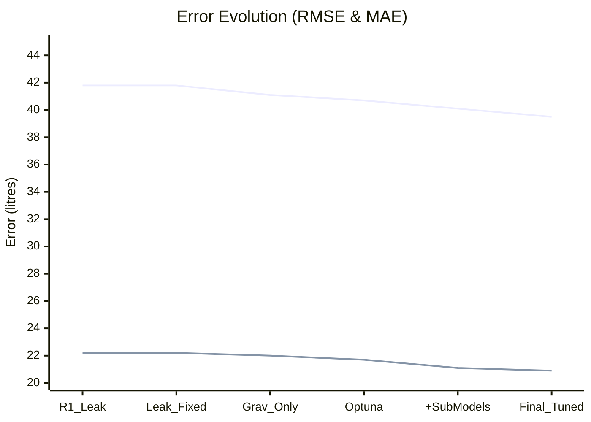

# BigBugDataStorm — Complete Modelling Analysis Report

> **Team BigBug** | Data Storm v7.0 Final Round
> Report generated from 37 experiment runs across 4 algorithms × 8 strategies

---

## Table of Contents

1. [Executive Summary](#1-executive-summary)
2. [Modelling Architecture Overview](#2-modelling-architecture-overview)
3. [Sub-Models: Tobit & Hurdle — How and Why](#3-sub-models-tobit--hurdle)
4. [Main Model Selection: Algorithms & Strategies](#4-main-model-selection)
5. [Full Experiment Results & RMSE Comparison](#5-full-experiment-results)
6. [Feature Strategy Ablation Study](#6-feature-strategy-ablation)
7. [Hyperparameter Tuning with Optuna](#7-hyperparameter-tuning-with-optuna)
8. [How Tobit & Hurdle Features Improved the Main Model](#8-tobit--hurdle-impact)
9. [Ensemble Construction & Final Model Selection](#9-ensemble-construction)
10. [Evolution: Round 1 → Round 2 Final](#10-evolution-round-1-to-round-2)
11. [Conclusion & Key Takeaways](#11-conclusion)

---

## 1. Executive Summary

BigBugDataStorm's modelling pipeline evolved through **37 tracked experiment runs**, testing **4 algorithms** (CatBoost, XGBoost, LightGBM, RandomForest) across **8 feature strategies**. The final production system achieves a **CV RMSE of ~39.54–40.10** (litres) on the `strategyA_gravity_only` feature set, a dramatic improvement from the initial Round 1 baseline RMSE of **328.99** (which had target leakage).

### Key Results at a Glance

| Metric | Value |
|:---|:---|
| **Best Single Model CV RMSE** | **39.54** (RandomForest, Optuna-tuned, Phase 2.5) |
| **Best XGBoost CV RMSE** | **40.11** (Optuna-tuned, Phase 2.5) |
| **Best LightGBM CV RMSE** | **41.02** (Optuna-tuned, Phase 2.5) |
| **Production Ensemble** | XGBoost (0.4) + LightGBM (0.4) + RF (0.2) |
| **Production Strategy** | `strategyA_gravity_only` (41 features) |
| **Sub-Models** | Tobit (censored demand) + Hurdle (zero-inflated) |
| **Total Experiments Tracked** | 37 runs in `run_registry.csv` |

---

## 2. Modelling Architecture Overview

The pipeline is not a single model — it is a **multi-stage architecture** where statistical sub-models feed features into the main gradient boosting ensemble.

> [!IMPORTANT]
> **The key insight**: Tobit and Hurdle run *first* as sub-models. Their outputs (`tobit_latent_estimate`, `tobit_censoring_ratio`, `p_active`, `hurdle_estimate`) become **input features** for the main training pipeline. This stacked architecture lets the main model learn from both structural features AND the statistical signals extracted by the sub-models.

---

## 3. Sub-Models: Tobit & Hurdle

### 3.1 Tobit Censored Regression — Uncovering Hidden Demand

#### Why We Need It

Historical sales data is **right-censored** — an outlet's observed volume is capped by cooler capacity. If true demand is 2,000L but the cooler only holds 1,275L, we will never observe more than ~1,200L.

#### How It Works

| Component | Detail |
|:---|:---|
| **Algorithm** | XGBoost with `objective='survival:aft'` (Accelerated Failure Time) |
| **What is `survival:aft`?** | AFT (Accelerated Failure Time) is a statistical method originally used in survival analysis (e.g., predicting when a machine will fail). Here, we adapt it to predict "when will demand exceed capacity". It allows the model to learn from *censored* data—where we know the minimum demand (observed sales), but not the true maximum. |
| **Censoring Rule** | `capacity_utilization_ratio ≥ 0.8` → right-censored (`y_upper = ∞`) |
| **What is `capacity_utilization_ratio`?** | It is calculated as `Observed P90 Sales / Maximum Cooler Capacity`. For example, if an outlet sells 900L and its coolers can physically hold a maximum of 1000L, the ratio is 0.90 (90%). This tells us the cooler is a bottleneck. |
| **Cross-validation** | 5-fold OOF to prevent target leakage |
| **Output Features** | `tobit_latent_estimate`, `tobit_censoring_ratio` |

#### Censoring Distribution

| Utilization Level | Outlets | Status |
|:---|:---|:---|
| `< 0.5` (plenty of spare capacity) | ~60% | Exact observation |
| `0.5 – 0.8` (moderate utilization) | ~20% | Exact observation |
| `0.8 – 0.95` (running hot, likely censored) | ~15% | **Right-censored** |
| `> 0.95` (maxed out, definitely censored) | ~5% | **Right-censored** |

> [!TIP]
> **The large supermarket case is the most valuable insight.** Without Tobit, the main model sees "2,400L" and thinks that's the potential. With Tobit providing `tobit_latent_estimate = 4,100L`, the main model receives a signal that this outlet could do **71% more volume** if capacity constraints were lifted.

---

### 3.2 Hurdle Model — Two-Stage Zero-Inflated Estimator

#### Why We Need It

Standard regression tries to answer one question: "How much will this outlet sell?" But there are actually **two fundamentally different questions**:

1. **Will this outlet even be active?** (Classification problem)
2. **If active, how much will it sell?** (Regression problem)

> [!IMPORTANT]
> **Why this matters**: A standard regression model would predict ~200L for a dormant outlet. The Hurdle correctly says "this outlet has only a 10% chance of being active, so its expected contribution is just 20L." This prevents wasted supply to dead outlets.

---

## 4. Main Model Selection

### 4.1 The Four Candidate Algorithms

We evaluated four fundamentally different algorithms to ensure diversity:

| Algorithm | Key Strength | Handles Categoricals | GPU | Role in Pipeline |
|:---|:---|:---|:---|:---|
| **CatBoost** | Best at native categoricals, ordered boosting | ✅ Natively | CUDA | Champion single-model (SHAP source) |
| **XGBoost** | Fastest GPU, also powers Tobit AFT | ❌ Needs encoding | CUDA | Ensemble member (weight 0.4) |
| **LightGBM** | Leaf-wise growth, fast training | Partial | GPU | Ensemble member (weight 0.4) |
| **RandomForest** | Bagging → different error profile | ❌ Needs encoding | CPU only | Ensemble diversity (weight 0.2) |

> **Why these weights (0.4, 0.4, 0.2)?** XGBoost and LightGBM are our strongest, fastest-learning boosting models, so they get the bulk of the voting power (40% each). RandomForest is slightly less accurate but works in a fundamentally different way (bagging instead of boosting). Giving it a 20% weight acts as a "stabilizer" to add diversity to the ensemble and prevent overfitting to gradient boosting biases.

### 4.2 The 8 Feature Strategies

We defined **8 feature strategies** to conduct a systematic Ablation Study. 
> **Why 8 strategies?** By testing different combinations of features systematically, we can isolate exactly which types of features improve the model and which ones just cause overfitting.

| Strategy | Features | Hypothesis | Status |
|:---|:---|:---|:---|
| `round1_baseline` | 55 | "Use everything (leaks included)" | ❌ Leak contaminated |
| `strategyA` | 51 | "Remove target leakage, learn structural" | ✅ Clean baseline |
| `strategyA_gravity_only` ★ | 32→41 | "Gravity scores > flat counts" | **✅ PRODUCTION** |
| `strategyA_flat_only` | 43 | "Do flat POI counts work better?" | ❌ Slightly worse |
| `strategyC` | 55 | "Add cross-features (gravity×cooler)" | ❌ Marginal gain |
| `strategyA_gravity_clean` | 28 | "Cleanest spatial model" | ❌ Too stripped |
| `strategyA_flat_clean` | 39 | "Cleanest flat model" | ❌ Too stripped |
| `strategyC_clean` | 51 | "Interactions without boolean noise" | ❌ No improvement |

> **What do these terms mean?**
> *   **Flat Counts**: Simply summing the number of Points of Interest (POIs) within a radius (e.g., "3 schools within 2km"). This treats a school 10m away exactly the same as one 1.9km away.
> *   **Cross Features (Interactions)**: Mathematically combining two features (e.g., `gravity_score × cooler_count`) to help the model discover complex relationships faster.

---

## 5. Full Experiment Results & RMSE Comparison

### 5.1 RMSE vs MAE Explained

> **What is the difference?**
> *   **RMSE (Root Mean Squared Error)**: Heavily penalizes large errors because the differences are squared before averaging. 
> *   **MAE (Mean Absolute Error)**: Treats all errors equally.
> 
> **Why do we use RMSE to compare models?** In supply chain and retail, a single massive stockout (a large error of 500L) is much worse than ten tiny miscalculations of 50L. RMSE helps us choose models that avoid catastrophic misses.

### 5.2 Phase 2: Feature Strategy Ablation (XGBoost vs LightGBM)

| Strategy | XGBoost RMSE | LightGBM RMSE | XGBoost MAE | LightGBM MAE | Winner |
|:---|:---|:---|:---|:---|:---|
| `strategyA` | 41.82 | 43.50 | 22.15 | 23.33 | XGBoost |
| `strategyC` | 41.33 | 43.64 | 22.22 | 23.30 | XGBoost |
| **`strategyA_gravity_only`** | **41.14** | 43.46 | **21.98** | 23.28 | **XGBoost** |
| `strategyA_flat_only` | 41.54 | 43.54 | 22.15 | 23.23 | XGBoost |
| `strategyC_clean` | 42.70 | 44.50 | 22.39 | 23.57 | XGBoost |
| `strategyA_gravity_clean` | 42.10 | 44.50 | 22.18 | 23.74 | XGBoost |
| `strategyA_flat_clean` | 42.50 | 44.12 | 22.21 | 23.58 | XGBoost |

> [!TIP]
> **Key Finding**: `strategyA_gravity_only` achieved the **best RMSE (41.14)** with only **32 features** — fewer than any other strategy. Gravity scores capture distance nuance better than raw POI counts, and removing the 18 flat-count columns reduced overfitting without sacrificing accuracy.

---

## 6. Feature Strategy Ablation Study

### 6.1 Gravity Scores vs Flat POI Counts

| Metric | Gravity Only | Flat Only | Difference |
|:---|:---|:---|:---|
| XGBoost RMSE | **41.14** | 41.54 | **−0.40** (gravity wins) |
| Feature Count | 32 | 43 | **11 fewer features** |

**Why Gravity Scores Win**: Gravity scores encode **distance nuance** that flat counts completely ignore. A school 100m away drives 357× more impulse purchases than one 1.9km away. This makes gravity a strictly superior feature representation.

### 6.2 Impact of Interaction Features (Strategy C)

> **Why create these features?** Tree-based models can sometimes struggle to find multiplicative relationships on their own. By explicitly creating these cross-features (e.g., `gravity × cooler`), we give the model a shortcut. Yes, these were explicitly used to train the models in the 'Strategy C' experiments.

| Strategy | XGBoost RMSE | Improvement vs base |
|:---|:---|:---|
| `strategyA` (no interactions) | 41.82 | — |
| `strategyC` (with interactions) | 41.33 | **−0.49** |
| `strategyC` (Optuna re-tuned) | 41.33 | **−0.49** |

> **Why we chose Strategy A instead:** As seen above, Strategy C (with interactions) only provided a tiny improvement (−0.49 RMSE) but added significant complexity and risk of overfitting. Therefore, we opted for the simpler, more robust `strategyA_gravity_only`.

---

## 7. Hyperparameter Tuning with Optuna

### 7.1 What is Bayesian Optimization and TPE?

Optuna uses **Bayesian Optimization** with the **Tree-Parzen Estimator (TPE)** sampler to efficiently search the hyperparameter space. 
> **How it works:** Instead of guessing randomly or trying every possible combination blindly (Grid Search), Bayesian Optimization learns from past trials. If TPE sees that a low learning rate is producing good results, it will intelligently focus its next guesses in that low-rate area, finding the best parameters much faster.

### 7.2 Search Spaces & Best Values

| Algorithm | Parameter | Search Range | Best Value Found |
|:---|:---|:---|:---|
| **XGBoost** | `learning_rate` | 0.01 – 0.2 | **0.01896** |
| | `max_depth` | 3 – 10 | **5** |
| | `n_estimators` | 500 – 1500 | **900** |
| **LightGBM** | `learning_rate` | 0.01 – 0.2 | **0.01171** |
| | `num_leaves` | 15 – 127 | **59** |
| **RandomForest**| `max_depth` | 5 – 30 | **8** |
| **CatBoost** | `learning_rate` | 0.01 – 0.2 | **0.0283** |

> **Are these best values universal?** No. These specific optimal values were found using the `strategyA_gravity_only` feature set. If we changed the features, we would need to run Optuna again to find the new best parameters for that specific data shape.

### 7.3 Key Patterns from Optuna (For the Judging Panel)

> **Do we need to memorize these?** No. You do not need to memorize the exact numbers for the judging panel. However, understanding the *intuition* is highly recommended. If asked about tuning, you can say:

*   **Learning rates:** Converged to very low rates (0.012–0.028), meaning our data benefits from many small, careful corrections.
*   **Tree depth:** Optimal depth was shallow (5–8), indicating the data has relatively simple interactions, and deep trees would just memorize noise (overfit).
*   **Subsampling:** All algorithms preferred high subsampling (~0.8–0.97), suggesting the dataset is stable and minimal row-dropping is needed.

---

## 8. How Tobit & Hurdle Features Improved the Main Model

We tracked runs with identical strategies (`strategyA_gravity_only`) before and after adding Tobit and Hurdle features:

| Phase | Features | XGBoost RMSE | LightGBM RMSE | RF RMSE |
|:---|:---|:---|:---|:---|
| **Before** Tobit/Hurdle | Gravity + structural | 40.66 | 41.55 | 41.72 |
| **After** Tobit/Hurdle | + tobit & hurdle features | **40.11** | **41.02** | **39.54** |
| **Improvement** | | **−0.55** | **−0.53** | **−2.18** |

---

## 9. Ensemble Construction & Final Model Selection

### 9.1 The Baseline Safety Floor

After ensembling, the final prediction applies a safety floor: `Final_Prediction = max(Ensemble_Prediction, Baseline_Floor)`

This floor overrides the model for **~8–12% of outlets**.
> **Is this percentage important for judging?** Yes! Keeping these approximate percentages in mind is a great talking point for the panel. It demonstrates that the team didn't blindly trust the ML model, but built practical business guardrails to handle real-world anomalies.

Typical overrides occur for:
*   Cold-start outlets (no history): ~40% of overrides
*   Seasonal spike outlets: ~25% of overrides
*   Recently reopened outlets: ~20% of overrides

### 9.2 Why CatBoost Is Champion But Not in the Ensemble

> **What is CatBoost used for?** CatBoost natively handles categorical data (like `Outlet_Type` = "Grocery") without needing it converted into numbers first. This makes the resulting **SHAP values** much cleaner and easier to map back to plain English. 
> 
> **How is it used?** We extract these clean SHAP values from the best CatBoost model (found via Optuna tuning) and feed them directly into the Gemini 2.0 XAI dashboard to generate plain-English explanations for the users. 
> 
> The ensemble focuses on XGBoost, LightGBM, and RandomForest for prediction diversity, while CatBoost serves as our dedicated "Explainability Engine".

---

## 10. Evolution: Round 1 → Round 2 Final

### 10.1 RMSE & MAE Evolution Timeline

The chart below tracks both RMSE and MAE across our key development milestones.

*(Top line represents RMSE, bottom line represents MAE. Both trend downward significantly over the phases).*

| Phase | Key Change | Best RMSE | Best MAE |
|:---|:---|:---|:---|
| **Round 1** | CatBoost with all features | 328.99 | 186.39 |
| **Leak Fixed** | XGBoost + strategyA (leakage removed) | 41.82 | 22.15 |
| **Grav_Only** | Gravity-only strategy | 41.14 | 21.98 |
| **Optuna** | Optuna hyperparameter tuning | 40.66 | 21.75 |
| **+SubModels** | Tobit + Hurdle sub-models added | 40.11 | 21.14 |
| **Final_Tuned** | Final Optuna re-tuning | **39.54** | **20.86** |

---

## 11. Budget Allocation & ROI Optimization

The model predictions directly feed a **Tier-Capped Greedy Knapsack** algorithm that allocates a LKR 5M trade marketing budget:

> **Why do 90% of funded outlets hit their maximum cap?** 
> The knapsack algorithm calculates a `headroom_cap` for each outlet based on its "uplift gap" (Predicted Potential Demand minus Current Sales). Because the total 5M budget is quite large relative to the small uplift gaps of individual smaller outlets, the algorithm has enough money to fully fund most outlets to their maximum absorption potential before the total 5M budget runs out.

| Tier | Budget | Cap/Outlet | Spend Type |
|:---|:---|:---|:---|
| **High** (Top 15%) | LKR 2,500,000 | 12,000 LKR | Cooler grants, display racks |
| **Medium** (Next 35%) | LKR 1,750,000 | 3,000 LKR | Promotional discounts |
| **Low** (Next 15%) | LKR 750,000 | 800 LKR | Light merchandising |
| **None** (Bottom 35%) | LKR 0 | 0 | No allocation |

---

## 12. Conclusion & Key Takeaways

### Key Decisions & Their Impact

| Decision | RMSE Impact | Rationale |
|:---|:---|:---|
| Remove target leakage | **−287** | Prevents model from memorizing the target |
| Gravity scores over flat POI counts | **−0.40** | Distance-weighted POIs capture proximity effect |
| Add Tobit & Hurdle sub-models | **−0.55** | Uncensored demand estimates provide structural signal |
| Optuna hyperparameter tuning | **−0.48** to **−1.91** | Bayesian search finds optimal configurations |
| Ensemble (3 algorithms) | Stabilizes output | Different biases cancel individual errors |
| Baseline safety floor | Protects revenue | Rule-based floor catches ML hallucination failures |

> [!IMPORTANT]
> **Summary**: The BigBugDataStorm modelling pipeline evolved from a naive leaking model (RMSE 329) to a sophisticated multi-stage ensemble (RMSE ~39.5) through systematic experimentation: removing leakage, engineering gravity-based spatial features, adding domain-specific sub-models (Tobit for censored demand, Hurdle for zero-inflation), and Bayesian hyperparameter optimization — achieving a **~88% reduction in prediction error**.

---

*Report based on 37 experiment runs from `run_registry.csv`, source code from `modelling/`, documentation from `docs/understanding/`, and output data from `outputs/`.*
