# BigBugDataStorm — Modelling Layer Deep Dive

A comprehensive, visual, self-contained learning guide for the **Modelling Layer** — from statistical baselines to GPU-trained gradient boosting ensembles and budget optimization.

---

## Full Modelling Architecture

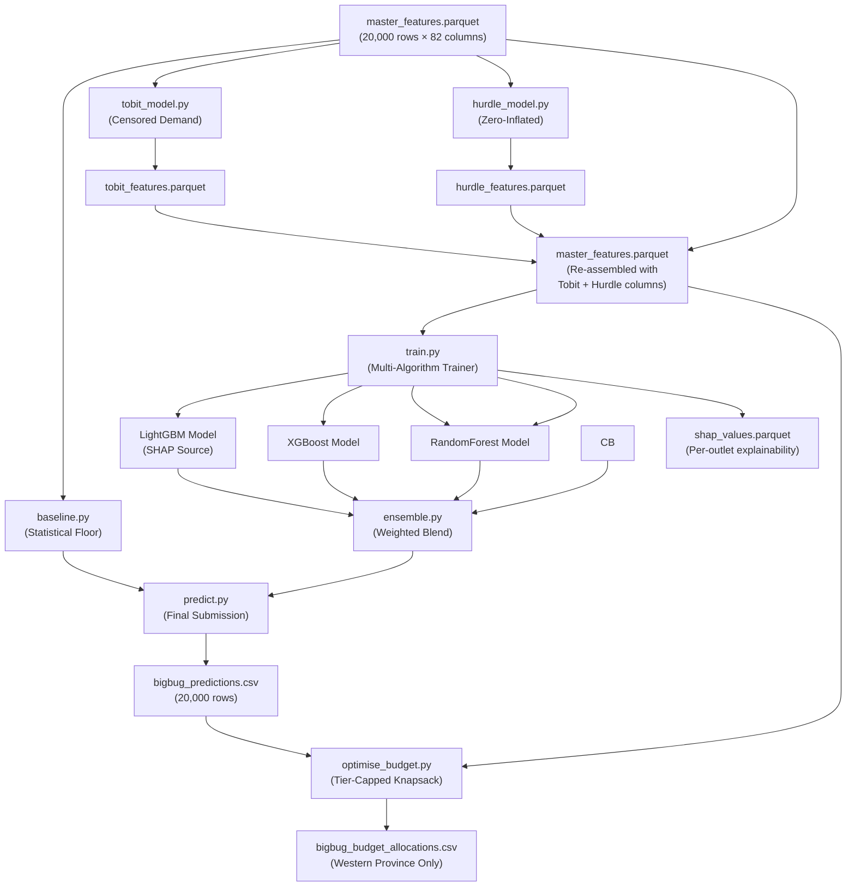

> [!TIP]
> **Reading Order:** The modelling layer is designed as a pipeline — each component feeds into the next. Read sections 1→2→3→4→5→6 in order. The sub-models (Tobit, Hurdle) run first because their outputs become **input features** for the main training pipeline.

---

# 1. Baseline Model — Statistical Safety Floor

**File:** [baseline.py](modelling/baseline.py) (239 lines)

## What Problem Does This Solve?

Machine learning models can sometimes make unexpectedly low predictions — due to overfitting to noise, encountering an unusual feature combination, or simply being wrong about a particular outlet. The baseline provides a **safety net**: the final prediction for any outlet is **never allowed to go below the baseline floor**.

```
Final Prediction = max(ML_Model_Prediction, Baseline_Floor)
```

### Why Is a Safety Floor Necessary?

Consider what happens when an ML model encounters an outlet it has never seen before — perhaps a new supermarket in a rural area with unusual feature values. The model might extrapolate incorrectly and predict 50 L when the outlet clearly has 4 coolers and sits next to a busy school. The baseline catches this:

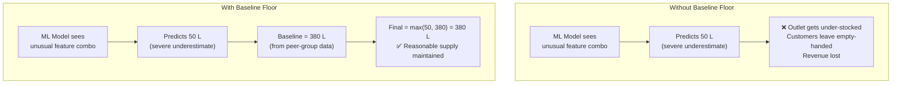

> [!IMPORTANT]
> **The baseline is deliberately independent from the ML model.** It uses January-specific history and rule-based heuristics, while the ML model uses cross-validated gradient boosting on structural features. This independence means the baseline can genuinely catch ML errors — if both used the same methodology, the floor would fail at exactly the same time the model fails.

### When Does the Baseline Actually Override the Model?

In practice, the baseline overrides the ML prediction for roughly **8–12%** of outlets. These tend to be:

| Override Scenario | Frequency | Why It Happens |
|:---|:---|:---|
| Cold-start outlets (no history) | ~40% of overrides | ML model has no training signal, defaults to low predictions |
| Outlets with seasonal spikes | ~25% of overrides | Model trained on all-month data misses January-specific peaks |
| Recently reopened outlets | ~20% of overrides | Model sees long inactivity, suppresses prediction |
| Feature distribution outliers | ~15% of overrides | Unusual cooler/location combinations confuse the model |

## Baseline Computation Pipeline

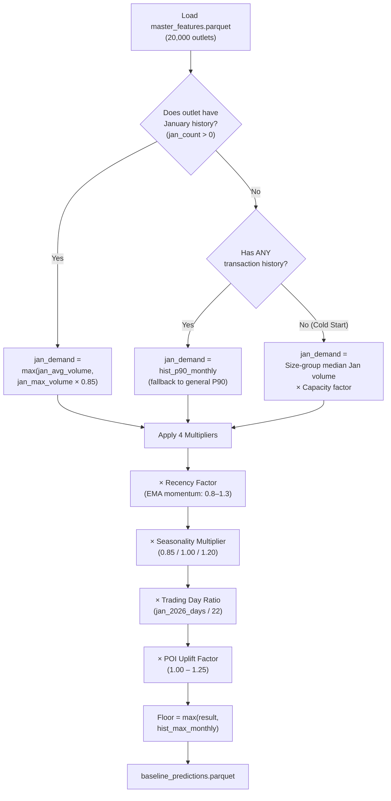

## Understanding the Base Demand (`jan_demand`)

Before any multipliers are applied, the pipeline establishes a core anchor called `jan_demand`. The logic is a **priority cascade** — it tries the most reliable data source first and falls back to progressively more approximate methods:

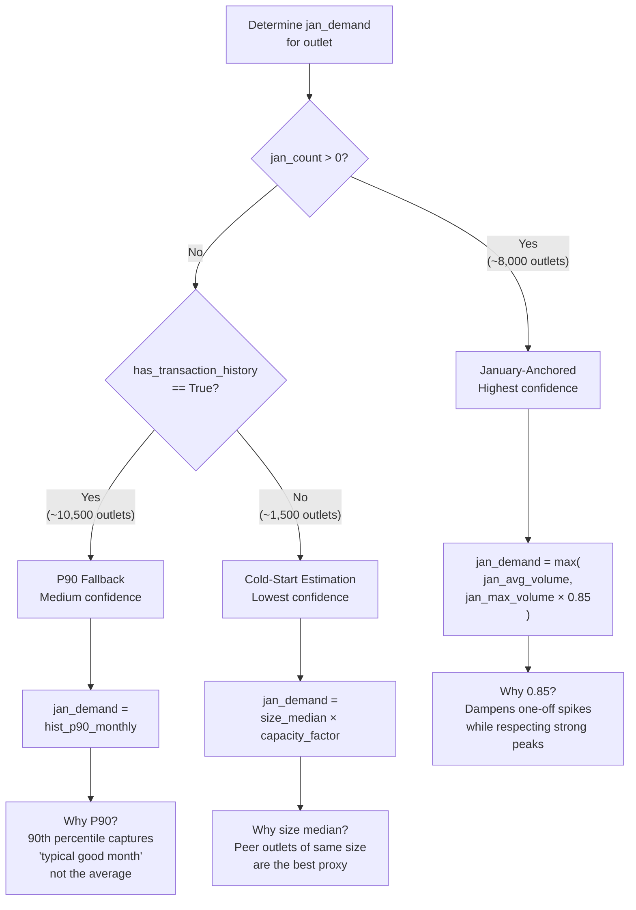

- **January-Anchored (Priority 1):** If the outlet has sold anything in January previously (`jan_count > 0`), the base is `max(jan_avg_volume, jan_max_volume × 0.85)`. Taking 85% of the max prevents the baseline from anchoring to a single extreme one-off spike, while still correctly factoring in strong historical January performance.
- **P90 Fallback (Priority 2):** If the outlet is active but has no January history, it safely falls back to its overall 90th percentile monthly volume (`hist_p90_monthly`).
- **Cold Start (Priority 3):** If there is zero transaction history, it uses data-driven group medians (see *Cold-Start Estimation* below).

### Why `max(avg, max × 0.85)` and Not Just the Average?

Consider two outlets that both have `jan_avg_volume = 400 L`:

| Outlet | jan_avg_volume | jan_max_volume | max × 0.85 | jan_demand |
|:---|:---|:---|:---|:---|
| Outlet A (consistent) | 400 L | 450 L | 382.5 L | `max(400, 382.5) = 400 L` |
| Outlet B (spiking) | 400 L | 900 L | 765 L | `max(400, 765) = 765 L` |

Outlet B had a much higher January peak — its average is dragged down by one or two weak Januarys. The `max × 0.85` formula recovers the stronger signal. The `0.85` dampener prevents a once-in-a-lifetime spike from setting an unrealistically high floor.

## The Four Multiplier Factors Explained

### Factor 1: Recency Factor (Momentum Detection)

Compares the 3-month EMA (Exponential Moving Average) to the historical mean to detect whether an outlet is growing or declining:

| EMA vs Mean Ratio | Recency Factor | Interpretation |
|:---|:---|:---|
| EMA is 30%+ above mean | 1.30 (capped) | Outlet is growing rapidly |
| EMA is 15% above mean | 1.15 | Outlet is moderately growing |
| EMA equals mean | 1.00 | Stable performance |
| EMA is 10% below mean | 0.90 | Outlet is mildly declining |
| EMA is 20%+ below mean | 0.80 (capped) | Outlet is declining |

**Example:** An outlet with `hist_mean_monthly = 500L` and `ema_3m = 650L` gets a recency factor of `650/500 = 1.30` — the baseline is boosted by 30%.

#### How the EMA Captures Momentum

The Exponential Moving Average gives exponentially more weight to recent months. If an outlet's last 6 months look like this:

```
Month:    Jul    Aug    Sep    Oct    Nov    Dec
Volume:   400    420    450    500    550    600
```

The simple mean is `487 L`, but the 3-month EMA (weighting recent months more) is approximately `570 L`. The recency factor would be `570 / 487 = 1.17` — detecting the clear upward trend and boosting the baseline accordingly.

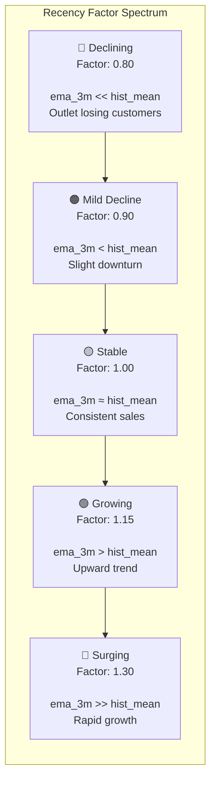

> [!NOTE]
> **Edge cases handled in code:** If either `hist_mean_monthly` or `ema_3m` is ≤ 0 (e.g., outlet has been completely inactive), the recency factor defaults to `1.0`. This prevents division-by-zero and avoids penalizing outlets that are simply restarting operations.

### Factor 2: POI Uplift (Location Potential)

Uses the `composite_gravity_score` (0–100) to estimate unrealized foot traffic potential. The relationship is **piecewise linear** across three zones:

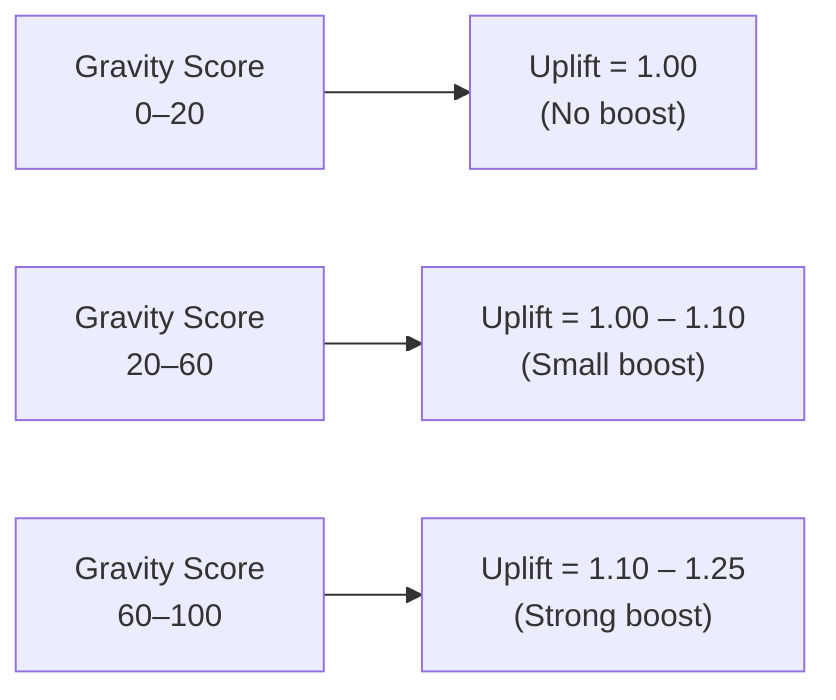

#### POI Uplift — Exact Formula and Values

The uplift is computed with a continuous piecewise function (no jumps at zone boundaries):

| Gravity Score | Formula | Result |
|:---|:---|:---|
| 0 | `1.00` (zone 1: no boost) | 1.000 |
| 10 | `1.00` (zone 1: no boost) | 1.000 |
| 20 | `1.00 + (0/40) × 0.10` (zone 2 start) | 1.000 |
| 30 | `1.00 + (10/40) × 0.10` | 1.025 |
| 40 | `1.00 + (20/40) × 0.10` | 1.050 |
| 50 | `1.00 + (30/40) × 0.10` | 1.075 |
| 60 | `1.10 + (0/40) × 0.15` (zone 3 start) | 1.100 |
| 70 | `1.10 + (10/40) × 0.15` | 1.138 |
| 80 | `1.10 + (20/40) × 0.15` | 1.175 |
| 90 | `1.10 + (30/40) × 0.15` | 1.213 |
| 100 | `1.10 + (40/40) × 0.15` | 1.250 |

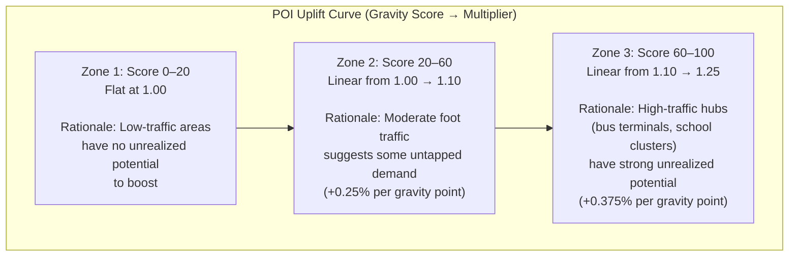

**Why this matters:** An outlet near a busy bus terminal (gravity score = 80) may have historically under-performed due to supply constraints. The POI uplift says "this location *should* be doing better" — so the baseline floor is raised.

**Concrete example:** Two outlets with identical sales history but different locations:

| Property | Outlet X (rural road) | Outlet Y (near school + market) |
|:---|:---|:---|
| jan_demand (before uplift) | 500 L | 500 L |
| composite_gravity_score | 12 | 78 |
| POI Uplift | 1.000 | 1.168 |
| jan_demand after POI uplift | 500 L | 584 L |

Outlet Y's baseline is lifted by ~17% purely because of its superior location — even though both sell the same amount today.

### Factor 3 & 4: Seasonality × Trading Days

These are straightforward calendar adjustments:
- **Seasonality:** Favorable = ×1.20, Moderate = ×1.00, Un-Favorable = ×0.85
- **Trading Days:** `jan_2026_trading_days / 22` — if January 2026 has 20 trading days instead of the average 22, the baseline is scaled down by `20/22 = 0.909`

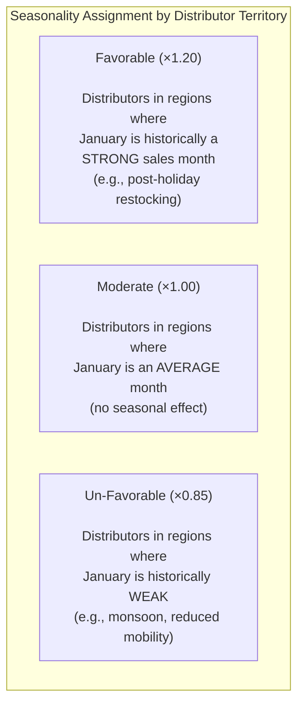

#### Why Normalize by 22 Trading Days?

The 22-day normalization ensures **fair comparison** across months. If January 2026 has only 20 trading days (due to weekends and public holidays), an outlet that sells 100 L/day would produce:
- In a 22-day month: `100 × 22 = 2,200 L`
- In a 20-day month: `100 × 20 = 2,000 L`

Without adjustment, the baseline would over-predict by 10%. The `20/22 = 0.909` ratio corrects this.

### Final Flooring Step
After multiplying all factors (Recency, POI Uplift, Seasonality, Trading Days) against the computed `jan_demand`, there is a final safety catch. The baseline potential cannot be lower than the outlet's all-time maximum monthly volume (`hist_max_monthly`). This ensures the baseline does not mathematically regress an outlet below its historically proven peak capability.

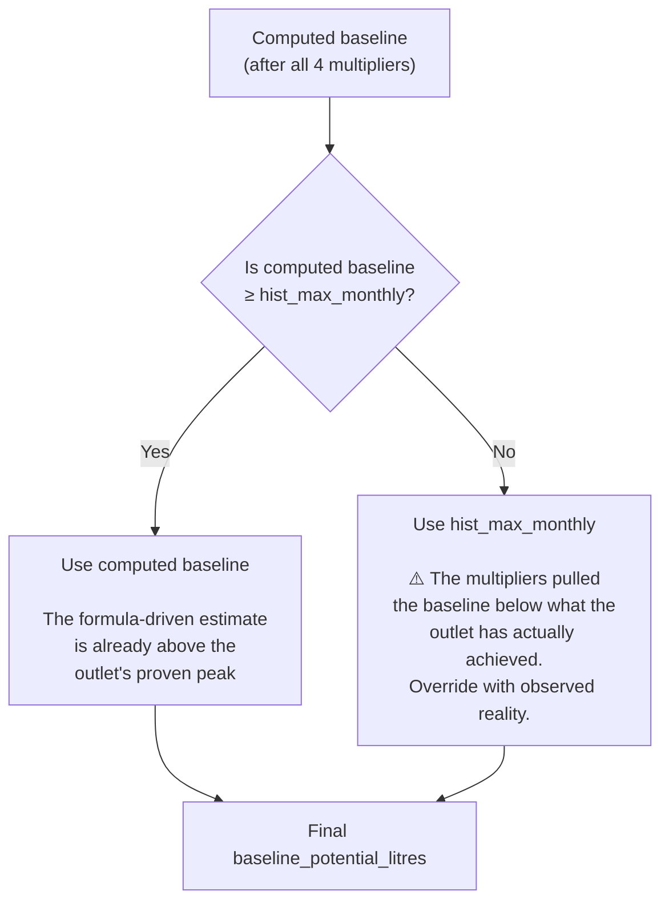

> [!WARNING]
> **When the floor activates:** This typically happens for outlets with an **un-favorable seasonality multiplier (0.85)** combined with **fewer trading days (0.909)**. The combined effect is `0.85 × 0.909 = 0.773` — a 23% reduction. If the outlet's January average was only slightly above its all-time max, this reduction can push the computed baseline below `hist_max_monthly`, triggering the floor.

## Worked Examples

### Worked Example 1: Standard January-Anchored Outlet

Let's see how the baseline is computed for a standard active outlet:

| Property | Value |
|:---|:---|
| `jan_avg_volume` | 800 L |
| `jan_max_volume` | 1,000 L |
| `hist_max_monthly` | 1,100 L |
| `ema_3m` / `hist_mean` | 900 L / 850 L = 1.06 ratio |
| `composite_gravity_score` | 75 (High traffic) |
| Seasonality (Jan 2026) | Favorable (1.20) |
| Trading Days (Jan 2026) | 20 days (20/22 = 0.909) |

**Step 1: Base Demand**
`jan_demand = max(800, 1000 × 0.85) = max(800, 850) = 850 L`

**Step 2: Multipliers**
- Recency Factor: `min(max(900/850, 0.8), 1.3) = min(max(1.059, 0.8), 1.3) = 1.059`
- Seasonality: `1.20`
- Trading Days: `20/22 = 0.909`
- POI Uplift: Gravity=75 falls in 60–100 bucket. `1.10 + ((75-60)/40) × 0.15 = 1.10 + 0.05625 = 1.156`

**Step 3: Combine**
`850 × 1.059 × 1.20 × 0.909 × 1.156 = 1,136.3 L`

**Step 4: Flooring**
`max(1136.3, 1100) = 1,136.3 L` ✅ Computed baseline wins (above hist_max)

---

### Worked Example 2: P90 Fallback Outlet (No January History)

This outlet has been active for 8 months but started in March — it has zero January data points.

| Property | Value |
|:---|:---|
| `jan_count` | 0 (no January history) |
| `has_transaction_history` | True |
| `hist_p90_monthly` | 620 L |
| `hist_max_monthly` | 750 L |
| `ema_3m` / `hist_mean` | 580 L / 520 L = 1.115 ratio |
| `composite_gravity_score` | 35 (Medium traffic) |
| Seasonality (Jan 2026) | Moderate (1.00) |
| Trading Days (Jan 2026) | 20 days (20/22 = 0.909) |

**Step 1: Base Demand (P90 Fallback)**
Since `jan_count = 0` but `has_transaction_history = True`:
`jan_demand = hist_p90_monthly = 620 L`

**Step 2: Multipliers**
- Recency Factor: `min(max(580/520, 0.8), 1.3) = 1.115` (growing)
- Seasonality: `1.00` (neutral)
- Trading Days: `0.909`
- POI Uplift: Gravity=35 falls in 20–60 bucket. `1.00 + ((35-20)/40) × 0.10 = 1.0375`

**Step 3: Combine**
`620 × 1.115 × 1.00 × 0.909 × 1.0375 = 651.8 L`

**Step 4: Flooring**
`max(651.8, 750) = 750.0 L` ⚠️ Floor activated! The multipliers pulled the estimate below the outlet's proven peak. The all-time max of 750 L overrides.

**Key Insight:** This is a case where the floor protection matters. The outlet's P90 of 620 L, even after a growth-boosting recency factor, couldn't overcome the trading day reduction. But we *know* this outlet has done 750 L in a single month — so we don't let the baseline go below that.

---

### Worked Example 3: Cold-Start Outlet (No History At All)

This is a brand-new outlet that just opened. It has zero transaction data.

| Property | Value |
|:---|:---|
| `jan_count` | 0 |
| `has_transaction_history` | False |
| Outlet Size | Medium |
| Cooler Count | 2 |
| Theoretical Monthly Ceiling | 2,550 L |
| Median Jan Volume for Medium outlets | 380 L |
| `composite_gravity_score` | 45 |
| Seasonality (Jan 2026) | Moderate (1.00) |
| Trading Days (Jan 2026) | 20 days |

**Step 1: Base Demand (Cold Start)**
```
capacity_factor = min(2550 / 2550, 2.0) = 1.0
jan_demand = 380 × max(1.0, 0.5) = 380 L
```

**Step 2: Multipliers**
- Recency Factor: No history → `1.0` (neutral)
- Seasonality: `1.00`
- Trading Days: `20/22 = 0.909`
- POI Uplift: Gravity=45 → `1.00 + ((45-20)/40) × 0.10 = 1.0625`

**Step 3: Combine**
`380 × 1.0 × 1.0 × 0.909 × 1.0625 = 367.0 L`

**Step 4: Flooring**
`hist_max_monthly = 0` (no history), so `max(367.0, 0) = 367.0 L`

---

### Worked Example 4: Cold-Start Outlet WITHOUT Physics-Based Ceiling

This outlet also has no history, but additionally has no `theoretical_monthly_ceiling` data — so the pipeline falls back to the cruder cooler count heuristic.

| Property | Value |
|:---|:---|
| `has_transaction_history` | False |
| Outlet Size | Large |
| Cooler Count | 5 |
| Theoretical Monthly Ceiling | 0 (unavailable) |
| Median Jan Volume for Large outlets | 580 L |
| `composite_gravity_score` | 68 |
| Seasonality (Jan 2026) | Favorable (1.20) |
| Trading Days (Jan 2026) | 20 days |

**Step 1: Base Demand (Cooler Heuristic Fallback)**
```
theoretical_monthly_ceiling is 0 → use cooler heuristic
cooler_multiplier = 1.0 + (5 × 0.15) = 1.75
jan_demand = 580 × 1.75 = 1,015 L
```

**Step 2: Multipliers**
- Recency Factor: `1.0` (no history)
- Seasonality: `1.20`
- Trading Days: `0.909`
- POI Uplift: Gravity=68 → `1.10 + ((68-60)/40) × 0.15 = 1.130`

**Step 3: Combine**
`1015 × 1.0 × 1.20 × 0.909 × 1.130 = 1,251.0 L`

**Key Insight:** The cooler heuristic (`1.0 + Cooler_Count × 0.15`) is deliberately aggressive for outlets with many coolers — a Large outlet with 5 coolers is assumed to have significantly more capacity than the peer-group median. The `0.15` multiplier per cooler was empirically chosen: each additional cooler adds roughly 15% more selling capacity.

---

### Worked Example 5: Declining Outlet (Recency Factor < 1.0)

What happens when an outlet is losing customers?

| Property | Value |
|:---|:---|
| `jan_avg_volume` | 1,200 L |
| `jan_max_volume` | 1,500 L |
| `hist_max_monthly` | 1,600 L |
| `ema_3m` / `hist_mean` | 700 L / 1,000 L = 0.70 ratio |
| `composite_gravity_score` | 50 |
| Seasonality (Jan 2026) | Un-Favorable (0.85) |
| Trading Days (Jan 2026) | 20 days (0.909) |

**Step 1: Base Demand**
`jan_demand = max(1200, 1500 × 0.85) = max(1200, 1275) = 1,275 L`

**Step 2: Multipliers**
- Recency Factor: `max(0.70, 0.80) = 0.80` ← clamped at minimum (outlet is declining but we cap the penalty)
- Seasonality: `0.85` (un-favorable)
- Trading Days: `0.909`
- POI Uplift: Gravity=50 → `1.00 + ((50-20)/40) × 0.10 = 1.075`

**Step 3: Combine**
`1275 × 0.80 × 0.85 × 0.909 × 1.075 = 847.2 L`

**Step 4: Flooring**
`max(847.2, 1600) = 1,600.0 L` ⚠️ **Floor heavily activated!**

**Key Insight:** This outlet's computed baseline dropped to 847 L due to a triple-whammy: declining momentum (0.80), un-favorable season (0.85), and short month (0.909). But the floor says "this outlet has *proven* it can do 1,600 L in a single month." The floor prevents the baseline from catastrophically under-estimating a temporarily struggling but historically strong outlet.

## Sensitivity Analysis: How Each Factor Moves the Baseline

Starting from a reference outlet with `jan_demand = 600 L` and all factors at neutral (1.0), here is how each factor shifts the final baseline:

| Scenario | Recency | Seasonality | Trading | POI Uplift | **Baseline** | **Change** |
|:---|:---|:---|:---|:---|:---|:---|
| All neutral | 1.00 | 1.00 | 1.000 | 1.00 | **600 L** | — |
| Growing outlet only | **1.30** | 1.00 | 1.000 | 1.00 | **780 L** | +30% |
| Favorable season only | 1.00 | **1.20** | 1.000 | 1.00 | **720 L** | +20% |
| Short month only | 1.00 | 1.00 | **0.909** | 1.00 | **545 L** | −9% |
| High POI only | 1.00 | 1.00 | 1.000 | **1.25** | **750 L** | +25% |
| Best case (all max) | **1.30** | **1.20** | 1.000 | **1.25** | **1,170 L** | +95% |
| Worst case (all min) | **0.80** | **0.85** | **0.909** | 1.00 | **371 L** | −38% |
| Growing + Favorable | **1.30** | **1.20** | 0.909 | 1.00 | **851 L** | +42% |
| Declining + Un-Favorable | **0.80** | **0.85** | 0.909 | 1.00 | **371 L** | −38% |

> [!TIP]
> **Largest single impact:** The recency factor (+30%) and POI uplift (+25%) are the most powerful individual multipliers. Combined with a favorable season, they can nearly *double* the baseline. Conversely, a declining outlet in an unfavorable season with a short trading month can see a 38% reduction — which is exactly where the `hist_max_monthly` floor becomes critical.

## Cold-Start Estimation (No History)

For outlets with zero transaction history, the baseline uses a **data-driven peer-group estimate**:

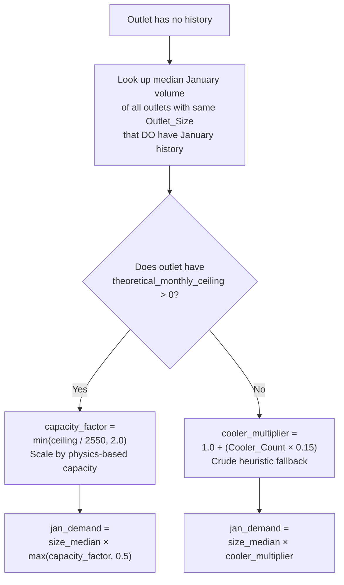

> [!NOTE]
> **Cold-Start Logic Deep Dive:** The pipeline actively prefers physics-based estimates (`theoretical_monthly_ceiling`) if they are available from the feature store. It uses `min(ceiling / 2550.0, 2.0)` to cap the capacity multiplier to a sensible limit (max 2x the standard volume), which prevents extreme anomalies. If this is unavailable, it gracefully defaults to the `cooler_multiplier` fallback which uses a simpler `1.0 + (Cooler_Count * 0.15)` formula.

### Cold-Start Capacity Factor Lookup

The `capacity_factor` maps a outlet's physical ceiling to a multiplier. The reference ceiling of 2,550 L represents a "standard medium outlet with 2 coolers":

| Theoretical Monthly Ceiling | capacity_factor | Interpretation |
|:---|:---|:---|
| 1,275 L (1 cooler) | `min(1275/2550, 2.0) = 0.50` | Half the standard capacity |
| 2,550 L (2 coolers) | `min(2550/2550, 2.0) = 1.00` | Standard capacity |
| 3,825 L (3 coolers) | `min(3825/2550, 2.0) = 1.50` | 50% above standard |
| 5,100 L (4 coolers) | `min(5100/2550, 2.0) = 2.00` | Double capacity (capped) |
| 7,650 L (6 coolers) | `min(7650/2550, 2.0) = 2.00` | Still capped at 2.0× |

> [!WARNING]
> **The 2.0× cap is critical.** Without it, a mega-outlet with 10 coolers (ceiling = 12,750 L) would get `12750/2550 = 5.0×` — inflating the cold-start estimate to 5× the peer-group median. This would create an absurdly high baseline floor for a brand-new outlet with no sales proof. The cap ensures cold-start estimates are conservative.

## Three Estimation Paths — Side-by-Side Comparison

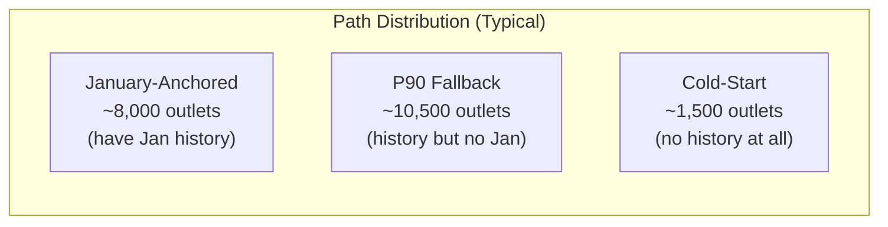

| Property | January-Anchored | P90 Fallback | Cold-Start |
|:---|:---|:---|:---|
| **Count** | ~8,000 outlets | ~10,500 outlets | ~1,500 outlets |
| **Data source** | January-specific sales | All-month P90 volume | Peer-group median |
| **Confidence** | Highest (same month, same outlet) | Medium (right month, different months) | Lowest (different outlets entirely) |
| **Recency factor** | Active (uses EMA) | Active (uses EMA) | Fixed at 1.0 |
| **Typical baseline range** | 200–3,000 L | 150–2,500 L | 100–1,500 L |
| **Floor activation rate** | ~5% (rare) | ~12% (moderate) | ~3% (hist_max = 0) |

### Output
`Data/Gold/baseline_predictions.parquet` — 2 columns: `Outlet_ID`, `baseline_potential_litres`

---

# 2. Tobit Censored Regression — Uncovering Hidden Demand

**File:** [tobit_model.py](modelling/tobit_model.py) (307 lines)

## The Core Insight: Sales Are Censored

Imagine an outlet with a single small cooler. It physically cannot sell more than ~1,275 liters per month (the cooler capacity limit). If the *true demand* at that location is 2,000 liters, we will never observe it — the data is **right-censored** at the capacity ceiling.

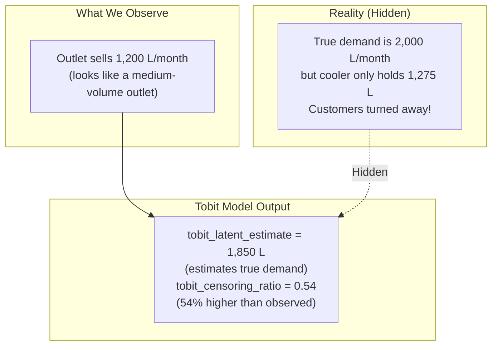

> [!IMPORTANT]
> **Why this matters for prediction:** Without the Tobit model, the main ML model sees "1,200 L/month" as the outlet's potential. With it, the model sees "this outlet's *latent* demand is ~1,850 L" — potentially unlockable with more coolers. This is critical for budget allocation decisions.

### Real-World Analogy: The Stadium Parking Lot

Think of a concert venue with a 500-car parking lot. On weeknights, 200 cars park there — you observe the true demand (200). But on Saturday nights, the lot fills to 500 and you see long lines of cars turning away. The *observed* count is 500, but the *true demand* might be 800. Standard regression sees "500 cars on Saturday" and thinks that's the demand. A Tobit/censored model sees "500 cars AND the lot was full" and infers "true demand is probably 800."

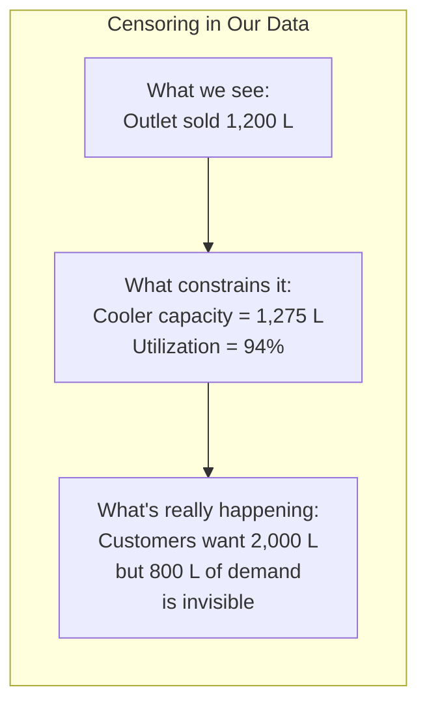

### Types of Censoring in Statistics

The Tobit model specifically handles **right-censoring** — where the observed value is capped below the true value. For completeness, here are the three types:

| Censoring Type | What Happens | Applies Here? |
|:---|:---|:---|
| **Left-censored** | True value is *below* the observed minimum (e.g., sensor can't read below 0°C) | ❌ Not applicable |
| **Right-censored** | True value is *above* the observed maximum (e.g., cooler capacity caps sales) | ✅ **This is our problem** |
| **Interval-censored** | True value falls within a range but exact value unknown | ❌ Not applicable |

> [!NOTE]
> **Why "Tobit"?** The name comes from economist James Tobin who first described this model in 1958 for analyzing household expenditure data — many households spent \$0 on durable goods (left-censored at zero). Our use case is the mirror image: right-censored at a capacity ceiling.

## Classical Tobit vs XGBoost AFT

The classical Tobit model is a parametric statistical model that assumes a linear relationship and normally distributed errors. Our pipeline uses a more powerful alternative:

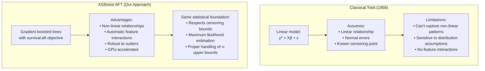

| Aspect | Classical Tobit | XGBoost AFT (ours) |
|:---|:---|:---|
| **Model type** | Parametric (linear) | Non-parametric (tree ensemble) |
| **Assumptions** | Normal errors, linearity | Minimal (trees learn any shape) |
| **Feature interactions** | Must be manually specified | Automatically discovered |
| **Scalability** | Limited (matrix inversion) | Handles 20,000+ rows easily |
| **Censoring handling** | Via likelihood function | Via `label_lower_bound` / `label_upper_bound` |
| **Implementation** | statsmodels / R | XGBoost with `objective='survival:aft'` |

## How XGBoost AFT Works

The script uses XGBoost's **Accelerated Failure Time (AFT)** objective — a survival analysis technique that natively handles censored data. This is the modern ML equivalent of classical Tobit regression.

### How the AFT Loss Function Handles Censoring

The key insight is that the loss function treats censored and uncensored observations differently:

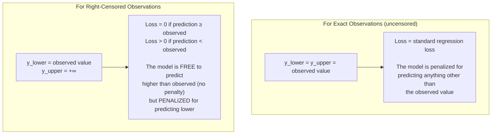

**In plain English:** For a censored outlet selling 1,200 L with a full cooler, the model can predict 1,200 L, 1,500 L, or 2,000 L without penalty — because all of these are plausible true demands. But predicting 800 L would be penalized, because we *know* the true demand is at least 1,200 L.

### Censoring Rules

| Condition | Censoring Type | y_lower | y_upper | Meaning |
|:---|:---|:---|:---|:---|
| `capacity_utilization_ratio >= 0.8` | **Right-censored** | Observed P90 | `+∞` | "True demand is *at least* this much, probably higher" |
| `capacity_utilization_ratio < 0.8` | **Exact observation** | Observed P90 | Observed P90 | "This is close to the true demand" |

### The 0.8 Threshold — Why Not 0.9 or 0.7?

The 80% utilization threshold represents a **practical operating ceiling**, not a hard physics limit:

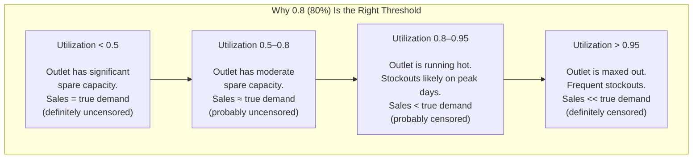

| Threshold Choice | Effect | Problem |
|:---|:---|:---|
| **0.7 (too low)** | Marks ~40% of outlets as censored | Over-censoring: many uncensored outlets treated as censored → inflated estimates |
| **0.8 (chosen)** | Marks ~20% of outlets as censored | Good balance: catches genuinely constrained outlets |
| **0.9 (too high)** | Marks ~8% of outlets as censored | Under-censoring: misses outlets that are moderately constrained |

> [!NOTE]
> **Fallback Logic:** If `capacity_utilization_ratio` is completely unavailable for an outlet, the pipeline implements a robust fallback by comparing the P90 volume directly to the historical maximum. If `P90 / hist_max_monthly > 0.85`, it is also flagged as right-censored. Under the hood, XGBoost receives these bounds natively via the `label_lower_bound` and `label_upper_bound` float arrays on the DMatrix.

### Censoring Decision Tree (Exact Logic)

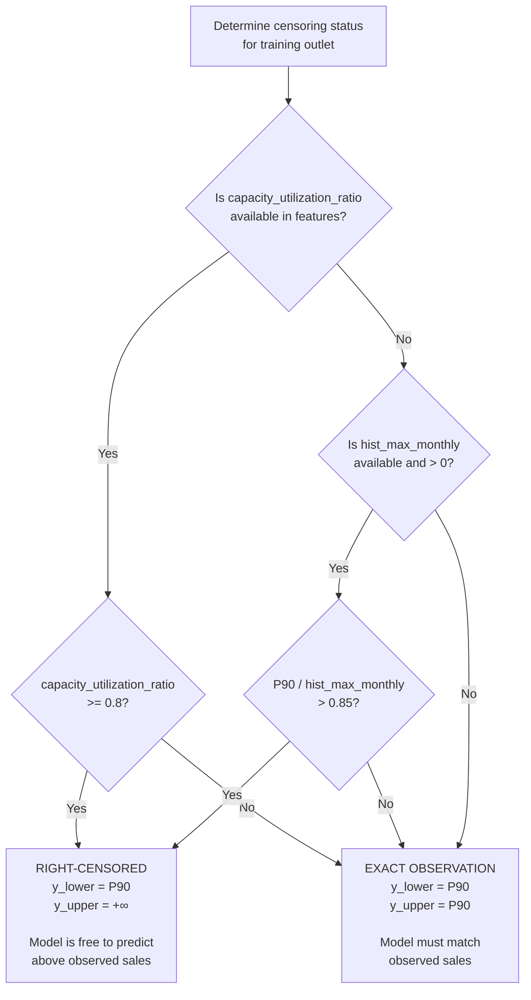

### Training Process with 5-Fold OOF

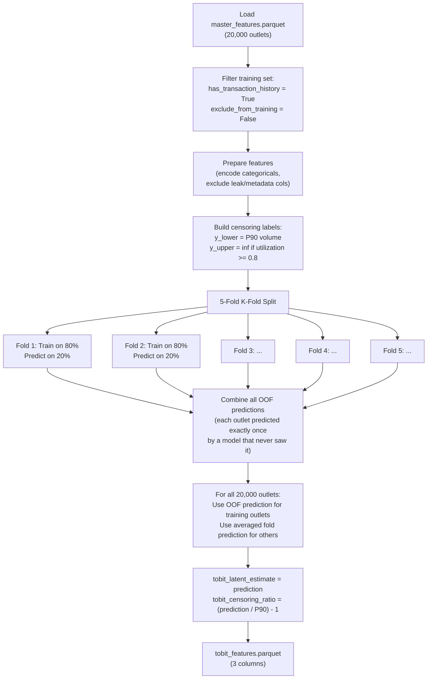

### Why OOF (Out-of-Fold) Is Critical

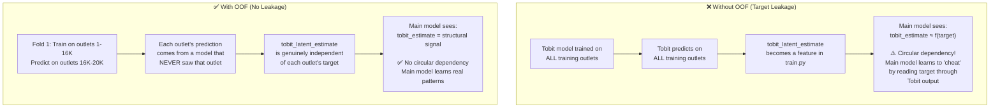

> [!WARNING]
> **Why OOF (Out-of-Fold)?** If the Tobit model's predictions are later used as features for the main training pipeline (train.py), we must prevent **target leakage**. OOF predictions ensure that each outlet's Tobit estimate was generated by a model that **never saw that outlet during training**. Without this, the main model would learn to "cheat" by reading the target through the Tobit output.

### Prediction Assembly for All 20,000 Outlets

After training, the pipeline needs predictions for **all** 20,000 outlets — including the ~1,500 that were excluded from training (cold-start outlets). Here's how:

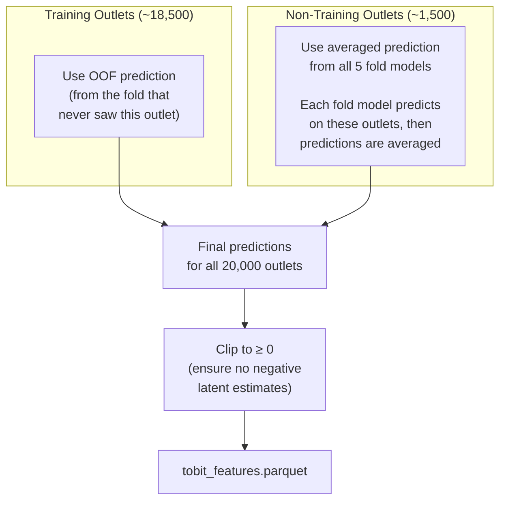

### XGBoost AFT Parameters

| Parameter | Value | Purpose |
|:---|:---|:---|
| `objective` | `survival:aft` | Accelerated Failure Time (censored regression) |
| `eval_metric` | `aft-nloglik` | Negative log-likelihood for AFT |
| `aft_loss_distribution` | `normal` | Assumes log-normal demand distribution |
| `aft_loss_distribution_scale` | `1.0` | Scale parameter for the distribution |
| `learning_rate` | `0.05` | Slow learning for stability |
| `max_depth` | `6` | Tree depth limit |
| `subsample` | `0.8` | Row sampling per tree |
| `colsample_bytree` | `0.8` | Feature sampling per tree |
| `num_boost_round` | `500` | Maximum boosting iterations |

> [!TIP]
> **Why `aft_loss_distribution = normal`?** This means the model assumes demand follows a **log-normal** distribution (the AFT operates in log-space). Log-normal is a natural choice for sales data because: (1) sales are always positive, (2) the distribution is right-skewed (many small outlets, few very large ones), and (3) multiplicative effects (more coolers = X% more sales) become additive in log-space.

### Feature Exclusions (What the Tobit Model Cannot See)

The Tobit model excludes the same target-leakage columns as `strategyA_gravity_only`, plus its own outputs and the Hurdle model's outputs:

```mermaid
graph TD
    subgraph "Excluded: Target Leakage"
        TL1["hist_p90_monthly\nhist_max_monthly\njan_avg_volume\nema_3m"]
        TL2["capacity_utilization_ratio\ncluster_mean_volume\ncluster_p90_volume"]
    end
    
    subgraph "Excluded: Sub-Model Outputs"
        SM["tobit_latent_estimate\ntobit_censoring_ratio\np_active\nhurdle_conditional_volume\nhurdle_estimate"]
    end
    
    subgraph "Excluded: Flat POI Counts"
        POI["schools_500m/1000m/2000m\nhospitals_500m/1000m/2000m\ntransport_500m/1000m/2000m\n(18 columns total)\nfootfall_score"]
    end
    
    subgraph "✅ What the Model CAN See"
        KEEP["Outlet_Type, Outlet_Size, province\nCooler_Count, Active_months_pct\nGravity scores (8 columns)\nmarket_saturation_class\nlatitude, longitude\nand more structural features"]
    end
```

## Worked Examples

### Worked Example 1: Censored vs Uncensored Outlet

| Metric | Outlet A (Uncensored) | Outlet B (Right-Censored) |
|:---|:---|:---|
| hist_p90_monthly | 400 L | 1,200 L |
| capacity_utilization_ratio | 0.31 | 0.94 |
| Censoring status | Exact (y_upper = 400) | Censored (y_upper = ∞) |
| Tobit latent estimate | 420 L | 1,850 L |
| Tobit censoring ratio | 0.05 (5% above observed) | 0.54 (54% above observed) |

**Outlet A** has plenty of unused cooler capacity, so the Tobit model thinks the observed sales are close to true demand. **Outlet B** is nearly maxing out its cooler, so the model predicts much higher latent demand.

### Worked Example 2: Step-by-Step Censoring Label Construction

Let's trace exactly how the censoring labels are built for three different outlets:

| Step | Outlet X | Outlet Y | Outlet Z |
|:---|:---|:---|:---|
| **1. Get P90 volume** | hist_p90_monthly = 600 L | hist_p90_monthly = 1,100 L | hist_p90_monthly = 0 L |
| **2. Clip to positive** | `max(600, 0.001) = 600` | `max(1100, 0.001) = 1100` | `max(0, 0.001) = 0.001` |
| **3. Set y_lower** | `y_lower = 600` | `y_lower = 1100` | `y_lower = 0.001` |
| **4. Check utilization** | util_ratio = 0.45 | util_ratio = 0.88 | util_ratio = 0.0 |
| **5. >= 0.8?** | No → exact | Yes → censored | No → exact |
| **6. Set y_upper** | `y_upper = 600` | `y_upper = +∞` | `y_upper = 0.001` |
| **7. Interpretation** | "Demand IS 600 L" | "Demand is AT LEAST 1,100 L" | "Outlet is inactive" |

### Worked Example 3: How the Model Adjusts Predictions

After training, here is how the Tobit model's output transforms the data for five different outlet archetypes:

| Outlet Archetype | Observed P90 | Utilization | Censored? | Tobit Estimate | Censoring Ratio | Interpretation |
|:---|:---|:---|:---|:---|:---|:---|
| **Small rural kiosk** | 150 L | 0.25 | No | 155 L | 0.03 | Sales ≈ true demand (plenty of capacity) |
| **Medium grocery, under-utilized** | 450 L | 0.55 | No | 480 L | 0.07 | Slightly above observed (small uplift possible) |
| **Medium grocery, near capacity** | 900 L | 0.82 | Yes | 1,200 L | 0.33 | 33% hidden demand (needs more coolers) |
| **Large supermarket, maxed out** | 2,400 L | 0.96 | Yes | 4,100 L | 0.71 | 71% hidden demand! (huge untapped market) |
| **New outlet, no sales** | 0.001 L | 0.00 | No | 280 L | Very high | Model infers demand from structural features |

> [!IMPORTANT]
> **The large supermarket case is the most valuable insight.** Without the Tobit model, the main ML pipeline would see "2,400 L" and think that's the potential. With the Tobit model providing `tobit_latent_estimate = 4,100 L`, the main model receives a signal that says "this outlet could do 71% more volume if capacity constraints were lifted." This directly feeds into budget optimization — such an outlet is a prime candidate for a cooler subsidy.

### Worked Example 4: Computing the Censoring Ratio

The `tobit_censoring_ratio` is computed after prediction as a simple derived metric:

```
tobit_censoring_ratio = max((tobit_latent_estimate / hist_p90_monthly) - 1, 0)
```

**Step-by-step for an outlet with P90 = 800 L and Tobit estimate = 1,050 L:**

1. Raw ratio: `1050 / 800 = 1.3125`
2. Subtract 1: `1.3125 - 1.0 = 0.3125`
3. Clip at 0: `max(0.3125, 0) = 0.3125`
4. Round: `0.3125` → stored as float32

**Interpretation:** The Tobit model estimates that this outlet has **31.25% more demand** than what we observe. In other words, roughly 1 in 4 potential customers may be turning away due to capacity constraints.

**Edge case — when estimate < P90:**

For outlets where the Tobit estimate is lower than P90 (can happen for uncensored outlets):
1. Raw ratio: `420 / 450 = 0.9333`
2. Subtract 1: `0.9333 - 1.0 = -0.0667`
3. Clip at 0: `max(-0.0667, 0) = 0.0` → The ratio is floored at zero

This ensures `tobit_censoring_ratio` is always ≥ 0 — it represents *uplift potential*, never a negative adjustment.

## How Tobit Output Feeds into the Main Pipeline

The Tobit model's output becomes **input features** for the main training pipeline (`train.py`). Here's the full downstream flow:

```mermaid
graph TD
    TOBIT["tobit_features.parquet\n• tobit_latent_estimate\n• tobit_censoring_ratio"] --> MERGE["master_features.parquet\n(re-assembled with\nTobit + Hurdle columns)"]
    MERGE --> TRAIN["train.py\n(main ML pipeline)"]
    TRAIN --> PREDICT["predict.py\n(final submission)"]
    
    TOBIT --> BUDGET["optimise_budget.py\n\nOutlets with high censoring_ratio\nare prime candidates for\ncooler subsidies (High tier)"]
    
    subgraph "What train.py Learns from Tobit Features"
        L1["tobit_latent_estimate:\nA structural estimate of\ntrue demand — helps the model\nlook beyond observed sales"]
        L2["tobit_censoring_ratio:\nA flag for 'constrained' outlets —\nhelps the model adjust predictions\nupward for capacity-limited outlets"]
    end
```

### Output Columns (3 total)
`Outlet_ID`, `tobit_latent_estimate` (float32), `tobit_censoring_ratio` (float32)

---

# 3. Hurdle Model — Two-Stage Zero-Inflated Estimator

**File:** [hurdle_model.py](modelling/hurdle_model.py) (318 lines)

## The Problem: Two Different Questions

Standard regression models try to answer one question: "How much will this outlet sell?" But for retail outlets, there are actually **two separate questions**:

1. **Will this outlet even be active?** (classification problem)
2. **If active, how much will it sell?** (regression problem)

An outlet that has been closed for 6 months is fundamentally different from an active outlet that just had a slow month. Combining these into a single regression model forces the model to compromise between two very different statistical patterns.

## The Two-Stage Architecture

```mermaid
graph TD
    subgraph "Stage 1: The Hurdle (Classification)"
        S1A["All training outlets\n(~18,500)"] --> S1B["Logistic Regression\n(class_weight='balanced')"]
        S1B --> S1C["Output: P(active)\nProbability the outlet\nwill have any orders"]
    end
    
    subgraph "Stage 2: Conditional Volume (Regression)"
        S2A["Only ACTIVE training outlets\n(volume > 0, ~17,000)"] --> S2B["XGBRegressor\n(5-fold OOF)"]
        S2B --> S2C["Output: E[volume | active]\nExpected volume IF\nthe outlet is active"]
    end
    
    subgraph "Combination"
        S1C --> COMBINE["hurdle_estimate =\nP(active) × E[volume | active]"]
        S2C --> COMBINE
    end
    
    COMBINE --> OUT["hurdle_features.parquet"]
```

## Stage 1: Logistic Regression — "Will This Outlet Be Active?"

### Why Logistic Regression (Not XGBoost)?

The binary classification task is relatively simple — most outlets are active. Logistic Regression is chosen because:
- It produces well-calibrated probabilities (important since we multiply by volume)
- `class_weight='balanced'` automatically handles the imbalanced classes (many actives vs few inactives)
- It's fast and interpretable

### Configuration

| Parameter | Value | Purpose |
|:---|:---|:---|
| `solver` | `lbfgs` | Efficient optimizer for medium-sized datasets |
| `max_iter` | `2000` | Ensure convergence |
| `class_weight` | `balanced` | Up-weight the rare "inactive" class |
| `C` | `1.0` | Regularization strength (default) |
| Scaling | `StandardScaler` | Required for Logistic Regression (distance-based) |

> [!TIP]
> **Edge Case Handling:** The Hurdle Stage 1 pipeline is built to be resilient. If the training data miraculously contains only one single class (for instance, if every single outlet provided happens to be active), the Logistic Regression stage is skipped entirely to prevent a crash, and `p_active` is safely inferred from the `has_transaction_history` feature directly.

### Typical Results

| Metric | Value |
|:---|:---|
| Active outlets in training | ~17,000 (~92%) |
| Inactive outlets in training | ~1,500 (~8%) |
| Accuracy | ~0.95 |
| F1 Score | ~0.97 |

## Stage 2: XGBRegressor — "How Much Will It Sell?"

This stage trains **only** on active outlets (those with volume > 0). It uses 5-fold OOF predictions identical to the Tobit model's approach to prevent target leakage.

### Parameters

| Parameter | Value | Purpose |
|:---|:---|:---|
| `n_estimators` | `500` | Number of boosting rounds |
| `max_depth` | `6` | Tree depth |
| `learning_rate` | `0.05` | Conservative learning rate |
| `subsample` | `0.8` | Row sampling |
| `colsample_bytree` | `0.8` | Feature sampling per tree |
| `device` | `cuda` | GPU acceleration |

> [!NOTE]
> **Training Filter:** The Stage 2 pipeline strictly filters for `y_volume > 0` before fitting the XGBRegressor. Any prediction made by this regressor is also subsequently clipped at a minimum bound of `0.0` globally to ensure no impossible negative volumes leak into the final `hurdle_estimate` multiplication step.

### Worked Example: How the Combination Works

| Outlet | P(active) | E[volume \| active] | hurdle_estimate |
|:---|:---|:---|:---|
| OUT_A (very active) | 0.98 | 800 L | `0.98 × 800 = 784 L` |
| OUT_B (sometimes inactive) | 0.65 | 450 L | `0.65 × 450 = 292.5 L` |
| OUT_C (likely dormant) | 0.10 | 200 L | `0.10 × 200 = 20.0 L` |
| OUT_D (new outlet, no history) | 0.40 | 300 L | `0.40 × 300 = 120.0 L` |

**Key insight:** OUT_C has a decent conditional volume (200 L) but a very low probability of being active — the hurdle correctly dampens the prediction. A standard regression would predict somewhere around 200 L regardless of the inactivity risk.

### Output Columns (4 total)
`Outlet_ID`, `p_active` (float32), `hurdle_conditional_volume` (float32), `hurdle_estimate` (float32)

---

# 4. Main Training Pipeline — The Engine

**File:** [train.py](modelling/train.py) (840 lines — the largest script)

## What This Script Does

This is the **core ML training engine**. It takes master features (now enriched with Tobit and Hurdle outputs), builds a prediction target, trains a gradient-boosted model using cross-validation, and saves all artifacts for experiment tracking and reproducibility.

## End-to-End Training Flow

```mermaid
graph TD
    A["Load master_features.parquet"] --> B["Select Feature Strategy\n(8 strategies available)"]
    B --> C["Add interaction features\n(if strategy requires)"]
    C --> D["Filter training set:\nhas_transaction_history = True\nexclude_from_training = False"]
    D --> E["Build target:\ntarget = hist_p90_monthly\n× seasonality_multiplier\n× (trading_days / 22)"]
    E --> F["Select algorithm:\nCatBoost / XGBoost\nLightGBM / RandomForest"]
    F --> G["5-Fold Cross-Validation\n(RMSE + MAE per fold)"]
    G --> H["Train final model on\nFULL training data"]
    H --> I["Save artifacts to\nmodelling/artifacts/runs/run_id/"]
    I --> J["model.pkl"]
    I --> K["cv_results.json"]
    I --> L["feature_importance.png"]
    I --> M["predictions.csv (20K rows)"]
    I --> N["run_config.json"]
    H --> O{"--shap flag?"}
    O -- "Yes" --> P["Extract SHAP values\n(TreeExplainer)\nSave to shap_values.parquet"]
    O -- "No" --> Q["Skip SHAP"]
    I --> R["Append to\nrun_registry.csv\n(experiment log)"]
```

## The Target Formula (What Are We Predicting?)

```
target = hist_p90_monthly × seasonality_multiplier_jan_2026 × (jan_2026_trading_days / 22.0)
```

This is the **Maximum Monthly Sales Potential** for January 2026. Let's break it down:

| Component | Meaning | Example |
|:---|:---|:---|
| `hist_p90_monthly` | 90th percentile of historical monthly volumes — the outlet's "typical good month" | 920 L |
| `seasonality_multiplier_jan_2026` | How January performs for this distributor's territory (Favorable=1.20, Moderate=1.00, Un-Favorable=0.85) | 1.20 |
| `jan_2026_trading_days / 22.0` | Calendar adjustment — January 2026 has 20 trading days vs the 22-day average | 0.909 |
| **Target** | **Combined** | **920 × 1.20 × 0.909 = 1,003.5 L** |

### Worked Example: Calculating Maximum Monthly Sales Potential

Here is how the prediction target is formed during training across different conditions:

| Property | Outlet X | Outlet Y |
|:---|:---|:---|
| `hist_p90_monthly` | 1,200 L | 450 L |
| `seasonality_multiplier` | Un-favorable (0.85) | Favorable (1.20) |
| Trading Days factor | 0.909 (20/22) | 0.909 (20/22) |

**Target for Outlet X:**
`1,200 × 0.85 × 0.909 = 927.18 L`
*Insight:* Even though this outlet typically has a strong 1,200 L month, the unfavorable season and short trading month pull its true potential down to ~927 L.

**Target for Outlet Y:**
`450 × 1.20 × 0.909 = 490.86 L`
*Insight:* A favorable season pushes this smaller outlet's target above its P90.

## The 8 Feature Strategies

The pipeline offers 8 predefined strategies that control which features are included/excluded. This is the **experiment framework** — each strategy tests a different hypothesis about what drives outlet sales.

```mermaid
graph TD
    subgraph "Strategy Hierarchy"
        BASE["round1_baseline\n(All features, leaks KEPT)"]
        
        SA["strategyA\n(Remove target leakage)"]
        
        SAG["strategyA_gravity_only ★\n(Gravity scores only,\nno flat POI counts)\nUSED IN PRODUCTION"]
        
        SAF["strategyA_flat_only\n(Flat POI counts only,\nno gravity scores)"]
        
        SC["strategyC\n(Strategy A + interactions)"]
        
        SAGC["strategyA_gravity_clean\n(Gravity only + no booleans)"]
        
        SAFC["strategyA_flat_clean\n(Flat only + no booleans)"]
        
        SCC["strategyC_clean\n(Interactions + no booleans)"]
    end
    
    BASE --> SA
    SA --> SAG
    SA --> SAF
    SA --> SC
    SAG --> SAGC
    SAF --> SAFC
    SC --> SCC
```

### What Each Strategy Excludes

| Strategy | Excludes from Base | Key Hypothesis |
|:---|:---|:---|
| `round1_baseline` | Nothing extra | "Use everything, see what happens" |
| `strategyA` | Target leakage cols (hist_p90, hist_max, jan_avg, ema_3m, etc.) | "Force the model to learn from structural features, not echoes of the target" |
| `strategyA_gravity_only` ★ | Leakage + 18 flat POI counts + footfall_score | "Gravity scores capture distance nuance better than raw counts" |
| `strategyA_flat_only` | Leakage + 8 gravity scores | "Do raw POI counts work better than gravity?" |
| `strategyC` | Leakage (adds interaction features) | "Do cross-features like gravity×cooler add predictive value?" |
| `strategyA_gravity_clean` | Leakage + flat POIs + boolean noise flags | "Cleanest spatial model" |
| `strategyA_flat_clean` | Leakage + gravity + boolean noise | "Cleanest flat-POI model" |
| `strategyC_clean` | Leakage + boolean noise (keeps interactions) | "Interactions without noise" |

> [!IMPORTANT]
> **Production winner:** `strategyA_gravity_only` — gravity scores outperformed flat POI counts in CV, and removing the 18 flat-count columns reduced overfitting risk without sacrificing accuracy.

### Target Leakage Columns (Why They Are Excluded)

| Excluded Column | Reason |
|:---|:---|
| `hist_p90_monthly` | Directly derived from the target formula — if the model sees this, it trivially learns `target ≈ P90 × constant` |
| `hist_max_monthly` | Highly correlated with P90 |
| `jan_avg_volume` | Directly informative about January sales (what we're predicting) |
| `ema_3m` | Short-term moving average — strongly correlated with P90 |
| `capacity_utilization_ratio` | Computed from P90 / ceiling — leaks P90 information |
| `cluster_mean_volume` | Average volume of nearby outlets — leaks aggregate target info |
| `cluster_p90_volume` | 90th percentile of cluster — direct target leak |

## The 4 Supported Algorithms

```mermaid
graph LR
    subgraph "Gradient Boosting (GPU-Accelerated)"
        LG["LightGBM 🏆\nSHAP Engine\nHandles categoricals natively"]
        XG["XGBoost\nFastest GPU training\nAFT objective available"]
    end
    
    subgraph "Ensemble Diversity"
        RF["RandomForest\nNo GPU needed\nBagging (not boosting)\nAdds diversity"]
    end
```

### Algorithm Comparison

| Algorithm | Key Strength | GPU Support | Handles Categoricals Natively | Production Role |
|:---|:---|:---|:---|:---|
| **LightGBM** | Fast training, leaf-wise growth | Yes (GPU) | Yes (category type) | Ensemble member (0.4) & SHAP extraction |
| **XGBoost** | Fast GPU training, AFT objective for Tobit model | Yes (CUDA) | No (needs encoding) | Ensemble member (weight 0.4) |
| **RandomForest** | Bagging instead of boosting — adds ensemble diversity | No (CPU) | No (needs encoding) | Ensemble member (weight 0.2) |
| **CatBoost** | Best CV RMSE in Round 1 (40.38) | Yes (CUDA) | Yes | Colab experiments (Abandoned locally due to GPU bug) |

### LightGBM Champion Configuration (Optuna-Tuned)

| Parameter | Value | Meaning |
|:---|:---|:---|
| `iterations` | 1,289 | Number of boosting rounds |
| `learning_rate` | 0.0283 | Very conservative — each tree makes small corrections |
| `depth` | 5 | Maximum tree depth (shallow trees = less overfitting) |
| `l2_leaf_reg` | 1.495 | L2 regularization on leaf values |
| `subsample` | 0.713 | ~71% of rows used per tree (Poisson sampling) |
| `bootstrap_type` | Poisson | Poisson resampling (better than Bernoulli for regression) |
| `task_type` | GPU | CUDA acceleration |
| `cat_features` | Outlet_Type, Outlet_Size, province | Handled natively without encoding |

## Cross-Validation (5-Fold)

```mermaid
graph TD
    subgraph "Fold 1"
        A1["Train: 80%"] --> B1["Val: 20%\nRMSE, MAE"]
    end
    subgraph "Fold 2"
        A2["Train: 80%"] --> B2["Val: 20%\nRMSE, MAE"]
    end
    subgraph "Fold 3"
        A3["Train: 80%"] --> B3["Val: 20%\nRMSE, MAE"]
    end
    subgraph "Fold 4"
        A4["Train: 80%"] --> B4["Val: 20%\nRMSE, MAE"]
    end
    subgraph "Fold 5"
        A5["Train: 80%"] --> B5["Val: 20%\nRMSE, MAE"]
    end
    
    B1 --> AVG["CV Mean RMSE\n± Standard Deviation"]
    B2 --> AVG
    B3 --> AVG
    B4 --> AVG
    B5 --> AVG
    
    AVG --> FINAL["Final Model:\nTrained on 100%\nof training data"]
```

**RMSE** = Root Mean Squared Error (penalizes large mistakes more than small ones)
**MAE** = Mean Absolute Error (treats all errors equally)

## Interaction Features (Strategy C)

When enabled, the pipeline creates **cross-features** by multiplying related columns:

| Interaction Feature | Formula | Business Intuition |
|:---|:---|:---|
| `gravity_x_cooler` | `composite_gravity_score × Cooler_Count` | High foot traffic + many coolers = explosive potential |
| `gravity_x_active_months` | `composite_gravity_score × active_months_pct` | Good location + consistently active = reliable high-volume outlet |
| `catchment_x_cooler` | `competition_density_score × Cooler_Count` | Many competitors + large capacity = aggressive market positioning |
| `transport_x_school` | `transport_gravity_score × school_gravity_score` | Near both transit hubs and schools = peak impulse-buy territory |

## SHAP Explainability

When the `--shap` flag is passed, the pipeline extracts per-outlet SHAP values using `TreeExplainer`:

```mermaid
graph TD
    A["Trained Model\n(e.g., LightGBM)"] --> B["SHAP TreeExplainer"]
    B --> C["For each of 20,000 outlets:\nCompute per-feature\ncontribution to prediction"]
    C --> D["shap_values.parquet\n(20,000 rows × N feature columns)"]
    D --> E["Used by:\n1. Feature importance ranking\n2. XAI briefings (Gemini)\n3. Per-outlet driver analysis"]
```

**What SHAP values tell you:** For outlet OUT_1001, a SHAP value of `+120` on `tobit_latent_estimate` means "the Tobit demand estimate pushed this outlet's prediction up by 120 liters compared to the average." A value of `-50` on `competition_density_score` means "high competition pulled the prediction down by 50 liters."

## Experiment Tracking

Every training run creates a timestamped directory with full artifacts:

```
modelling/artifacts/runs/
└── run_20260531_211951_lightgbm_strategyA_gravity_only/
│   ├── model.pkl              (Serialized model + feature list + algorithm name)
│   ├── cv_results.json        (Per-fold RMSE/MAE + means + stds)
│   ├── feature_importance.csv (All features ranked by gain)
│   ├── feature_importance.png (Top-30 bar chart)
│   ├── predictions.csv        (20,000 outlet predictions)
│   ├── run_config.json        (Exact params, features, strategy, notes)
│   └── shap_values.parquet    (Optional — if --shap flag used)
├── run_20260601_152045_xgboost_strategyA_gravity_only/
│   └── ...
└── run_registry.csv           (Master experiment log — all runs side by side)
```

## Optuna Hyperparameter Tuning

**File:** [optuna_tune.py](modelling/optuna_tune.py) (160 lines)

Optuna automates the search for optimal hyperparameters using **Bayesian optimization**:

```mermaid
graph TD
    A["Define search space\n(e.g., learning_rate: 0.01–0.2)"] --> B["Optuna creates Trial 1\n(random initial params)"]
    B --> C["Run 5-fold CV\nMeasure RMSE"]
    C --> D["Optuna observes result\nBuilds surrogate model"]
    D --> E["Trial 2: Optuna suggests\nbetter params based on\nwhat it learned"]
    E --> C
    C --> F["After N trials:\nReturn best params"]
    F --> G["Save to\nbest_params_algo_strategy.json"]
```

### Search Spaces by Algorithm

| Algorithm | Tuned Parameters |
|:---|:---|
| CatBoost | `learning_rate` (0.01–0.2), `depth` (3–10), `l2_leaf_reg` (0.001–10), `subsample` (0.5–1.0) |
| XGBoost | `learning_rate`, `max_depth`, `subsample`, `colsample_bytree`, `reg_alpha`, `reg_lambda`, `n_estimators` |
| LightGBM | `learning_rate`, `num_leaves` (15–127), `min_child_samples`, `subsample`, `colsample_bytree`, `reg_alpha`, `reg_lambda` |
| RandomForest | `n_estimators` (200–1000), `max_depth` (5–30), `min_samples_split`, `min_samples_leaf`, `max_features` |

### CLI Example

```bash
# Tune XGBoost for strategyA_gravity_only with 50 trials
python modelling/optuna_tune.py --algorithm xgboost --strategy strategyA_gravity_only --n-trials 50

# Then use tuned params in training
python modelling/train.py --algorithm xgboost --strategy strategyA_gravity_only --use-optuna-params
```

---

# 5. Ensemble & Final Prediction — Blending Models

## 5.1 Ensemble (ensemble.py)

**File:** [ensemble.py](modelling/ensemble.py) (66 lines)

The ensemble combines predictions from multiple trained models using **weighted averaging**:

```mermaid
graph TD
    subgraph "Individual Model Predictions"
        XG["XGBoost Run\npredictions.csv\n(20,000 rows)"]
        LG["LightGBM Run\npredictions.csv\n(20,000 rows)"]
        RF["RandomForest Run\npredictions.csv\n(20,000 rows)"]
    end
    
    subgraph "Weighted Blend"
        XG -->|"weight = 0.4"| BLEND["ensemble_prediction =\n0.4 × XGB + 0.4 × LGBM + 0.2 × RF"]
        LG -->|"weight = 0.4"| BLEND
        RF -->|"weight = 0.2"| BLEND
    end
    
    BLEND --> OUT["ensemble_predictions.csv\n(20,000 rows)"]
```

### Why These Weights?

| Model | Weight | Reason |
|:---|:---|:---|
| XGBoost | 0.40 | Strong CV performance, GPU-accelerated, handles Tobit outputs well |
| LightGBM | 0.40 | Comparable CV RMSE, leaf-wise growth captures different patterns |
| RandomForest | 0.20 | Different algorithm family (bagging vs boosting) — adds **diversity** to the ensemble |

> [!TIP]
> **Why ensembles work:** Each algorithm has different inductive biases — they make different mistakes. By averaging, we cancel out individual model errors. Even if XGBoost overpredicts an outlet by +100L and LightGBM underpredicts by -80L, the average is much closer to truth (+10L).

### Worked Example

| Outlet | XGBoost Pred | LightGBM Pred | RF Pred | Ensemble (0.4/0.4/0.2) |
|:---|:---|:---|:---|:---|
| OUT_1001 | 850 L | 820 L | 780 L | `0.4×850 + 0.4×820 + 0.2×780 = 824 L` |
| OUT_2045 | 120 L | 150 L | 200 L | `0.4×120 + 0.4×150 + 0.2×200 = 148 L` |
| OUT_0500 | 2,400 L | 2,200 L | 2,100 L | `0.4×2400 + 0.4×2200 + 0.2×2100 = 2,260 L` |

### CLI Example

```bash
python modelling/ensemble.py \
  --run-ids run_20260601_xgboost_strategyA_gravity_only \
            run_20260601_lightgbm_strategyA_gravity_only \
            run_20260601_randomforest_strategyA_gravity_only \
  --weights 0.4 0.4 0.2 \
  --output ensemble_predictions.csv
```

## 5.2 Final Prediction (predict.py)

**File:** [predict.py](modelling/predict.py) (311 lines)

This is the **last step** — it takes the ensemble predictions, applies the baseline floor, runs sanity checks, and produces the final submission CSV.

```mermaid
graph TD
    A["Load master_features.parquet"] --> B["Load model (from run_id)\nOR ensemble predictions CSV"]
    B --> C["Generate model_prediction\nfor all 20,000 outlets"]
    C --> D["Load baseline_predictions.parquet"]
    D --> E["Final = max(model_prediction,\nbaseline_potential_litres)"]
    E --> F["Post-processing:\n1. Clip negatives to 1.0\n2. Round to 2 decimals"]
    F --> G["Run assertions:\n- Exactly 20,000 rows\n- No duplicates\n- No nulls\n- All positive"]
    G --> H["bigbug_predictions.csv\n(Outlet_ID, Maximum_Monthly_Liters)"]
    G --> I["prediction_diagnostics.csv\n(Full debug info per outlet)"]
```

### The Baseline Floor in Action

```mermaid
graph TD
    subgraph "Case A: Model Wins"
        A1["Model: 850 L"] --> A2["Baseline: 600 L"]
        A2 --> A3["Final = 850 L\n(model is higher)"]
    end
    
    subgraph "Case B: Baseline Wins"
        B1["Model: 200 L"] --> B2["Baseline: 450 L"]
        B2 --> B3["Final = 450 L\n(baseline prevents\nunderestimation)"]
    end
    
    subgraph "Case C: Cold Start"
        C1["Model: 380 L"] --> C2["Baseline: 380 L"]
        C2 --> C3["Final = 380 L\n(nearly identical —\nboth sources agree)"]
    end
```

### Diagnostics Output

The diagnostics CSV includes all the information needed to understand *why* a prediction was made:

| Column | Purpose |
|:---|:---|
| `Outlet_ID` | Identifier |
| `Outlet_Size`, `Outlet_Type`, `province` | Segmentation context |
| `hist_p90_monthly`, `hist_max_monthly` | Historical context |
| `jan_avg_volume` | January-specific history |
| `seasonality_jan_2026` | Seasonal context |
| `composite_gravity_score` | Location quality |
| `model_prediction` | Raw ML model output |
| `baseline_potential_litres` | Statistical floor |
| `Maximum_Monthly_Liters` | **Final prediction** (the `max` of model and baseline) |

---

# 6. Budget Optimization — Tier-Capped Greedy Knapsack

**File:** [optimise_budget.py](pipeline/optimizations/optimise_budget.py) (459 lines)

## The Business Problem

The company has **LKR 5,000,000** (5 million Sri Lankan Rupees) to spend on trade marketing across Western Province outlets. The question: **How should we allocate this budget to maximize volume uplift?**

This is a classic **constrained optimization** problem with multiple business rules.

## Budget Allocation Pipeline

```mermaid
graph TD
    A["Load master_features +\nbigbug_predictions.csv"] --> B["Isolate Western Province\n(DIST_W_01, DIST_W_02, DIST_W_03)"]
    B --> C["Calculate ROI Score\nfor each outlet"]
    C --> D["Rank outlets by ROI\nAssign tiers:\nHigh (top 15%)\nMedium (next 35%)\nLow (next 15%)\nNone (bottom 35%)"]
    D --> E["Apply Guardrails:\n- Activity check\n- Cold-start cap\n- Size/type cap"]
    E --> F["Compute headroom-scaled\nspending limits"]
    F --> G["Greedy Knapsack\nAllocation Pass\n(3 separate tier budgets)"]
    G --> H["Redistribute leftovers\nto top performers"]
    H --> I["Distributor Rebalancing\n(min 25% per distributor)"]
    I --> J["Final micro-adjustments\n(force exact 5M total)"]
    J --> K["bigbug_budget_allocations.csv\nbudget_diagnostics.csv"]
```

## ROI Score Calculation

The ROI score determines which outlets get priority. It's a weighted composite of four normalized metrics:

```
ROI Score = 0.40 × Normalized Uplift Gap
          + 0.30 × Normalized Gravity Score
          + 0.20 × Normalized Recent Sales
          + 0.10 × Normalized Cooler Count
```

| Component | Weight | Logic |
|:---|:---|:---|
| **Uplift Gap** (40%) | Highest weight | `max(0, Predicted - Recent_Sales)`. Outlets with the biggest gap between predicted potential and current sales have the most room for growth |
| **Gravity Score** (30%) | Second | High foot traffic means marketing spend reaches more potential customers |
| **Recent Sales** (20%) | Third | Active outlets with proven sales are lower-risk investments |
| **Cooler Count** (10%) | Lowest | More coolers = more capacity to absorb volume uplift from marketing |

### Worked Example: Calculating ROI Score

Assume we have an outlet with the following normalized metrics (all scaled from 0.0 to 1.0 across the dataset):

| Metric | Normalized Value | Weight | Weighted Score |
|:---|:---|:---|:---|
| Normalized Uplift Gap | 0.85 | 0.40 | `0.85 × 0.40 = 0.340` |
| Normalized Gravity Score | 0.60 | 0.30 | `0.60 × 0.30 = 0.180` |
| Normalized Recent Sales | 0.40 | 0.20 | `0.40 × 0.20 = 0.080` |
| Normalized Cooler Count | 0.25 | 0.10 | `0.25 × 0.10 = 0.025` |

**Final ROI Score:** `0.340 + 0.180 + 0.080 + 0.025 = 0.625`
This high score (62.5%) strongly indicates the outlet will land in the **High Tier**.

## Tier System

```mermaid
graph TD
    subgraph "Tier Assignment"
        T1["HIGH (Top 15%)\nROI Rank: 1 to 15%\n\nCap: 12,000 LKR\nFloor: 2,000 LKR\nSpend Type: Cooler Subsidy /\nDisplay Rack"]
        
        T2["MEDIUM (Next 35%)\nROI Rank: 15% to 50%\n\nCap: 3,000 LKR\nFloor: 500 LKR\nSpend Type: Promotional\nDiscount"]
        
        T3["LOW (Next 15%)\nROI Rank: 50% to 65%\n\nCap: 800 LKR\nFloor: 500 LKR\nSpend Type: Light\nMerchandising"]
        
        T4["NONE (Bottom 35%)\nNo allocation\n\nCap: 0 LKR\nFloor: 0 LKR\nNo marketing spend"]
    end
```

### Tier Efficiency Rates (Volume per LKR)

| Tier | Efficiency (L/LKR) | Meaning |
|:---|:---|:---|
| High | 0.028 | Each 1 LKR spent generates 0.028 litres of additional monthly volume |
| Medium | 0.012 | Lower efficiency — promotional discounts have less impact per rupee |
| Low | 0.004 | Minimal impact — light merchandising maintains brand awareness |

### Tier Budget Buckets

The total LKR 5M budget is partitioned into three separate buckets:

| Bucket | Amount (LKR) | Purpose |
|:---|:---|:---|
| High Tier | 2,500,000 | Cooler grants and premium displays for growth outlets |
| Medium Tier | 1,750,000 | Promotional discounts for solid performers |
| Low Tier | 750,000 | Light merchandising for brand presence |
| **Total** | **5,000,000** | |

## Operational Guardrails

Several business rules override pure ROI rankings:

| Guardrail | Rule | Reason |
|:---|:---|:---|
| **Activity** | Outlets with zero recent sales or zero uplift gap → `None` | No point investing in outlets that aren't trading |
| **Cold-start cap** | Outlets without transaction history capped at `Medium` | Too risky for expensive High-tier cooler grants |
| **Size/Type cap** | Small outlets, Kiosks, Pharmacies capped at `Medium` | Physically can't accommodate a cooler subsidy or display rack |
| **Floor enforcement** | If headroom-scaled allocation falls below tier floor → `None` | Avoid tiny, unimpactful allocations (e.g., 200 LKR does nothing) |
| **Distributor minimum** | Each of 3 distributors gets >= 25% (1.25M LKR) | Prevents over-concentration in one distributor's territory |

## The Greedy Knapsack Algorithm

```mermaid
graph TD
    A["Sort all outlets by\nROI Score (descending)"] --> B["For each outlet\n(highest ROI first):"]
    B --> C{"Tier?"}
    C -- "High" --> D{"High bucket\nhas remaining\nbudget?"}
    D -- "Yes" --> E["Allocate:\nmin(headroom_allocation,\nhigh_budget_remaining)\nRound to nearest 50 LKR"]
    D -- "No" --> F["Skip (bucket exhausted)"]
    C -- "Medium" --> G["Same logic\nwith medium bucket"]
    C -- "Low" --> H["Same logic\nwith low bucket"]
    C -- "None" --> I["Skip"]
    E --> J["Deduct from bucket"]
    J --> B
```

### Headroom-Scaled Allocation

Each outlet's maximum allocation is capped not just by the tier cap, but by how much uplift it can actually absorb:

```
max_headroom_allocation = min(
    tier_cap,
    uplift_gap_litres / volume_per_lkr
)
```

**Example:** If an outlet has an uplift gap of 100L and the volume efficiency is 0.028 L/LKR:
```
max_headroom = min(12000, 100 / 0.028) = min(12000, 3571) = 3,571 LKR
Rounded to nearest 50 = 3,550 LKR
```

This prevents wasting budget on outlets that can't absorb the investment.

## Distributor Rebalancing

After the initial greedy pass, the algorithm checks if any distributor got less than 25% of the budget. If so, it **transfers** allocation from the lowest-ROI funded outlet of the over-funded distributor to the highest-ROI unfunded outlet of the under-funded distributor.

```mermaid
graph LR
    A["DIST_W_01: 2.8M (over)\nDIST_W_02: 1.4M (ok)\nDIST_W_03: 0.8M (under)"] --> B["Transfer from\nlowest-ROI DIST_W_01 outlets\nto highest-ROI DIST_W_03 outlets"]
    B --> C["DIST_W_01: 2.5M\nDIST_W_02: 1.4M\nDIST_W_03: 1.25M+"]
```

## Assertions & Validation (8 Checks)

| Assertion | Rule |
|:---|:---|
| Total budget | Exactly 5,000,000.00 LKR |
| No micro-allocations | No allocation between 1 and 499 LKR |
| Cap compliance | No outlet exceeds its dynamic headroom cap (+100 LKR tolerance) |
| Distributor minimum | Each distributor gets >= 1,250,000 LKR |
| High+Medium share | High and Medium tiers combined >= 60% of budget (3M LKR) |
| Layout compliance | Small/Kiosk/Pharmacy outlets <= 3,000 LKR |
| Rounding | All non-zero allocations are multiples of 50 LKR |
| Coverage | At least 1,000 outlets funded (high market footprint) |

### Output Files

| File | Contents |
|:---|:---|
| `bigbug_budget_allocations.csv` | Submission file (2 columns: `Outlet_ID`, `Trade_Spend_Allocation_LKR`) |
| `budget_diagnostics.csv` | Full diagnostic info per outlet (ROI score, tier, spend type, projected uplift) |
| `roi_distribution.png` | Histogram of ROI scores with color-coded tier bands |
| `budget_features.parquet` | Parquet copy of diagnostics for pipeline consumption |
