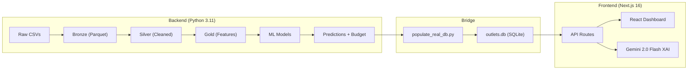
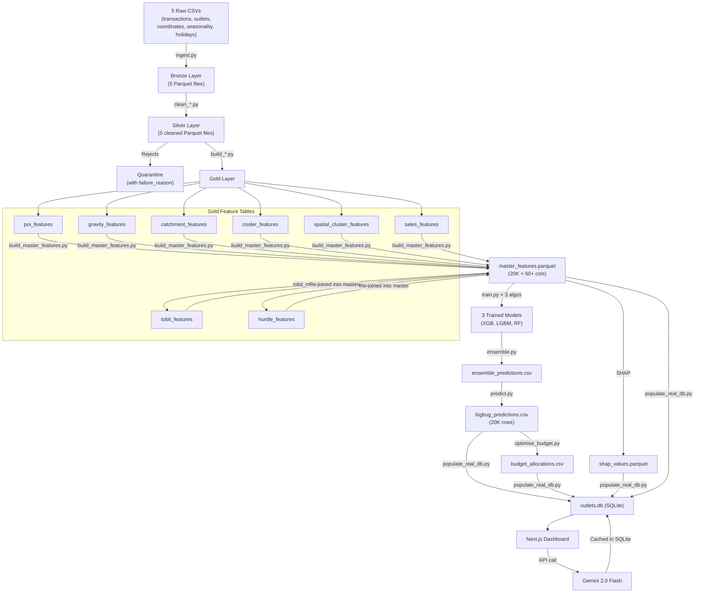

# BigBugDataStorm — Complete Technical Overview

> **Team BigBug's end-to-end solution for Data Storm v7.0 Final Round**
> Predicting **Maximum Monthly Sales Potential (litres)** for 20,000 retail outlets in Sri Lanka and optimally allocating a **LKR 5M trade marketing budget**.

---

## Table of Contents

1. [High-Level Architecture](#1-high-level-architecture)
2. [Tech Stack Summary](#2-tech-stack-summary)
3. [Repository Structure](#3-repository-structure)
4. [Backend — Python Data Pipeline](#4-backend--python-data-pipeline)
   - [4.1 Pipeline Orchestrator](#41-pipeline-orchestrator)
   - [4.2 Bronze Layer — Raw Ingestion](#42-bronze-layer--raw-ingestion)
   - [4.3 Silver Layer — Cleaning & Validation](#43-silver-layer--cleaning--validation)
   - [4.4 Gold Layer — Feature Engineering](#44-gold-layer--feature-engineering)
   - [4.5 Budget Optimization](#45-budget-optimization)
5. [Modelling Layer](#5-modelling-layer)
   - [5.1 Baseline Model](#51-baseline-model)
   - [5.2 Tobit Censored Regression](#52-tobit-censored-regression)
   - [5.3 Hurdle (Zero-Inflated) Model](#53-hurdle-zero-inflated-model)
   - [5.4 Main Training Pipeline](#54-main-training-pipeline)
   - [5.5 Ensemble & Final Prediction](#55-ensemble--final-prediction)
6. [Frontend — Next.js Web App](#6-frontend--nextjs-web-app)
   - [6.1 Framework & Libraries](#61-framework--libraries)
   - [6.2 App Structure & Pages](#62-app-structure--pages)
   - [6.3 Data Access Layer (SQLite)](#63-data-access-layer-sqlite)
   - [6.4 API Routes](#64-api-routes)
   - [6.5 GenAI XAI (Gemini Integration)](#65-genai-xai-gemini-integration)
   - [6.6 UI Components](#66-ui-components)
7. [Data Flow Diagram](#7-data-flow-diagram)
8. [Configuration & Environment](#8-configuration--environment)
9. [How to Run](#9-how-to-run)
10. [Key Design Decisions](#10-key-design-decisions)

---

## 1. High-Level Architecture

The project is split into **two independent systems** connected by a **SQLite database bridge**:



> [!IMPORTANT]
> The backend pipeline outputs **Parquet files** and **CSVs**. A Python script ([populate_real_db.py](app/scripts/populate_real_db.py)) converts these into a single **54MB SQLite database** (`outlets.db`) that the Next.js app reads directly via `better-sqlite3`.

---

## 2. Tech Stack Summary

### Backend (Python Data Pipeline & ML)

| Category | Technology | Version | Purpose |
|---|---|---|---|
| **Language** | Python | 3.11 | Pipeline scripts, ML training |
| **Data** | Pandas | 2.2.2 | DataFrame manipulation |
| **Data** | NumPy | 1.26.4 | Numerical computation |
| **File Format** | PyArrow | 16.1.0 | Parquet read/write |
| **ML — Gradient Boosting** | XGBoost | 3.2.0 | AFT survival + boosting |
| **ML — Gradient Boosting** | LightGBM | 4.3.0 | GPU-accelerated boosting (SHAP engine) |
| **ML — Gradient Boosting** | CatBoost | 1.2.10 | Colab experiments (deprecated locally) |
| **ML — Ensemble** | Scikit-learn | 1.5.0 | KMeans, KFold, RandomForest, LogisticRegression |
| **ML — Tuning** | Optuna | 4.8.0 | Hyperparameter optimization |
| **ML — Explainability** | SHAP | 0.51.0 | TreeExplainer for feature attributions |
| **Geospatial** | GeoPy | 2.4.1 | Geodesic distance calculations |
| **Geospatial** | Requests + Overpy | 2.32.3 / 0.7 | OpenStreetMap Overpass API |
| **Stats** | SciPy | 1.13.1 | `linregress` for trend slopes |
| **Config** | PyYAML | 6.0.1 | `config.yaml` parsing |
| **Viz** | Matplotlib / Seaborn | 3.9.0 / 0.13.2 | Plots, feature importance |

### Frontend (Next.js Web App)

| Category | Technology | Version | Purpose |
|---|---|---|---|
| **Framework** | Next.js | 16.2.6 | SSR + API routes |
| **Language** | TypeScript | ^5 | Type-safe code |
| **UI Library** | React | 19.2.4 | Component rendering |
| **Styling** | Tailwind CSS | v4 | Utility-first CSS |
| **Component Library** | shadcn/ui (base-nova) | 4.8.3 | Pre-built UI components |
| **Icons** | Lucide React | 1.17.0 | Icon set |
| **Charts** | Recharts | 3.8.1 | Data visualization charts |
| **Maps** | Leaflet + React-Leaflet | 1.9.4 / 5.0.0 | Interactive geo-mapping |
| **Map Clustering** | react-leaflet-cluster | 4.1.3 | Marker clustering |
| **Database** | better-sqlite3 | 12.10.0 | Synchronous SQLite driver |
| **GenAI** | @google/genai | 2.7.0 | Google Gemini API SDK |
| **Markdown** | react-markdown | 10.1.0 | Rendering markdown content |
| **Fonts** | Inter + Outfit (Google) | — | Sans-serif + heading typography |

---

## 3. Repository Structure

```
BigBugDataStorm/
├── config.yaml                    ← Centralized pipeline config
├── requirements.txt               ← Pinned Python deps (66 lines)
├── agent.md                       ← Spec-driven development index
│
├── pipeline/                      ← Data pipeline scripts
│   ├── run_pipeline.py            ← Master orchestrator (18 stages)
│   ├── bronze/ingest.py           ← CSV → Parquet
│   ├── silver/                    ← 5 cleaning scripts + dq_checks.py
│   ├── gold/                      ← 8 feature engineering scripts
│   ├── optimizations/             ← Budget optimizer
│   └── utils/logger.py            ← Shared logging
│
├── modelling/                     ← ML model training & inference
│   ├── baseline.py                ← Statistical floor
│   ├── tobit_model.py             ← XGBoost AFT censored regression
│   ├── hurdle_model.py            ← 2-stage zero-inflated model
│   ├── train.py                   ← Multi-algo trainer (840 lines)
│   ├── ensemble.py                ← Weighted model blending
│   ├── predict.py                 ← Final submission generation
│   └── optuna_tune.py             ← Hyperparameter search
│
├── Data/                          ← Medallion Lakehouse
│   ├── Raw/                       ← 5 original CSV files
│   ├── Bronze/                    ← Schema-preserved Parquet
│   ├── Silver/                    ← Cleaned + validated
│   ├── Gold/                      ← Engineered features + SHAP
│   ├── Optimizations/             ← Budget allocation outputs
│   └── Quarantine/                ← Rejected records with reasons
│
├── app/                           ← Next.js web dashboard
│   ├── package.json               ← Node.js dependencies
│   ├── .env.local                 ← GEMINI_API_KEY
│   ├── data/outlets.db            ← 54MB SQLite database
│   ├── scripts/                   ← DB population + verification
│   └── src/
│       ├── app/                   ← Next.js App Router pages
│       ├── components/            ← React components
│       ├── data_access/           ← SQLite query layer
│       └── lib/                   ← Utilities + Gemini client
│
├── notebooks/                     ← 3 Jupyter EDA notebooks
├── outputs/                       ← Final CSVs + diagnostics
├── docs/                          ← Reports + methodology papers
└── specs/                         ← Detailed spec files per script
```

---

## 4. Backend — Python Data Pipeline

### 4.1 Pipeline Orchestrator

**File:** [run_pipeline.py](pipeline/run_pipeline.py)

The orchestrator manages **18 sequential stages** (Stage 0–17) using `subprocess.run()`. Key features:

- **Pre-flight checks** — validates all 5 raw CSV files exist in `Data/Raw/`
- **Resumable execution** — `--start-from <N>` flag to restart from any stage
- **CLI flags:** `--run-scraping`, `--train-models`, `--tune-hyperparameters`
- **Post-execution validation** — asserts 20,000 prediction rows, no nulls, all positive
- **Logging** — appends to `outputs/pipeline.log`

```
Stage 0     → Bronze/ingest.py
Stage 1-5   → Silver/clean_*.py (outlets, coordinates, transactions, seasonality, holidays)
Stage 6     → Gold/scrape_poi_raw.py (optional, uses cached data by default)
Stage 7-13  → Gold/build_*_features.py (POI, sales, gravity, catchment, cooler, spatial, master)
Stage 14    → modelling/baseline.py
Stage 15    → modelling/train.py + ensemble.py (3 algorithms: XGBoost, LightGBM, RandomForest)
Stage 16    → modelling/predict.py
Stage 17    → optimizations/optimise_budget.py
```

### 4.2 Bronze Layer — Raw Ingestion

**File:** [ingest.py](pipeline/bronze/ingest.py) (2.1 KB)

Converts 5 raw CSVs to schema-preserved Parquet files in `Data/Bronze/`. No transformations — purely a format change for columnar performance.

**Input CSVs:** `transactions.csv`, `outlets.csv`, `outlet_coordinates.csv`, `seasonality.csv`, `holidays.csv`

### 4.3 Silver Layer — Cleaning & Validation

| Script | Size | Purpose |
|---|---|---|
| [clean_outlets.py](pipeline/silver/clean_outlets.py) | 5.7 KB | Type corrections (`"Grocry"→"Grocery"`), missing size imputation |
| [clean_coordinates.py](pipeline/silver/clean_coordinates.py) | 5.4 KB | Sri Lanka bounds validation, lat/lon swap detection |
| [clean_transactions.py](pipeline/silver/clean_transactions.py) | 9.7 KB | Negative volume netting, anomaly flagging |
| [clean_seasonality.py](pipeline/silver/clean_seasonality.py) | 4.3 KB | Seasonality multiplier validation |
| [clean_holidays.py](pipeline/silver/clean_holidays.py) | 5.5 KB | Holiday calendar processing |
| [dq_checks.py](pipeline/silver/dq_checks.py) | 9.0 KB | Shared data quality assertion framework |

> [!NOTE]
> **Quarantine System:** Invalid records are never silently dropped. Every rejection is routed to `Data/Quarantine/` with a `failure_reason` code (e.g., `"invalid_latitude:value=-12.34"`).

### 4.4 Gold Layer — Feature Engineering

This is the most complex layer, with 8 scripts producing specialized Parquet files:

| Script | Size | Output | Key Technique |
|---|---|---|---|
| [scrape_poi_raw.py](pipeline/gold/scrape_poi_raw.py) | 9.6 KB | `poi_raw_cache/*.json` | K-Means clustering (400 clusters) + Overpass API scraping |
| [build_poi_features.py](pipeline/gold/build_poi_features.py) | 8.6 KB | `poi_features.parquet` | Geodesic distance counting at 500m/1km/2km radii |
| [build_gravity_features.py](pipeline/gold/build_gravity_features.py) | 11.6 KB | `gravity_features.parquet` | **Reilly's Law inverse-square distance decay** — the key innovation |
| [build_catchment_features.py](pipeline/gold/build_catchment_features.py) | 9.9 KB | `catchment_features.parquet` | **BallTree** competitor density within radius bands |
| [build_cooler_features.py](pipeline/gold/build_cooler_features.py) | 6.9 KB | `cooler_features.parquet` | Physics-based capacity ceiling: `coolers × 150L × 0.85 fill × 30/3 replenish` |
| [build_spatial_cluster_features.py](pipeline/gold/build_spatial_cluster_features.py) | 9.4 KB | `spatial_cluster_features.parquet` | **DBSCAN** micro-market neighborhood clustering |
| [build_sales_features.py](pipeline/gold/build_sales_features.py) | 13.7 KB | `sales_features.parquet` | Vectorized temporal aggregations (P90, EMA, trend slope, YoY growth) |
| [build_master_features.py](pipeline/gold/build_master_features.py) | 16.8 KB | `master_features.parquet` | Left-joins all feature tables → 20,000 rows × 60+ columns |

> [!TIP]
> **Gravity Model Config** is in [config.yaml](config.yaml#L20-L31) — you can change decay functions (`inverse_square`, `exponential`, `inverse_linear`), epsilon, max radius, and per-POI-type weights.

### 4.5 Budget Optimization

**File:** [optimise_budget.py](pipeline/optimizations/optimise_budget.py) (23.3 KB)

Implements a **Tier-Capped Greedy Knapsack** algorithm to distribute LKR 5M across Western Province outlets:
- Calculates ROI scores based on uplift gap (predicted - actual) / baseline
- Assigns allocation tiers: **high**, **medium**, **low**
- Enforces minimum-spend floors per tier
- Caps distributor-level allocation to prevent over-concentration
- Recommends spend types: `cooler_grant`, `discount_voucher`, `pos_material`

---

## 5. Modelling Layer

### 5.1 Baseline Model

**File:** [baseline.py](modelling/baseline.py) (9.1 KB)

Computes a **static statistical floor** for every outlet's prediction. The final prediction is always `max(model_prediction, baseline)` — ensuring no outlet is predicted below its historical floor.

**Output:** `Data/Gold/baseline_predictions.parquet`

### 5.2 Tobit Censored Regression

**File:** [tobit_model.py](modelling/tobit_model.py) (11.3 KB)

> [!IMPORTANT]
> This models the insight that **historical sales are right-censored** — an outlet's observed volume is capped by cooler capacity, credit limits, or supply disruptions. The true demand is higher.

- Uses **XGBoost's `survival:aft` (Accelerated Failure Time)** objective — the ML equivalent of classical Tobit regression
- Outlets with `capacity_utilization_ratio ≥ 0.8` are marked as **right-censored** (`y_upper = ∞`)
- Trains with **5-fold OOF** (out-of-fold) predictions to prevent leakage
- Outputs `tobit_latent_estimate` and `tobit_censoring_ratio` as additional features for the main ensemble

**Output:** `Data/Gold/tobit_features.parquet`

### 5.3 Hurdle (Zero-Inflated) Model

**File:** [hurdle_model.py](modelling/hurdle_model.py) (11.5 KB)

A **two-stage model** that separates "will this outlet be active?" from "how much will it sell?":

| Stage | Model | Target | Purpose |
|---|---|---|---|
| **Stage 1** | Logistic Regression (balanced, scaled) | Binary: `P(volume > 0)` | Classify active vs. inactive outlets |
| **Stage 2** | XGBRegressor (5-fold OOF) | `E[volume \| active]` | Predict conditional volume for active outlets |

**Final:** `hurdle_estimate = P(active) × E[volume | active]`

**Output:** `Data/Gold/hurdle_features.parquet`

### 5.4 Main Training Pipeline

**File:** [train.py](modelling/train.py) (840 lines, 31 KB) — the largest and most complex script.

Key design:

- **Multi-algorithm support:** CatBoost, XGBoost, LightGBM, RandomForest — selected via `--algorithm` flag
- **8 feature strategies** defined in the `STRATEGIES` dict (lines 127–168) controlling which features to include/exclude:
  - `round1_baseline` — all features, leak features kept
  - `strategyA` — removes target leakage features
  - `strategyA_gravity_only` — gravity scores only, no flat POI counts ← **used in production**
  - `strategyC` — adds interaction features (gravity × cooler, etc.)
  - And 4 more variants
- **Target formula:** `hist_p90_monthly × seasonality_multiplier_jan_2026 × (jan_2026_trading_days / 22.0)`
- **5-fold cross-validation** with RMSE/MAE tracking
- **SHAP extraction** via `TreeExplainer` (optional `--shap` flag)
- **Experiment tracking:** Every run is saved to `modelling/artifacts/runs/{run_id}/` with:
  - `model.pkl`, `predictions.csv`, `cv_results.json`, `feature_importance.png`, `run_config.json`
  - Appended to `run_registry.csv` for experiment comparison

**Config for the final LightGBM model** (from [config.yaml](config.yaml#L56-L65)):
```yaml
algorithm: "lightgbm"
iterations: 1289
learning_rate: 0.0283
depth: 5
l2_leaf_reg: 1.495
subsample: 0.713
bootstrap_type: "Poisson"
task_type: "GPU"   # CUDA required
```

### 5.5 Ensemble & Final Prediction

**Ensemble:** [ensemble.py](modelling/ensemble.py) (3.1 KB)
- Blends predictions from multiple runs with configurable weights
- Default production weights: **XGBoost 0.4 + LightGBM 0.4 + RandomForest 0.2**

**Prediction:** [predict.py](modelling/predict.py) (12.8 KB)
- Final prediction = `max(ensemble_prediction, baseline_floor)`
- Post-processing: clips negatives to 1.0, rounds to 2 decimals
- Generates `bigbug_predictions.csv` (20,000 rows) + `prediction_diagnostics.csv`
- Strict assertions: 20K rows, no duplicates, no nulls, all positive

---

## 6. Frontend — Next.js Web App

### 6.1 Framework & Libraries

The app is built with **Next.js 16** (App Router) + **React 19** + **TypeScript 5**. Key choices:

| Choice | Detail |
|---|---|
| **Rendering** | Server Components (RSC) by default — data queries run on the server |
| **Styling** | Tailwind CSS v4 + shadcn/ui (base-nova style) + custom glassmorphism CSS |
| **Database** | `better-sqlite3` — synchronous reads, no ORM, raw SQL |
| **Maps** | Leaflet + react-leaflet with marker clustering for 20K points |
| **Charts** | Recharts for bar/pie/line visualizations |
| **GenAI** | `@google/genai` SDK → Gemini 2.0 Flash for outlet explanations |
| **Fonts** | Inter (body) + Outfit (headings) via `next/font/google` |

### 6.2 App Structure & Pages

The Next.js App Router structure (all under `app/src/app/`):

| Route | Page File | Server/Client | Description |
|---|---|---|---|
| `/` | [page.tsx](app/src/app/page.tsx) | Server → Client | Main dashboard — stats KPIs, outlet table, interactive map |
| `/outlets/[id]` | [page.tsx](app/src/app/outlets/%5Bid%5D/page.tsx) | Server → Client | Outlet detail — single outlet deep-dive with XAI |
| `/budget` | [page.tsx](app/src/app/budget/page.tsx) | Server → Client | Budget spend dashboard — allocation by tier/distributor |
| `/health` | [page.tsx](app/src/app/health/page.tsx) | Server | Pipeline health — data quality metrics per dataset |

**Root layout:** [layout.tsx](app/src/app/layout.tsx)
- Dark mode (`class="dark"`) permanently enabled
- Fixed sidebar navigation with glassmorphism styling
- Top bar with "API Connection: Active" status indicator

**Global styles:** [globals.css](app/src/app/globals.css)
- Tailwind v4 + shadcn imports
- Custom `.glass-panel`, `.glass-panel-glow`, `.text-glow-cyan` utility classes
- oklch color system for both light and dark themes

### 6.3 Data Access Layer (SQLite)

The entire web app reads from a **single SQLite file** (`app/data/outlets.db`, ~54MB) with **6 tables**:

**Database connection:** [db.ts](app/src/data_access/db.ts)
- Uses `globalThis` pattern to survive Next.js hot reloads
- WAL mode enabled for concurrent read/write

**Query module:** [queries.ts](app/src/data_access/queries.ts) (535 lines)
- All queries are **synchronous** (better-sqlite3's design)
- Fully typed with TypeScript interfaces

| Function | Purpose |
|---|---|
| `getDashboardStats(filters?)` | Aggregated KPIs (total outlets, volume, budget, capacity utilization) |
| `getFilterOptions()` | Distinct values for province, distributor, type, tier, saturation |
| `getPaginatedOutlets(filters, page, limit)` | Paginated outlet table with LEFT JOIN to budget allocations |
| `getMapPoints(filters?)` | Stripped-down lat/lng/type/tier for 20K map markers (array-of-arrays format for minimal JSON) |
| `getOutletDetails(id)` | Full outlet profile + XAI context + budget allocation (3-way JOIN) |
| `getXAIContext(id)` | SHAP context JSON + cached Gemini explanation |
| `updateXaiExplanation(id, text)` | Cache Gemini response back to SQLite |
| `getBudgetAllocations()` | All budget records with outlet metadata |
| `getPipelineHealth()` | Data quality metrics per dataset |
| `getOutletPOIs(id)` | Nearby POIs within 2km using **Haversine formula** |

**SQLite Schema (6 tables):**

```sql
outlets              -- 20,000 rows, 30 columns (outlet profile + predictions + features)
budget_allocations   -- ~9,000 rows (Western Province only)
xai_contexts         -- 20,000 rows (SHAP JSON + cached Gemini explanations)
pipeline_health      -- 2 rows (coordinates + transactions quality stats)
outlet_clusters      -- 20,000 rows (outlet → K-Means cluster mapping)
cluster_pois         -- ~100K+ rows (POI lat/lon/type/name from Overpass)
```

**Database builder:** [populate_real_db.py](app/scripts/populate_real_db.py) (393 lines)
- Reads from `Data/Gold/master_features.parquet`, `outputs/round2_final/bigbug_predictions.csv`, `outputs/budget_diagnostics.csv`, `Data/Gold/shap_values.parquet`, and `Data/Gold/poi_raw_cache/*.json`
- Dynamically computes pipeline health from quarantine files
- Parses all 400 POI cache JSONs into `cluster_pois` table

### 6.4 API Routes

All API routes are in `app/src/app/api/`:

| Endpoint | File | Method | Description |
|---|---|---|---|
| `/api/outlets` | [route.ts](app/src/app/api/outlets/route.ts) | GET | Paginated outlet list with multi-field filtering |
| `/api/outlets/[id]` | `route.ts` | GET | Single outlet detail |
| `/api/map` | [route.ts](app/src/app/api/map/route.ts) | GET | Map marker data (array-of-arrays for performance) |
| `/api/stats` | [route.ts](app/src/app/api/stats/route.ts) | GET | Dashboard aggregated statistics |
| `/api/explain/[id]` | [route.ts](app/src/app/api/explain/%5Bid%5D/route.ts) | GET | GenAI XAI explanation (Gemini) |

### 6.5 GenAI XAI (Gemini Integration)

**File:** [route.ts](app/src/app/api/explain/%5Bid%5D/route.ts) (390 lines) — the most sophisticated API route.

#### How it works:

1. **Check cache** — if `xai_explanation` exists in SQLite, return it immediately
2. **Build enriched context** — merges outlet profile, sales performance, demand analysis (Tobit/Hurdle), cooler capacity, market competition, location footfall, top 10 SHAP drivers, and budget allocation into a structured JSON
3. **Call Gemini 2.0 Flash** — sends the enriched context with a detailed **128-line system prompt** (lines 5–127) that:
   - Instructs the model to act as a "senior business intelligence analyst"
   - Explains every data field in business language
   - Demands strict JSON output: `{ diagnostic_alert, driver_cards[], action_checklist[] }`
   - **Bans** all technical terms (SHAP, Tobit, DBSCAN, etc.)
   - Forces budget to be the first driver card when allocated
4. **Fallback** — if Gemini is unavailable (429/rate-limit/network error), a **deterministic fallback briefing** is generated from the outlet's data using rule-based logic ([generateFallbackBriefing()](app/src/app/api/explain/%5Bid%5D/route.ts#L129-L232))
5. **Cache** — result is written back to SQLite for instant subsequent loads

#### System prompt key sections:
- **Sales Performance** understanding (lines 14–19)
- **True Demand Estimation** — Tobit/Hurdle translated to business language (lines 22–26)
- **Cooler Capacity** bottleneck detection rules (lines 28–34)
- **Market Competition** — saturation class strategy guidance (lines 36–39)
- **Location & Foot Traffic** — gravity scores as qualitative language (lines 41–46)
- **Budget Allocation** — conditional logic for Western Province eligibility (lines 69–83)
- **Banned terms list** (line 124)

### 6.6 UI Components

| Component | File | Lines | Description |
|---|---|---|---|
| **DashboardClient** | [DashboardClient.tsx](app/src/components/DashboardClient.tsx) | 23 KB | Main dashboard with KPI cards, filterable table, map toggle |
| **OutletDetailClient** | [OutletDetailClient.tsx](app/src/components/OutletDetailClient.tsx) | 38 KB | Single outlet deep-dive: profile, SHAP drivers, XAI briefing, POI map |
| **BudgetClient** | [BudgetClient.tsx](app/src/components/BudgetClient.tsx) | 19.5 KB | Budget dashboard with tier breakdown, distributor allocations |
| **Map** | [Map.tsx](app/src/components/Map.tsx) | 6 KB | Leaflet map with 20K clustered markers, color-coded by tier |
| **SingleMap** | [SingleMap.tsx](app/src/components/SingleMap.tsx) | 8.8 KB | Single outlet map with nearby POI markers |
| **TooltipInfo** | [TooltipInfo.tsx](app/src/components/TooltipInfo.tsx) | 0.7 KB | Reusable info tooltip component |
| **Button** | [button.tsx](app/src/components/ui/button.tsx) | 3.3 KB | shadcn button variant component |

---

## 7. Data Flow Diagram



---

## 8. Configuration & Environment

### Pipeline Config

**File:** [config.yaml](config.yaml) (67 lines)

| Section | Key Settings |
|---|---|
| `sri_lanka_bounds` | Lat: 5.9–9.9, Lon: 79.5–81.9 (used for coordinate validation) |
| `valid_outlet_sizes` | Small, Medium, Large, Extra Large |
| `valid_outlet_types` | Grocery, Bakery, Eatery, Pharmacy, Hotel, SMMT, Kiosk |
| `poi` | 400 K-Means clusters, 2km buffer, radii: 500m/1km/2km |
| `gravity_model` | inverse_square decay, epsilon=0.05km, max_radius=2km, weighted by POI type |
| `cooler_constraints` | 150L per cooler, 3-day replenishment cycle, 85% fill rate |
| `modelling` | seed=42, 5-fold CV, P90 target percentile, LightGBM/XGBoost/RF ensemble |
| `team_name` | "bigbug" (used in output filenames) |

### Environment Variables

**File:** [.env.local](app/.env.local)

```env
GEMINI_API_KEY=<your_key_here>
```

### TypeScript Config

**File:** [tsconfig.json](app/tsconfig.json)
- Target: ES2017
- Module resolution: `bundler`
- Path alias: `@/*` → `./src/*`
- Strict mode enabled

---

## 9. How to Run

### Backend Pipeline

```bash
# 1. Setup Python env
python -m venv venv
venv\Scripts\activate
pip install -r requirements.txt

# 2. Place raw CSVs in Data/Raw/

# 3. Fast path (uses cached POI data + pre-trained models)
python pipeline/run_pipeline.py

# 4. Full path (live scraping + fresh model training — needs GPU)
python pipeline/run_pipeline.py --run-scraping --train-models

# 5. Resume from a specific stage
python pipeline/run_pipeline.py --start-from 7
```

### Web App

```bash
# 1. Build SQLite database from pipeline outputs
cd app
python scripts/populate_real_db.py

# 2. Set Gemini API key in .env.local

# 3. Install & run
npm install
npm run dev
# → http://localhost:3000
```

---

## 10. Key Design Decisions

| Decision | Rationale |
|---|---|
| **Medallion Lakehouse** (Bronze → Silver → Gold) | Clear separation of raw data, cleaned data, and features. Each layer is independently auditable and re-runnable. |
| **Quarantine System** | Zero silent data drops. Every rejection has a `failure_reason` code for full traceability. |
| **Inverse-Square Gravity** | Replaced flat radius-based POI counts with Reilly's Law distance decay — closer POIs have exponentially more influence. |
| **Tobit Censored Regression** | Historical sales are right-censored by cooler capacity. The Tobit model estimates hidden latent demand. |
| **Hurdle Model** | Separates P(active) from E[volume\|active] — two fundamentally different statistical processes. |
| **OOF Predictions** | Sub-models (Tobit, Hurdle) use 5-fold out-of-fold predictions to prevent target leakage when their outputs become features. |
| **SQLite Bridge** | Single portable file. No database server needed. `better-sqlite3` is synchronous — perfect for Next.js RSC. |
| **Gemini Fallback** | If the API is down (quota, rate-limit), a deterministic rule-based briefing is generated instantly with the same JSON schema. |
| **Tier-Capped Knapsack** | Raw ROI optimization caused distributor over-concentration. The tiered system forces balanced investment across the portfolio. |
| **SHAP as Context** | Raw SHAP values are serialized as JSON per outlet, then fed to Gemini as "model top drivers" — bridging ML explainability and natural language. |

---

## Key Files Quick Reference

| Area | File | Description |
|---|---|---|
| **Entry Point** | [run_pipeline.py](pipeline/run_pipeline.py) | Pipeline orchestrator |
| **Config** | [config.yaml](config.yaml) | All pipeline parameters |
| **ML Training** | [train.py](modelling/train.py) | Multi-algo trainer (840 lines) |
| **ML Prediction** | [predict.py](modelling/predict.py) | Final submission generator |
| **Tobit Model** | [tobit_model.py](modelling/tobit_model.py) | Censored regression |
| **Hurdle Model** | [hurdle_model.py](modelling/hurdle_model.py) | Zero-inflated 2-stage |
| **Feature Master** | [build_master_features.py](pipeline/gold/build_master_features.py) | Joins all feature tables |
| **Gravity Features** | [build_gravity_features.py](pipeline/gold/build_gravity_features.py) | Inverse-square POI gravity |
| **Budget Optimizer** | [optimise_budget.py](pipeline/optimizations/optimise_budget.py) | Tier-capped knapsack |
| **DB Builder** | [populate_real_db.py](app/scripts/populate_real_db.py) | Parquet → SQLite bridge |
| **DB Connection** | [db.ts](app/src/data_access/db.ts) | SQLite singleton |
| **DB Queries** | [queries.ts](app/src/data_access/queries.ts) | All SQL queries (535 lines) |
| **XAI API** | [route.ts (explain)](app/src/app/api/explain/%5Bid%5D/route.ts) | Gemini XAI endpoint |
| **App Layout** | [layout.tsx](app/src/app/layout.tsx) | Root layout + sidebar nav |
| **Dashboard UI** | [DashboardClient.tsx](app/src/components/DashboardClient.tsx) | Main dashboard component |
| **Outlet Detail UI** | [OutletDetailClient.tsx](app/src/components/OutletDetailClient.tsx) | Single outlet view (38KB) |
| **Budget UI** | [BudgetClient.tsx](app/src/components/BudgetClient.tsx) | Budget spend dashboard |
| **Map Component** | [Map.tsx](app/src/components/Map.tsx) | Leaflet 20K marker map |
| **Spec Index** | [agent.md](agent.md) | Full specification file index |
| **Detailed Specs** | [specs/](specs) | Per-script implementation specs |
| **Package Config** | [package.json](app/package.json) | Node.js dependencies |
| **Python Deps** | [requirements.txt](requirements.txt) | Pinned Python packages |

