# BigBugDataStorm — Complete Pipeline Walkthrough

A comprehensive, visual, self-contained learning guide for the **Silver** (Cleaning) and **Gold** (Feature Engineering) layers.

---

## Full Pipeline Architecture

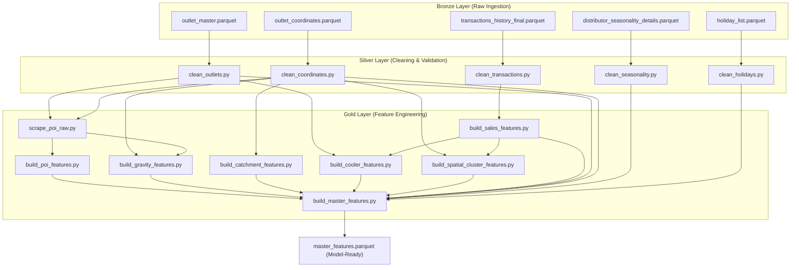

---

# Part 1: Silver Layer (Cleaning & Validation)

## Silver Layer Overview


> [!NOTE]
> **The DQ Framework:** Every Silver script uses the same shared validation engine (`dq_checks.py`). It performs: Duplicate checks, Null checks, Format (regex) checks, Range checks, Value-set checks, and Referential integrity checks. Failed records are routed to a quarantine table with a descriptive reason string — they are **never silently dropped**.

---

### 1.1 [clean_outlets.py](pipeline/silver/clean_outlets.py)

**Goal:** Clean and normalize the master list of 20,000 retail outlets.

**DQ Checks Performed:**
| Check Type | Rule | Example Failure |
|:---|:---|:---|
| Duplicate | `Outlet_ID` must be unique | Two rows with `OUT_00001` |
| Null | `Outlet_ID`, `Outlet_Type`, `Cooler_Count` required | Missing `Outlet_Type` |
| Format | `Outlet_ID` matches `OUT_\d{5}` | `OUTLET-1` fails regex |
| Range | `Cooler_Count` between 0 and 5 | `Cooler_Count = 8` |

**Size Imputation Rule (when `Outlet_Size` is missing):**
| Cooler_Count | Imputed Size | Flag |
|:---|:---|:---|
| 0 or 1 | Small | `size_imputed = True` |
| 2 | Medium | `size_imputed = True` |
| 3 or 4 | Large | `size_imputed = True` |
| 5 | Extra Large | `size_imputed = True` |

**Type Normalization:** Typos are corrected via a dictionary from `config.yaml` (e.g., `"Grocry"` → `"Grocery"`, `"Baker"` → `"Bakery"`).

---

### 1.2 [clean_coordinates.py](pipeline/silver/clean_coordinates.py)

**Goal:** Clean, validate, and swap GPS coordinates.

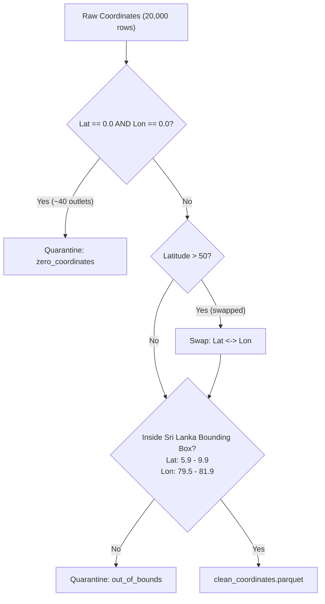

> [!IMPORTANT]
> **Why swap detection matters:** Sri Lanka's latitude is roughly 5–10, and its longitude is roughly 79–82. If an outlet has `Latitude = 80.5`, that's actually a longitude value (swapped columns). The script detects this because Latitude > 50 is impossible for Sri Lanka, then swaps the two columns back.

---

### 1.3 [clean_transactions.py](pipeline/silver/clean_transactions.py)

**Goal:** Clean sales histories, detect outliers, and flag blackout periods.

**Key Operations:**

1. **Fuzzy Column Mapping:** Maps messy column names (`"outletid"`, `"qty"`) to canonical names (`Outlet_ID`, `Volume_Litres`).
2. **Timeline Synthesis:** If only `Year` and `Month` columns exist, synthesizes `Date = YYYY-MM-01`.
3. **IQR Outlier Detection:**
   * For outlets with >= 4 transactions: flag if `Volume > Q3 + 5 * IQR` (per-outlet).
   * For outlets with < 4 transactions: use the global threshold.
   * Outliers are **flagged** (`is_volume_outlier = True`), never deleted.
4. **Blackout Detection:** Flags months where volume = 0, sandwiched between active months (`is_blackout_period = True`).

---

### 1.4 [clean_seasonality.py](pipeline/silver/clean_seasonality.py)

**Goal:** Validate seasonal indices and extrapolate to January 2026.

**Key Logic:** Since the model must predict January 2026, but the data only goes to 2025, the script replicates January 2025's seasonality index for all 10 distributors and assigns `Year = 2026, Month = 1, is_extrapolated = True`.

---

### 1.5 [clean_holidays.py](pipeline/silver/clean_holidays.py)

**Goal:** Process holidays and calculate trading days for January 2026.

**Outputs:**
* `holidays_clean.parquet`: One row per calendar date with boolean columns (`is_public`, `is_bank`, `is_mercantile`, `is_poya_day`).
* `jan_2026_trading_days.json`: Scalar counts of business days (weekdays minus holidays) in January 2026.

**Manually added holidays:** Duruthu Full Moon Poya Day (Jan 2, 2026), Thai Pongal Day (Jan 14, 2026).

---
---

# Part 2: Gold Layer (Feature Engineering)

## Gold Layer Overview

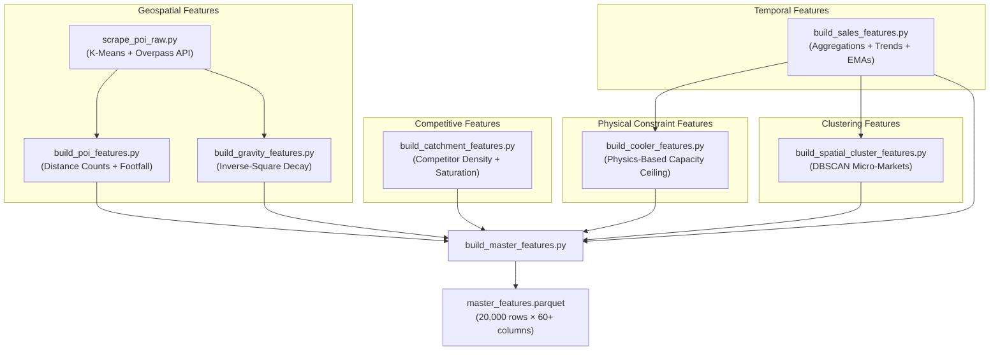

> [!TIP]
> **Reading Tip:** The Gold Layer is organized by *feature domain* — Geospatial, Competitive, Physical, Clustering, and Temporal. Each domain answers a different business question about what drives outlet sales volume.

---

## 2.1 [scrape_poi_raw.py](pipeline/gold/scrape_poi_raw.py) — POI Data Acquisition

### What is a POI?
A **Point of Interest** is a real-world location (school, hospital, bus stop, supermarket, temple, hotel) that generates foot traffic near an outlet. The more foot traffic nearby, the more potential customers.

### Why not query every outlet individually?
Querying the Overpass API 20,000 times (once per outlet) would be extremely slow and would hit rate limits. Instead, the script groups nearby outlets into **400 geographic clusters** using K-Means, then sends **one query per cluster**. This reduces API calls from 20,000 to 400 — a 50x speedup.

### Step-by-Step Process

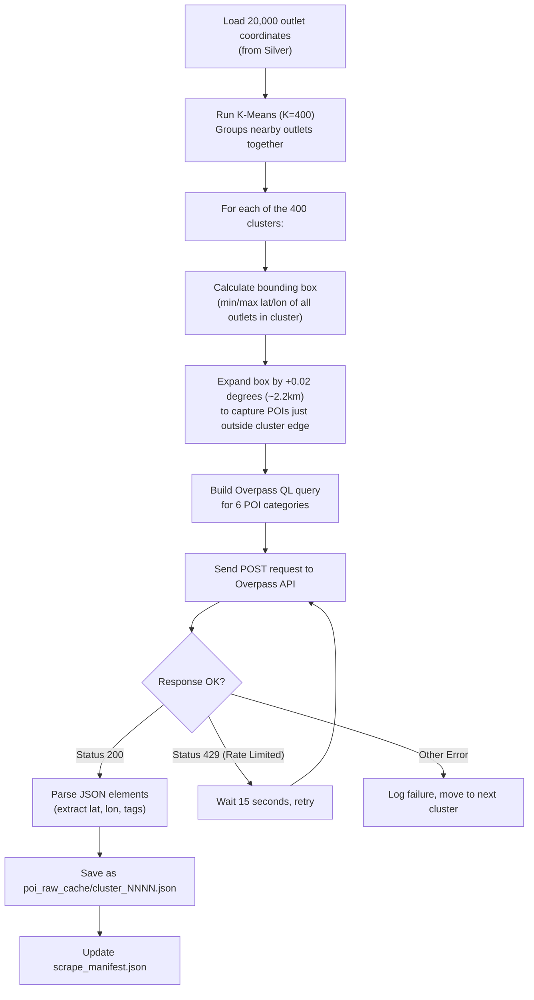

### The 6 POI Categories Scraped

| Category | OpenStreetMap Tags | Why it matters |
|:---|:---|:---|
| **Schools** | `amenity=school`, `amenity=university` | Students and staff generate daily foot traffic |
| **Hospitals** | `amenity=hospital`, `amenity=clinic` | Patients and visitors buy beverages |
| **Transport** | `highway=bus_stop`, `railway=station` | Commuters are high-frequency impulse buyers |
| **Markets** | `shop=supermarket`, `amenity=marketplace` | Shoppers already in "buying mode" |
| **Worship** | `amenity=place_of_worship` | Regular weekly/daily congregation |
| **Hospitality** | `tourism=hotel`, `amenity=restaurant` | Tourists and diners buy drinks |

### What the cached JSON looks like (simplified)

```json
{
  "cluster_id": 42,
  "bounding_box": { "lat_min": 6.89, "lat_max": 6.95, "lon_min": 79.83, "lon_max": 79.90 },
  "outlet_ids": ["OUT_01001", "OUT_01002", "OUT_01050"],
  "n_pois_returned": 47,
  "elements": [
    { "lat": 6.912, "lon": 79.854, "tags": { "amenity": "school" } },
    { "lat": 6.920, "lon": 79.861, "tags": { "highway": "bus_stop" } }
  ]
}
```

### Rate Limiting & Resilience
* A **manifest file** (`scrape_manifest.json`) tracks which clusters have been completed. If the script crashes or is interrupted, re-running it **skips already-completed clusters** and resumes from where it left off.
* HTTP 429 (Too Many Requests) responses trigger a 15-second wait before retrying.

---

## 2.2 [build_poi_features.py](pipeline/gold/build_poi_features.py) — Footfall Score

### What this script does
Takes the raw POI cache from 2.1 and converts it into **per-outlet features**: how many POIs of each type are within 500m, 1km, and 2km, plus a composite **footfall score**.

### Step-by-Step Process

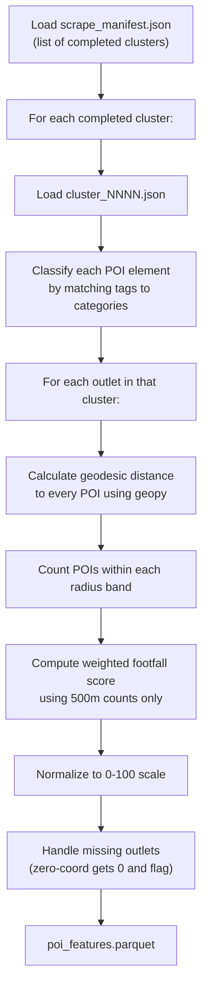

### How Distance Counting Works

For each outlet, the script measures the straight-line geographic distance to every POI in its cluster. Then it counts how many POIs fall within each radius:

| Radius Band | Column Name Pattern | Example |
|:---|:---|:---|
| 500 meters | `schools_500m`, `transport_500m`, ... | `schools_500m = 3` means 3 schools within 500m |
| 1,000 meters (1km) | `schools_1000m`, `transport_1000m`, ... | `transport_1000m = 8` |
| 2,000 meters (2km) | `schools_2000m`, `transport_2000m`, ... | `hospitals_2000m = 2` |

This creates **18 columns** (6 categories × 3 radii).

### How the Footfall Score is Calculated

The footfall score only uses the **500m radius** counts (closest POIs matter most for walk-in traffic):

**Footfall Weights:**
| Category | Weight | Reasoning |
|:---|:---|:---|
| Transport (bus stops, stations) | 3.0 | Highest — commuters are frequent impulse buyers |
| Schools | 2.5 | Students buy beverages daily |
| Markets (supermarkets) | 2.0 | Shoppers already in buying mode |
| Hospitals | 1.5 | Visitors and patients |
| Worship | 1.0 | Periodic gatherings |
| Hospitality | 1.0 | Tourists and diners |

**Formula:** `Raw Footfall = SUM(POI_count_500m × Weight)`

**Example Calculation:**

| Outlet | schools_500m | transport_500m | markets_500m | hospitals_500m | worship_500m | hospitality_500m |
|:---|:---|:---|:---|:---|:---|:---|
| OUT_1001 | 2 | 1 | 0 | 0 | 1 | 0 |

```
Raw Footfall = (2 × 2.5) + (1 × 3.0) + (0 × 2.0) + (0 × 1.5) + (1 × 1.0) + (0 × 1.0)
             = 5.0 + 3.0 + 0 + 0 + 1.0 + 0
             = 9.0
```

This raw score is then **Min-Max normalized** to a 0–100 scale:
`footfall_score = (raw - min_across_all_outlets) / (max - min) × 100`

### Output Columns (20 total)
`Outlet_ID`, 18 count columns, `footfall_score`, `poi_data_available`

---

## 2.3 [build_gravity_features.py](pipeline/gold/build_gravity_features.py) — Gravity Model

### The Problem with Flat Counts (Why we need this)
The POI features from 2.2 treat all POIs within a radius equally — a school 50 meters away counts the same as a school 1,900 meters away. In reality, **closer POIs have dramatically more influence** on foot traffic. A bus stop right outside the shop brings far more customers than one 2km away.

### The Solution: Reilly's Law of Retail Gravitation
This is a well-known retail science model. The "gravity" (attraction) between a store and a POI decreases with the **square** of the distance — just like gravity in physics.

**The Decay Function:**
```
Attraction = 1 / (Distance_km + Epsilon)²
```
Where `Epsilon = 0.05 km` (50 meters) prevents division by zero when a POI is directly on top of an outlet.

### How Distance Decay Behaves

| Distance to POI | Attraction Score | Interpretation |
|:---|:---|:---|
| 0.0 km (at the door) | 400.0 | Maximum attraction |
| 0.1 km (100m) | 44.4 | Very strong — immediate vicinity |
| 0.3 km (300m) | 8.2 | Still strong walking distance |
| 0.5 km (500m) | 3.3 | Moderate — 5 minute walk |
| 1.0 km | 0.9 | Weak — too far to walk casually |
| 1.5 km | 0.4 | Very weak |
| 2.0 km | 0.2 | Almost negligible |

> [!IMPORTANT]
> **Key insight:** A POI at 100m contributes **110× more** to the gravity score than a POI at 1km. This is why flat counts (Section 2.2) miss the nuance that gravity captures.

### Step-by-Step Process

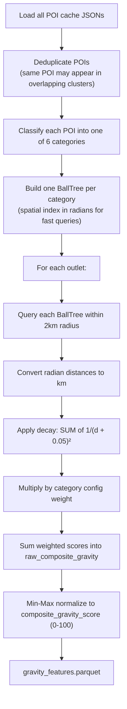

### What is a BallTree?

A **BallTree** is a spatial data structure that organizes points into nested hyper-spheres (balls). Instead of measuring the distance from an outlet to every single POI (which would be O(n) per outlet), the BallTree can **skip entire regions of space** that are too far away, making queries O(log n). For 20,000 outlets × thousands of POIs, this is critical for performance.

The tree uses the **Haversine metric** (great-circle distance on a sphere), which correctly handles the curvature of the Earth. Coordinates are converted to **radians** before insertion because Haversine expects radian inputs.

### Detailed Example

**Outlet OUT_1002** has three schools nearby:

| POI | Distance (km) | Decay Score |
|:---|:---|:---|
| School A | 0.1 km | `1/(0.1+0.05)² = 1/0.0225 = 44.4` |
| School B | 0.5 km | `1/(0.5+0.05)² = 1/0.3025 = 3.3` |
| School C | 1.5 km | `1/(1.5+0.05)² = 1/2.4025 = 0.4` |
| **Total school_gravity_score** | | **48.1** |

School A (just 100m away) contributes **92%** of the total gravity score, even though School C is also "within range."

### Output Columns (9 total)
`Outlet_ID`, `school_gravity_score`, `hospital_gravity_score`, `transport_gravity_score`, `market_gravity_score`, `worship_gravity_score`, `hospitality_gravity_score`, `raw_composite_gravity`, `composite_gravity_score`, `gravity_data_available`

---

## 2.4 [build_catchment_features.py](pipeline/gold/build_catchment_features.py) — Competitor Density

### What this script measures
While 2.2 and 2.3 measure **POIs** (demand generators), this script measures **competition** — how many *other outlets* are selling in the same area. An outlet surrounded by 50 competitors will split the customer pool; an isolated outlet gets all the local demand.

### Step-by-Step Process

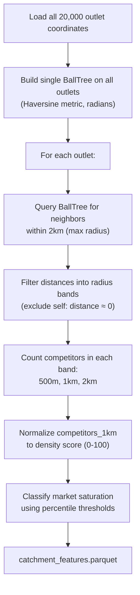

### Market Saturation Classification

The script classifies each outlet's competitive environment into three categories using the **percentile distribution** of `competitors_1km` across all 20,000 outlets:

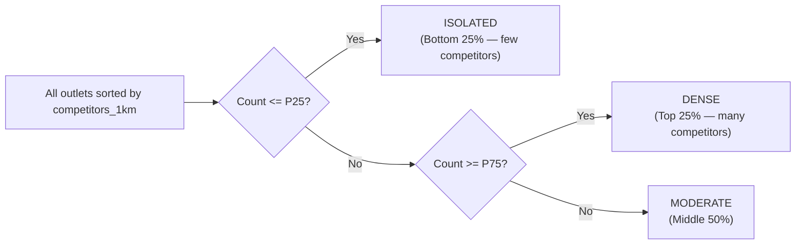

### Example

| Outlet | competitors_500m | competitors_1km | competitors_2km | Density Score | Class |
|:---|:---|:---|:---|:---|:---|
| OUT_1003 | 2 | 10 | 35 | 33.3 | Moderate |
| OUT_2045 | 0 | 2 | 8 | 6.7 | Isolated |
| OUT_0500 | 15 | 40 | 90 | 100.0 | Dense |

### Monotonicity Assertion
The script asserts that `competitors_500m <= competitors_1km <= competitors_2km` for every outlet. If this fails, it means the BallTree radius logic has a bug — a smaller circle can never contain more points than a larger circle.

### Output Columns (6 total)
`Outlet_ID`, `competitors_500m`, `competitors_1km`, `competitors_2km`, `competition_density_score`, `market_saturation_class`

---

## 2.5 [build_cooler_features.py](pipeline/gold/build_cooler_features.py) — Physics-Based Capacity Ceiling

### What this script models
Every outlet has a physical constraint: it can only sell as much as its coolers can store and replenish. A shop with 1 small cooler **physically cannot** sell 5,000 liters a month, no matter how busy the location. This script calculates that theoretical maximum.

### The Physics Model

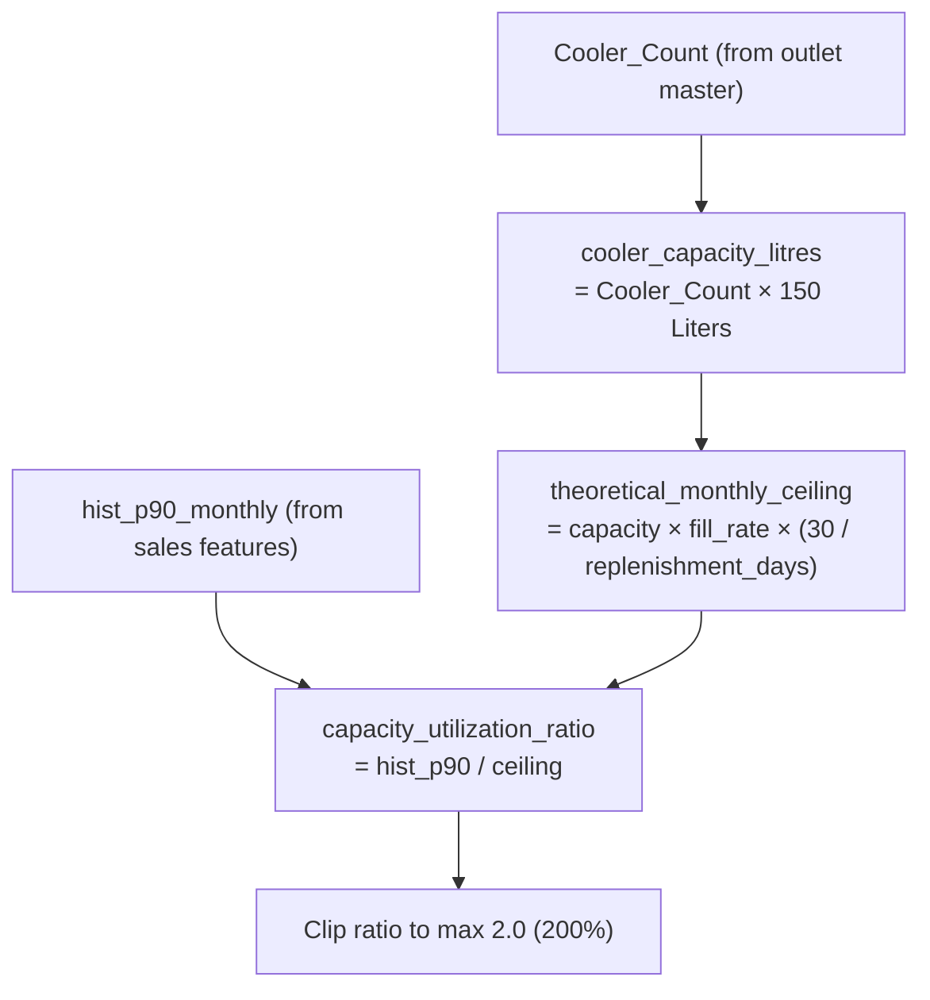

### Configuration Parameters

| Parameter | Value | Meaning |
|:---|:---|:---|
| `litres_per_cooler` | 150 L | Each cooler holds 150 liters of product |
| `replenishment_cycle_days` | 3 days | Distributor visits every 3 days to restock |
| `fills_per_cycle` (fill rate) | 0.85 (85%) | Coolers are never 100% full — air circulation needed |

### Full Ceiling Formula

```
Theoretical Monthly Ceiling = (Cooler_Count × 150L × 0.85 × 30 days) / 3 days
```

### Worked Examples

| Outlet | Coolers | Capacity (L) | Monthly Ceiling | Hist P90 | Utilization |
|:---|:---|:---|:---|:---|:---|
| OUT_A | 1 | 150 | `150 × 0.85 × 10 = 1,275` | 400 L | `400/1275 = 0.31 (31%)` |
| OUT_B | 2 | 300 | `300 × 0.85 × 10 = 2,550` | 1,200 L | `1200/2550 = 0.47 (47%)` |
| OUT_C | 3 | 450 | `450 × 0.85 × 10 = 3,825` | 2,400 L | `2400/3825 = 0.63 (63%)` |
| OUT_D | 5 | 750 | `750 × 0.85 × 10 = 6,375` | 6,000 L | `6000/6375 = 0.94 (94%)` |
| OUT_E | 0 | 0 | 0 | 500 L | `0.00 (special case)` |

> [!WARNING]
> **Zero-cooler outlets:** If `Cooler_Count = 0`, the theoretical ceiling is 0, which would cause a division-by-zero. The script clips the denominator to a minimum of 1.0, and then explicitly sets the utilization ratio to `0.0` for these outlets.

### What the utilization ratio tells the model
* **Low ratio (0.1–0.3):** The outlet is underutilizing its cooler capacity. There may be room to grow sales.
* **Medium ratio (0.4–0.7):** Healthy utilization.
* **High ratio (0.8–1.0):** Nearly at physical capacity. Sales growth may require additional coolers.
* **Ratio > 1.0 (capped at 2.0):** The outlet is somehow selling more than the theoretical ceiling (possible if the cooler is restocked more frequently than every 3 days, or if sales happen at room temperature).

### Output Columns (5 total)
`Outlet_ID`, `Cooler_Count`, `cooler_capacity_litres`, `theoretical_monthly_ceiling`, `capacity_utilization_ratio`

---

## 2.6 [build_spatial_cluster_features.py](pipeline/gold/build_spatial_cluster_features.py) — Micro-Market Clustering

### Why another clustering algorithm?
In 2.1, K-Means was used to group outlets for efficient API scraping. But K-Means has a fundamental limitation: it creates **fixed circular clusters of roughly equal size**, even if the real geographic distribution is irregular. A chain of outlets along a highway, an L-shaped cluster around a bend, or a highly dense city center cannot be properly represented by K-Means circles.

**DBSCAN** (Density-Based Spatial Clustering of Applications with Noise) solves this. It discovers clusters of **any shape** based purely on density, and smartly identifies isolated points as **noise** instead of forcing them into a cluster.

### How DBSCAN Works (Conceptual)

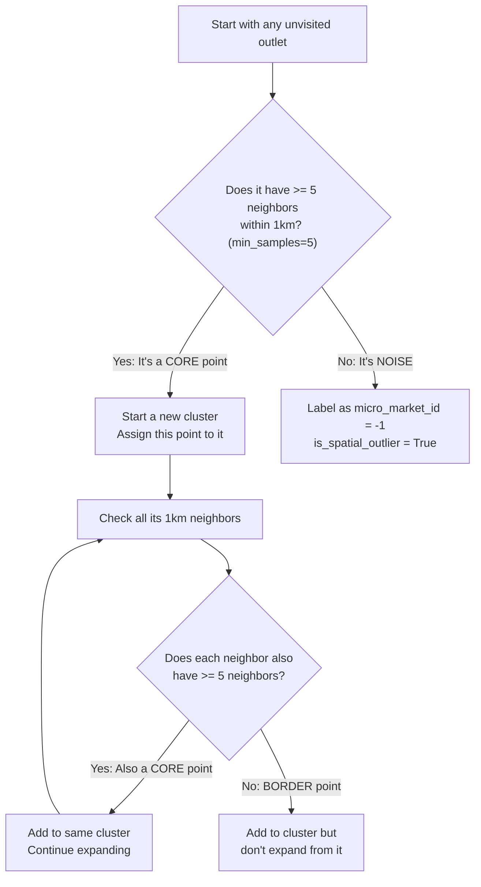

### DBSCAN Parameters

| Parameter | Value | Effect |
|:---|:---|:---|
| `eps` | 1.0 km | Maximum distance between two outlets to be considered neighbors |
| `min_samples` | 5 | Minimum number of outlets within `eps` distance to form a dense region |
| `metric` | Haversine | Uses Earth-surface distance (great-circle) instead of flat Euclidean |

### Micro-Market Statistics

Once clusters are identified, the script computes aggregate statistics for each cluster using sales data:

| Statistic | Column Name | What it represents |
|:---|:---|:---|
| Cluster size | `cluster_outlet_count` | How many outlets are in this micro-market |
| Mean volume | `cluster_mean_volume` | Average monthly P90 sales across the micro-market |
| P90 volume | `cluster_p90_volume` | 90th percentile of monthly volumes in the cluster |

> [!NOTE]
> **Why this matters for modeling:** An outlet in a high-volume micro-market (e.g., downtown Colombo with `cluster_mean_volume = 2,500L`) is likely to have higher sales than an identical outlet in a low-volume micro-market (e.g., rural village with `cluster_mean_volume = 200L`). The cluster statistics give the model a "neighborhood context" that individual outlet features miss.

### Example Scenarios

**Scenario 1 — Urban Highway:**
15 outlets lined up along Galle Road, each within 1km of the next. DBSCAN connects them into one long chain-shaped micro-market (Cluster #12). K-Means would have split them into 2-3 circles.

**Scenario 2 — Rural Outlet:**
OUT_1005 sits alone in a farming village. No other outlet is within 1km. DBSCAN labels it as noise: `micro_market_id = -1`, `is_spatial_outlier = True`, `cluster_outlet_count = 0`.

**Scenario 3 — Dense City Center:**
200 outlets clustered tightly in Colombo Fort, all within walking distance. DBSCAN forms one massive cluster with `cluster_outlet_count = 200` and a high `cluster_mean_volume`.

### Output Columns (6 total)
`Outlet_ID`, `micro_market_id`, `is_spatial_outlier`, `cluster_outlet_count`, `cluster_mean_volume`, `cluster_p90_volume`

---

## 2.7 [build_sales_features.py](pipeline/gold/build_sales_features.py) — Temporal Sales Profiles

### What this script does
This is the **most feature-rich** Gold Layer script. It takes raw cleaned transactions and builds a comprehensive sales profile for every outlet — aggregations, trends, seasonality, and momentum indicators.

### Step-by-Step Process

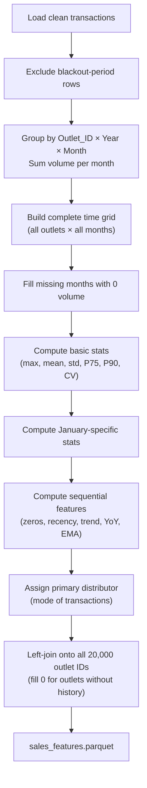

### Feature Groups Explained

#### Group A: Basic Volume Statistics

| Feature | Formula | What it tells the model |
|:---|:---|:---|
| `hist_max_monthly` | Maximum monthly volume ever | The outlet's peak capacity |
| `hist_mean_monthly` | Mean across all months (including zeros) | Average performance |
| `hist_std_monthly` | Standard deviation | How volatile the sales are |
| `hist_p90_monthly` | 90th percentile of monthly volumes | "Typical good month" — robust against outliers |
| `hist_p75_monthly` | 75th percentile | A more conservative estimate |
| `hist_cv` | `std / mean` (Coefficient of Variation) | Relative volatility — 0.2 is stable, 2.0 is chaotic |
| `total_volume` | Sum of all volume ever | Lifetime value |
| `active_months` | Count of months with volume > 0 | Activity level |
| `active_months_pct` | `active_months / total_months_in_data` | Normalized activity (0.0 to 1.0) |

#### Group B: January-Specific Statistics

Since the target is January 2026, historical January performance is highly predictive:

| Feature | What it captures |
|:---|:---|
| `jan_avg_volume` | Average volume across all past Januaries |
| `jan_max_volume` | Best-ever January |
| `jan_count` | How many Januaries had non-zero sales |

#### Group C: Sequential / Temporal Features

| Feature | How it's computed | What it reveals |
|:---|:---|:---|
| `consecutive_zero_months_max` | Longest streak of 0-volume months | Whether the outlet has gone dormant before |
| `months_since_last_order` | Months from the last non-zero volume to the end of data | Recency — is the outlet still active? |
| `recent_3m_avg` | Mean of the last 3 months | Current momentum |
| `trend_slope` | Linear regression slope over all monthly volumes (requires >= 6 months) | Is the outlet growing (+), declining (-), or flat (≈0)? |
| `yoy_growth_rate` | `(last_year_avg - first_year_avg) / first_year_avg` (requires >= 2 years) | Long-term growth trajectory |
| `ema_3m` | 3-month Exponential Moving Average | Short-term smoothed trend |
| `ema_6m` | 6-month Exponential Moving Average | Medium-term smoothed trend |

> [!TIP]
> **EMA vs Simple Average:** An Exponential Moving Average gives more weight to **recent** months. If an outlet sold 100L, 200L, 500L in the last three months, the EMA_3m will be closer to 500L than the simple average of 267L. This helps the model detect recent momentum shifts.

#### Group D: Distributor Assignment

| Feature | Logic |
|:---|:---|
| `distributor_id` | The most frequent (mode) distributor across all transactions for that outlet |

Outlets with no transaction history get the **global mode distributor** (the most common distributor across the entire dataset).

### Output Columns (21 total)
`Outlet_ID`, `hist_max_monthly`, `hist_p90_monthly`, `hist_p75_monthly`, `hist_mean_monthly`, `hist_std_monthly`, `hist_cv`, `jan_avg_volume`, `jan_max_volume`, `jan_count`, `active_months`, `active_months_pct`, `consecutive_zero_months_max`, `yoy_growth_rate`, `recent_3m_avg`, `trend_slope`, `months_since_last_order`, `total_volume`, `distributor_id`, `ema_3m`, `ema_6m`

---

## 2.8 [build_master_features.py](pipeline/gold/build_master_features.py) — Final Assembly

### What this script does
This is the **final assembly step**. It takes the base outlet master table and LEFT JOINs every feature table onto it, then handles all remaining null values, derives geographic mappings, and writes the model-ready output.

### Merge Sequence

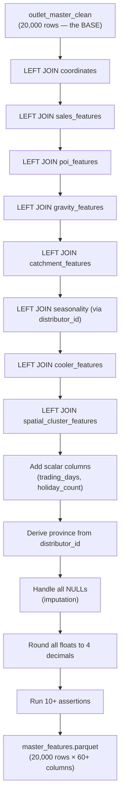

### Null Handling Strategy

| Column(s) | Null Reason | Imputation Strategy |
|:---|:---|:---|
| `Latitude`, `Longitude` | ~40 outlets quarantined (zero-coords) | Fill with **province centroid** (e.g., Western → 6.9271, 79.8612) |
| `coords_swapped` | Same quarantined outlets | Fill with `False` |
| Sales features (all) | Outlets without any transaction history | Fill with `0`, set `has_transaction_history = False` |
| `trend_slope` | Outlets with < 6 months of data | Fill with **global median** |
| `yoy_growth_rate` | Outlets with < 2 years of data | Fill with **global median** |
| `seasonality_jan_2026` | Outlets with no distributor mapping | Fill with `"Moderate"` (multiplier = 1.00) |

### Seasonality Multiplier Mapping

| Seasonality Index | Multiplier | Effect on prediction |
|:---|:---|:---|
| Favorable | 1.20 | +20% boost — distributor expects strong January |
| Moderate | 1.00 | Neutral baseline |
| Un-Favorable | 0.85 | -15% dampening — distributor expects weak January |

### Province Mapping (from Distributor ID)

| Distributor IDs | Province |
|:---|:---|
| DIST_W_01, DIST_W_02, DIST_W_03 | Western |
| DIST_C_01, DIST_C_02, DIST_C_03 | Central |
| DIST_NW_01, DIST_NW_02 | North-Western |
| DIST_S_01, DIST_S_02 | Southern |

### Special Flags

| Flag | Purpose |
|:---|:---|
| `exclude_from_training` | `True` for outlets with originally missing coordinates. These outlets have imputed (province centroid) coordinates and should be excluded from spatial model training to avoid data leakage. |
| `has_transaction_history` | `True` if `active_months > 0`. Allows the model to treat new/inactive outlets differently. |

### Final Assertions (Data Contract)
* Exactly 20,000 rows
* No duplicate or null `Outlet_ID`
* No null `Latitude`, `Longitude`, `coords_swapped`, `seasonality_multiplier_jan_2026`, or `hist_p90_monthly`
* `has_transaction_history` and `exclude_from_training` are boolean type
* `jan_2026_trading_days > 0`

### Output
`Data/Gold/master_features.parquet` — **20,000 rows × 82 columns**, ready for model training.

---

# Part 3: Master Features Column Dictionary

This section provides a complete field-by-field reference for all **82 columns** in the final consolidated `master_features.parquet` dataset, organized by feature domains.

## 3.1 Base Outlet Attributes
These columns originate from the core retail outlet registry and are processed during the Silver cleaning phase.

| Column Name | Data Type | Source Script | Description & Imputation Rules |
| :--- | :--- | :--- | :--- |
| `Outlet_ID` | `object` (string) | [clean_outlets.py](pipeline/silver/clean_outlets.py) | Unique identifier for each outlet (Format: `OUT_\d{5}`). |
| `Outlet_Size` | `object` (string) | [clean_outlets.py](pipeline/silver/clean_outlets.py) | Nominal size of the outlet: `Small`, `Medium`, `Large`, or `Extra Large`. |
| `Cooler_Count` | `int8` | [clean_outlets.py](pipeline/silver/clean_outlets.py) | The count of active coolers installed at the outlet (range: `0` to `5`). |
| `Outlet_Type` | `object` (string) | [clean_outlets.py](pipeline/silver/clean_outlets.py) | Normalized retail type of the outlet (e.g., `Grocery`, `Bakery`, `Pharmacy`, `Supermarket`). |
| `size_imputed` | `bool` | [clean_outlets.py](pipeline/silver/clean_outlets.py) | Flag indicating if `Outlet_Size` was missing in raw data and imputed based on `Cooler_Count`. |

---

## 3.2 Geographic & Coordinate Validation
Coordinates cleaned, validated, and normalized for geographic and spatial features.

| Column Name | Data Type | Source Script | Description & Imputation Rules |
| :--- | :--- | :--- | :--- |
| `Latitude` | `float64` | [clean_coordinates.py](pipeline/silver/clean_coordinates.py) | Cleaned GPS latitude. Quarantined zero-coords are imputed with their distributor's province centroid. |
| `Longitude` | `float64` | [clean_coordinates.py](pipeline/silver/clean_coordinates.py) | Cleaned GPS longitude. Quarantined zero-coords are imputed with their distributor's province centroid. |
| `coords_swapped` | `bool` | [clean_coordinates.py](pipeline/silver/clean_coordinates.py) | Flag indicating if coordinates were swapped (detected when Lat > 50) and corrected. |

---

## 3.3 Historical & Temporal Sales Features
Aggregated profiles derived from transaction histories. Nulls are filled with `0` for inactive outlets.

| Column Name | Data Type | Source Script | Description & Details |
| :--- | :--- | :--- | :--- |
| `hist_max_monthly` | `float64` | [build_sales_features.py](pipeline/gold/build_sales_features.py) | The maximum monthly sales volume (in Liters) ever recorded for this outlet. |
| `hist_p90_monthly` | `float64` | [build_sales_features.py](pipeline/gold/build_sales_features.py) | The 90th percentile of monthly sales volume. Used as a robust "typical peak" metric. |
| `hist_p75_monthly` | `float64` | [build_sales_features.py](pipeline/gold/build_sales_features.py) | The 75th percentile of monthly sales volume. |
| `hist_mean_monthly` | `float64` | [build_sales_features.py](pipeline/gold/build_sales_features.py) | The average monthly sales volume over all historical months. |
| `hist_std_monthly` | `float64` | [build_sales_features.py](pipeline/gold/build_sales_features.py) | Standard deviation of monthly sales volume. |
| `hist_cv` | `float64` | [build_sales_features.py](pipeline/gold/build_sales_features.py) | Coefficient of Variation (`std / mean`). Measures relative sales volatility. |
| `jan_avg_volume` | `float64` | [build_sales_features.py](pipeline/gold/build_sales_features.py) | Average sales volume recorded specifically in past January months. |
| `jan_max_volume` | `float64` | [build_sales_features.py](pipeline/gold/build_sales_features.py) | Maximum sales volume recorded specifically in any past January. |
| `jan_count` | `int8` | [build_sales_features.py](pipeline/gold/build_sales_features.py) | Count of historical January months where the outlet had active transactions. |
| `active_months` | `int16` | [build_sales_features.py](pipeline/gold/build_sales_features.py) | Total number of calendar months in which the outlet recorded a non-zero sales volume. |
| `active_months_pct` | `float64` | [build_sales_features.py](pipeline/gold/build_sales_features.py) | Normalized activity percentage (`active_months / total_pipeline_months`). |
| `consecutive_zero_months_max` | `int8` | [build_sales_features.py](pipeline/gold/build_sales_features.py) | The longest consecutive run of inactive (0-volume) months recorded. |
| `yoy_growth_rate` | `float64` | [build_sales_features.py](pipeline/gold/build_sales_features.py) | Year-over-year sales growth rate. Missing values filled with global median. |
| `recent_3m_avg` | `float64` | [build_sales_features.py](pipeline/gold/build_sales_features.py) | Average monthly sales volume in the most recent 3 months of transaction history. |
| `trend_slope` | `float64` | [build_sales_features.py](pipeline/gold/build_sales_features.py) | Slope of linear regression over monthly sales volumes. Missing values filled with global median. |
| `months_since_last_order` | `int16` | [build_sales_features.py](pipeline/gold/build_sales_features.py) | Months between the last non-zero volume order date and the end of history. |
| `total_volume` | `float64` | [build_sales_features.py](pipeline/gold/build_sales_features.py) | Cumulative sales volume (in Liters) recorded over the entire history. |
| `distributor_id` | `object` (string) | [build_sales_features.py](pipeline/gold/build_sales_features.py) | The ID of the primary distributor (mode of distributor IDs in its transaction history). |
| `ema_3m` | `float64` | [build_sales_features.py](pipeline/gold/build_sales_features.py) | 3-month Exponential Moving Average of monthly sales volumes. |
| `ema_6m` | `float64` | [build_sales_features.py](pipeline/gold/build_sales_features.py) | 6-month Exponential Moving Average of monthly sales volumes. |

---

## 3.4 Point of Interest (POI) Density Counts
Local demand generators aggregated across three radii bands.

| Column Name | Data Type | Source Script | Description |
| :--- | :--- | :--- | :--- |
| `schools_500m`, `schools_1000m`, `schools_2000m` | `int32` | [build_poi_features.py](pipeline/gold/build_poi_features.py) | Count of schools and universities within 500m, 1km, and 2km. |
| `hospitals_500m`, `hospitals_1000m`, `hospitals_2000m` | `int32` | [build_poi_features.py](pipeline/gold/build_poi_features.py) | Count of hospitals and clinics within 500m, 1km, and 2km. |
| `transport_500m`, `transport_1000m`, `transport_2000m` | `int32` | [build_poi_features.py](pipeline/gold/build_poi_features.py) | Count of bus stops and railway stations within 500m, 1km, and 2km. |
| `markets_500m`, `markets_1000m`, `markets_2000m` | `int32` | [build_poi_features.py](pipeline/gold/build_poi_features.py) | Count of supermarkets and marketplace POIs within 500m, 1km, and 2km. |
| `worship_500m`, `worship_1000m`, `worship_2000m` | `int32` | [build_poi_features.py](pipeline/gold/build_poi_features.py) | Count of religious places of worship within 500m, 1km, and 2km. |
| `hospitality_500m`, `hospitality_1000m`, `hospitality_2000m` | `int32` | [build_poi_features.py](pipeline/gold/build_poi_features.py) | Count of hotels and restaurant POIs within 500m, 1km, and 2km. |
| `footfall_score` | `float64` | [build_poi_features.py](pipeline/gold/build_poi_features.py) | Weighted normalization (0–100) combining 500m POI counts. |
| `poi_data_available` | `bool` | [build_poi_features.py](pipeline/gold/build_poi_features.py) | Flag indicating if POI coordinates were available for distance calculation. |

---

## 3.5 Point of Interest (POI) Gravity Features
Geospatial attraction scores modeling exponential distance decay (Reilly's Law).

| Column Name | Data Type | Source Script | Description |
| :--- | :--- | :--- | :--- |
| `school_gravity_score` | `float64` | [build_gravity_features.py](pipeline/gold/build_gravity_features.py) | Gravity metric for school POIs within 2km. |
| `hospital_gravity_score` | `float64` | [build_gravity_features.py](pipeline/gold/build_gravity_features.py) | Gravity metric for hospital POIs within 2km. |
| `transport_gravity_score` | `float64` | [build_gravity_features.py](pipeline/gold/build_gravity_features.py) | Gravity metric for transport POIs within 2km. |
| `market_gravity_score` | `float64` | [build_gravity_features.py](pipeline/gold/build_gravity_features.py) | Gravity metric for market POIs within 2km. |
| `worship_gravity_score` | `float64` | [build_gravity_features.py](pipeline/gold/build_gravity_features.py) | Gravity metric for worship POIs within 2km. |
| `hospitality_gravity_score` | `float64` | [build_gravity_features.py](pipeline/gold/build_gravity_features.py) | Gravity metric for hospitality POIs within 2km. |
| `raw_composite_gravity` | `float64` | [build_gravity_features.py](pipeline/gold/build_gravity_features.py) | Sum of weighted category gravity scores before normalization. |
| `composite_gravity_score` | `float64` | [build_gravity_features.py](pipeline/gold/build_gravity_features.py) | Min-Max normalized score (0–100) of `raw_composite_gravity`. |
| `gravity_data_available` | `bool` | [build_gravity_features.py](pipeline/gold/build_gravity_features.py) | Flag indicating if gravity features could be computed. |

---

## 3.6 Competitive Catchment Features
Metrics quantifying the number of surrounding retail competitors.

| Column Name | Data Type | Source Script | Description |
| :--- | :--- | :--- | :--- |
| `competitors_500m` | `int32` | [build_catchment_features.py](pipeline/gold/build_catchment_features.py) | Count of other outlets within a 500m radius. |
| `competitors_1km` | `int32` | [build_catchment_features.py](pipeline/gold/build_catchment_features.py) | Count of other outlets within a 1km radius. |
| `competitors_2km` | `int32` | [build_catchment_features.py](pipeline/gold/build_catchment_features.py) | Count of other outlets within a 2km radius. |
| `competition_density_score` | `float64` | [build_catchment_features.py](pipeline/gold/build_catchment_features.py) | Normalized percentile score (0–100) of competitor density in 1km. |
| `market_saturation_class` | `object` (string) | [build_catchment_features.py](pipeline/gold/build_catchment_features.py) | Saturation class based on 1km counts: `isolated`, `moderate`, or `dense`. |

---

## 3.7 Seasonality Attributes
Distributor seasonality parameters extrapolated to the target month.

| Column Name | Data Type | Source Script | Description |
| :--- | :--- | :--- | :--- |
| `seasonality_jan_2026` | `object` (string) | [clean_seasonality.py](pipeline/silver/clean_seasonality.py) | Categorical seasonal index: `Favorable`, `Moderate`, or `Un-Favorable`. |
| `seasonality_multiplier_jan_2026` | `float64` | [build_master_features.py](pipeline/gold/build_master_features.py) | Numeric coefficient mapped from index (`Favorable` = 1.20, `Moderate` = 1.00, `Un-Favorable` = 0.85). |

---

## 3.8 Physical Cooler Capacity Features
Theoretical volume limits based on physical storage configurations.

| Column Name | Data Type | Source Script | Description |
| :--- | :--- | :--- | :--- |
| `cooler_capacity_litres` | `float64` | [build_cooler_features.py](pipeline/gold/build_cooler_features.py) | Total cooler storage volume (`Cooler_Count` × 150 L). |
| `theoretical_monthly_ceiling` | `float64` | [build_cooler_features.py](pipeline/gold/build_cooler_features.py) | Max monthly sales limit considering restock frequency (3 days) and fill rate (85%). |
| `capacity_utilization_ratio` | `float64` | [build_cooler_features.py](pipeline/gold/build_cooler_features.py) | Ratio of historical P90 sales to theoretical ceiling (capped at 2.0; 0.0 for zero coolers). |

---

## 3.9 Spatial Clusters (Micro-Markets)
Density-based micro-market attributes discovered via DBSCAN.

| Column Name | Data Type | Source Script | Description |
| :--- | :--- | :--- | :--- |
| `micro_market_id` | `int32` | [build_spatial_cluster_features.py](pipeline/gold/build_spatial_cluster_features.py) | ID of DBSCAN micro-market cluster. Outliers (noise) are assigned `-1`. |
| `is_spatial_outlier` | `bool` | [build_spatial_cluster_features.py](pipeline/gold/build_spatial_cluster_features.py) | Boolean flag indicating if the outlet is a density outlier (`micro_market_id == -1`). |
| `cluster_outlet_count` | `int32` | [build_spatial_cluster_features.py](pipeline/gold/build_spatial_cluster_features.py) | Total number of outlets in the outlet's micro-market cluster. |
| `cluster_mean_volume` | `float64` | [build_spatial_cluster_features.py](pipeline/gold/build_spatial_cluster_features.py) | Average P90 monthly volume among all outlets in the cluster. |
| `cluster_p90_volume` | `float64` | [build_spatial_cluster_features.py](pipeline/gold/build_spatial_cluster_features.py) | 90th percentile of monthly volumes among all outlets in the cluster. |

---

## 3.10 Advanced Modeling Features (Tobit & Hurdle Estimates)
Specialized predictive features addressing zero-inflated and left-censored sales patterns.

| Column Name | Data Type | Source Script | Description |
| :--- | :--- | :--- | :--- |
| `tobit_latent_estimate` | `float64` | `tobit_features` | Latent (uncensored) demand estimate predicted using a Tobit model to adjust for zero truncation. |
| `tobit_censoring_ratio` | `float64` | `tobit_features` | Historical ratio of censored (zero sales) months for this outlet. |
| `p_active` | `float64` | `hurdle_features` | Estimated probability of the outlet being active (non-zero orders) in a given month. |
| `hurdle_conditional_volume` | `float64` | `hurdle_features` | Predicted sales volume conditioned on the outlet being active. |
| `hurdle_estimate` | `float64` | `hurdle_features` | Combined hurdle prediction: `p_active × hurdle_conditional_volume`. |

---

## 3.11 Calendar, Administrative & Validation Metadata
Scalars and derived columns supporting training/evaluation splits.

| Column Name | Data Type | Source Script | Description & Details |
| :--- | :--- | :--- | :--- |
| `jan_2026_holiday_count` | `int64` | [build_master_features.py](pipeline/gold/build_master_features.py) | Calendar holiday count in Sri Lanka for Jan 2026 (Value: `2`). |
| `jan_2026_trading_days` | `int64` | [build_master_features.py](pipeline/gold/build_master_features.py) | Standard trading days (weekdays minus holidays) in Jan 2026 (Value: `20`). |
| `province` | `object` (string) | [build_master_features.py](pipeline/gold/build_master_features.py) | Geographic province derived from `distributor_id` (Western, Central, Southern, North-Western). |
| `exclude_from_training` | `bool` | [build_master_features.py](pipeline/gold/build_master_features.py) | Set to `True` for outlets with invalid/imputed coordinates to prevent spatial leakage in training. |
| `has_transaction_history` | `bool` | [build_master_features.py](pipeline/gold/build_master_features.py) | Set to `True` if the outlet has recorded at least one historical order. |
