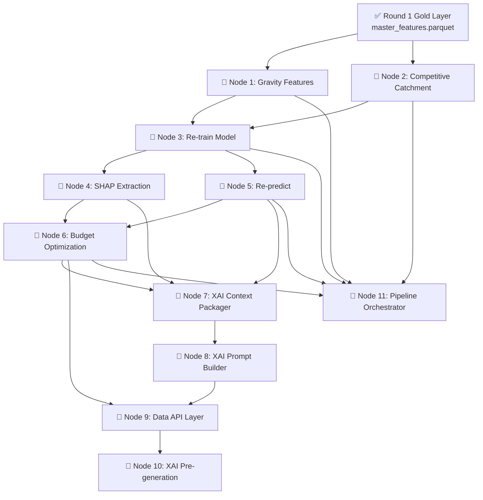

# BigBug Pipeline — Complete Node Map

> Your friend handles the **Web App** (Next.js frontend + API routes). Everything below is **your** scope.

---

## Status Overview

| Layer | Status |
|:------|:-------|
| Bronze → Silver → Gold (Round 1) | ✅ **DONE** |
| Modelling: baseline, train, predict (Round 1) | ✅ **DONE** |
| Gold Extended: Gravity Features | 🔴 **TODO** — Node 1 |
| Gold Extended: Competitive Catchment | 🔴 **TODO** — Node 2 |
| Re-training with gravity + catchment features | 🔴 **TODO** — Node 3 |
| SHAP Value Extraction | 🔴 **TODO** — Node 4 |
| Re-prediction (updated model) | 🔴 **TODO** — Node 5 |
| Budget Optimization (5M LKR) | 🔴 **TODO** — Node 6 |
| XAI Context Packager | 🔴 **TODO** — Node 7 |
| XAI Prompt Builder | 🔴 **TODO** — Node 8 |
| Data API Layer (for Next.js) | 🔴 **TODO** — Node 9 |
| XAI Pre-generation (Western Province) | 🔴 **TODO** — Node 10 |
| Pipeline Orchestrator | 🔴 **TODO** — Node 11 |
| Config.yaml updates | 🔴 **TODO** — woven into each node |

---

## Dependency Graph (implement top-to-bottom)



---

## Node 1 — Gravity Features (Distance-Decay POI Scores)

> **Why:** The problem statement *explicitly* calls out gravity/decay models as the expected upgrade over flat POI counts. This is a high-weight evaluation criterion (30% for Data Engineering).

| | |
|:--|:--|
| **Script** | `pipeline/gold/build_gravity_features.py` `[NEW]` |
| **Spec** | `specs/gold/GRAVITY_MODEL.md` |
| **Reads** | `Data/Gold/poi_raw_cache/` (already exists from Round 1 scraping) + `Data/Silver/outlet_coordinates_clean.parquet` |
| **Writes** | `Data/Gold/gravity_features.parquet` |
| **Also modify** | `pipeline/gold/build_master_features.py` — add left-join of gravity features |
| **Config** | Add `gravity_model` block to `config.yaml` |

### 🔬 Q&A: Why inverse-square gravity over Gaussian or exponential decay?

**Short answer:** For the main competition pipeline, **we will exclusively use the Inverse-Square decay function.** 

| Decay function | Formula | Behaviour | Pros | Cons |
|:---------------|:--------|:----------|:-----|:-----|
| **Inverse square** | `1 / (d + ε)²` | Sharp near-field drop, long tail | No hyperparameter to tune; easy to explain ("just like gravity"); standard in retail (Reilly's Law) | Very aggressive — a POI at 50m vs 200m differs by 16× |

> [!TIP]
> **Inverse-square is the safest and best choice** — it's explicitly named in Reilly's Law of Retail Gravitation, which judges will recognise. We will build the entire pipeline using this. (See `docs/modelling_strategy.md` for notes on experimenting with exponential/gaussian if time permits later).

### 🔬 Q&A: Why ε = 0.05? How to choose the best parameter?

**ε prevents division by zero** when a POI sits at the exact same GPS coordinate as an outlet (distance ≈ 0 km). Without it: `1/0² = ∞`.

**Why 0.05 specifically?**
- ε = 0.05 km = 50 metres. This means a POI at 0m distance contributes `1/(0.05)² = 400`, while a POI at 50m contributes `1/(0.1)² = 100`. The 50m POI is 4× less influential — a reasonable physical interpretation.
- Too small (e.g., ε = 0.001): a POI at 1m = `1/0.001² = 1,000,000` — one hyper-close POI would dominate everything. Bad.
- Too large (e.g., ε = 0.5): a POI at 0m = `1/0.5² = 4`, at 50m = `1/0.55² = 3.3`. Almost no discrimination between near and far. Defeats the purpose of decay.

**Recommendation:** Keep ε = 0.05 for the primary pipeline. It's mathematically sound.

### 🔬 Q&A: Composite weight reasoning — are these made up? Are we using other scores?

**Yes, we are generating ALL 6 individual gravity scores** (`school`, `market`, `hospital`, `transport`, `worship`, `hospitality`) as separate columns in `gravity_features.parquet`. These will all be fed into LightGBM so it can independently learn which categories drive sales.

**The weights for the `composite_gravity_score` encode a domain hypothesis optimized for beverage sales:**
| Category | Weight | Business rationale |
|:---------|:-------|:-------------------|
| Transport | **3.0** | Commuters are the #1 driver of impulse beverage purchases. |
| Schools | **3.0** | Focuses on the core consumer demographic (youth/students) with high daily demand. |
| Hospitality | **2.0** | High dining/social activity; beverages are strong food complements. |
| Markets | **2.0** | Co-location with shopping activity drives top-up and bulk grocery purchases. |
| Hospitals | **1.0** | Steady flow but wellness-oriented; lower beverage purchase volume. |
| Worship | **0.5** | Low commercial relevance; highly periodic/isolated foot traffic. |

We calculate this single `composite_gravity_score` mostly for use in the **Web App UI** and the **Budget Optimization ROI score**.

### What to implement:
1. Load all POI JSON responses from `Data/Gold/poi_raw_cache/`
2. Parse each POI's lat/lon and map it to one of 6 categories.
3. For each of the 19,960 valid-coordinate outlets, compute:
   - Per-category gravity score = `Σ 1/(distance_km + 0.05)²` for all POIs in that category within 2km
   - Use `geopy.distance.geodesic` for distance calculation (or BallTree for speed)
4. Compute composite gravity score using weighted sum.
5. Min-max normalise the composite to `[0, 100]`
6. Set `gravity_data_available = False` for the 40 zero-coord outlets (all scores = 0)
7. Save as `gravity_features.parquet`

---

## Node 2 — Competitive Catchment Density

> **Why:** Section 2.2 of the problem statement explicitly asks for competitive catchment density to estimate how "crowded" each outlet's local market is.

| | |
|:--|:--|
| **Script** | `pipeline/gold/build_catchment_features.py` `[NEW]` |
| **Reads** | `Data/Silver/outlet_coordinates_clean.parquet` |
| **Writes** | `Data/Gold_Extended/catchment_features.parquet` |
| **Also modify** | `pipeline/gold/build_master_features.py` — add left-join |

### 🔬 Q&A: Why no decay function for competitive catchment? Reasoning:

**Confirmed: We will NOT use a decay function for competitive catchment.** 
Catchment density measures market saturation (density/counts), not influence (gravity).

**Why flat counts are better for competition:**
- A competitor at 100m and one at 900m (both within 1km) are equally real threats — they both appear on Google Maps, both visible to customers walking by.
- Using decay would under-count competitors that are "far but still relevant" (e.g., the next grocery store is 800m away — still very reachable by foot in Sri Lanka).
- The problem statement asks to "estimate how crowded or isolated a store is" — this is purely a count concept.

### What to implement:
1. For each outlet, count **how many other outlets** exist within 500m, 1km, and 2km.
2. Compute a `competition_density_score` — normalised [0, 100] measuring local market saturation.
3. Classify each outlet as `isolated`, `moderate`, or `dense` based on percentile thresholds.
4. Output columns: `competitors_500m`, `competitors_1km`, `competitors_2km`, `competition_density_score`, `market_saturation_class`.

> [!IMPORTANT]
> Use `sklearn.neighbors.BallTree` with `haversine` metric. Iterating with geodesic for 20K×20K pairs is infeasible. BallTree does it in seconds.

---

## Node 3 — Re-train LightGBM with Gravity + Catchment Features

> **Why:** The existing model uses 41 flat-count features. Adding 7 gravity scores + catchment features will improve the model.

| | |
|:--|:--|
| **Script** | `modelling/train.py` `[MODIFY]` |
| **Reads** | `Data/Gold/master_features.parquet` (now including gravity + catchment columns) |
| **Writes** | `modelling/artifacts/runs/...` |

### 🔬 Q&A: 99% contribution from statistical features, POI features barely matter — how to fix?

**This is caused by Target Leakage via the pseudo-label.** Your target variable is `hist_p90_monthly × ...`. If `hist_p90_monthly` is a training feature, the model just memorizes it and ignores the POIs.

**The Fix (Strategy A):**
Remove the "answer key" features from training. Add them to `EXCLUDE_COLS`:
```python
ADDITIONAL_EXCLUDES = [
    "hist_p90_monthly",       
    "hist_max_monthly",       
    "jan_avg_volume",         
    "jan_max_volume",         
]
```
This forces the model to predict potential from *structural drivers* (location, POI gravity, competitors). The RMSE might rise slightly, but the predictions will actually be meaningful. 

### 🔬 Q&A: Hardware for Training (ASUS TUF RTX 5070 GPU)?

**Yes! That hardware is incredibly powerful and more than enough.** An RTX 5070 will train LightGBM on 20K rows in a matter of *seconds*. There is absolutely no need to use Google Colab.

**How to use the GPU in LightGBM:**
Simply add `device_type="gpu"` to your LGBMRegressor parameters.
```python
model = LGBMRegressor(
    device_type="gpu",
    random_seed=42,
    # ... other params ...
)
```

### 🔬 Q&A: Model History Tracking (Handling 20+ runs)?

**Do not overwrite `model.pkl` every time.** We need a robust architecture to track history.

**Implementation (in `train.py`):**
1. Generate a timestamp for the run: `run_id = f"run_{datetime.now().strftime('%Y%m%d_%H%M%S')}_lightgbm"`
2. Create a dedicated folder: `modelling/artifacts/runs/{run_id}/`
3. Save `model.pkl`, `cv_results.json`, and `feature_importance.png` inside that folder.
4. Maintain a master log file: `modelling/artifacts/run_registry.csv`. Append a row for every run with `Run_ID, Algorithm, CV_RMSE, Features_Used, Timestamp`.

---

## Node 4 — SHAP Value Extraction

> **Why:** Required for the XAI module. SHAP values power the per-outlet explanations that the LLM translates into business language.

| | |
|:--|:--|
| **Script** | `modelling/train.py` `[MODIFY]` — add Step 6b after model training |
| **Reads** | Trained model + `master_features.parquet` (all 20K rows) |
| **Writes** | `Data/Gold/shap_values.parquet` |
| **Spec** | `specs/modelling/XAI_SPEC.md` Step 1 |

### 🔬 Q&A: Do we get SHAP values per cell (row + col)?
**Yes.** `explainer.shap_values(X_all)` returns a 2D numpy array of shape `(20000, num_features)`. This means you get a specific signed float value for *every single feature* on *every single outlet*. We will save this exact matrix into `shap_values.parquet` so the Next.js API can query the exact drivers for any specific outlet.

### What to implement:
```python
import shap

explainer = shap.TreeExplainer(final_model)
shap_values = explainer.shap_values(X_all)  # X_all = all 20K outlets

shap_df = pd.DataFrame(shap_values, columns=feature_cols)
shap_df.insert(0, "Outlet_ID", df["Outlet_ID"].values)
shap_df.to_parquet("Data/Gold/shap_values.parquet", index=False)
```

---

## Node 5 — Re-predict (Updated Model)

> **Why:** The predictions CSV must reflect the improved gravity-aware model.

| | |
|:--|:--|
| **Script** | `modelling/predict.py` `[RE-RUN]` — no code changes needed |
| **Reads** | Latest `model.pkl` + `master_features.parquet` + `baseline_predictions.parquet` |
| **Writes** | `outputs/bigbug_predictions.csv` (overwrites), `outputs/prediction_diagnostics.csv` |

### What to do:
- Just re-run `python modelling/predict.py` (ensure it reads from your latest run folder).
- Verify 20,000 rows, all positive, rounded to 2 decimals.

---

## Node 6 — Budget Optimization (5M LKR Western Province)

> **Why:** Deliverable #2 — the competition explicitly requires `teamname_budget_allocations.csv`. Also feeds the budget dashboard view in the web app.

| | |
|:--|:--|
| **Script** | `modelling/optimise_budget.py` `[NEW]` |
| **Spec** | `specs/modelling/BUDGET_OPTIMIZATION.md` |
| **Reads** | `Data/Gold/master_features.parquet`, `outputs/bigbug_predictions.csv`, `Data/Gold/sales_features.parquet` |
| **Writes** | `outputs/bigbug_budget_allocations.csv`, `data/Optimization/budget_features.parquet` |
| **Config** | Add `budget_optimization` block to `config.yaml` |

### Steps (follow the spec exactly):
1. **Filter** to Western Province outlets (`DIST_W_01/02/03`) — ~6,842 rows.
2. **Compute uplift gap** = `predicted_potential_litres - recent_3m_avg`, clipped at 0.
3. **Compute ROI score** = weighted composite of normalised (uplift gap 40%, gravity score 30%, recent volume 20%, cooler count 10%).
4. **Tier classification**: high (top 10% ROI), medium (P40–P90), low (below P40).
5. **Greedy knapsack allocation**: sort by ROI desc, fill tier caps until budget exhausted.
6. **Guardrails**: each distributor gets ≥25% of budget, high+medium tiers get ≥60%.
7. **Output**: `bigbug_budget_allocations.csv` and `budget_features.parquet`.

---

## Node 7 — XAI Context Packager

> **Why:** Assembles the structured data payload that the LLM prompt will consume. This is the bridge between raw model outputs and human-readable explanations.

| | |
|:--|:--|
| **Script** | `pipeline/xai/context_packager.py` `[NEW]` |
| **Spec** | `specs/modelling/XAI_SPEC.md` Step 2 |
| **Reads** | `Data/Gold/shap_values.parquet`, `master_features.parquet`, `gravity_features.parquet`, `data/Optimization/budget_features.parquet`, `bigbug_predictions.csv` |
| **Writes** | `Data/Gold/xai_context.parquet` |
| **Config** | Add `xai.feature_labels` mapping to `config.yaml` |

### What to implement:
1. Create `pipeline/xai/__init__.py`.
2. For each outlet, build a context dict containing identity, prediction, top 3 positive SHAP drivers, top 2 negative SHAP drivers, and budget context.
3. Serialise each context dict as JSON string and store in `xai_context.parquet`.

---

## Node 8 — XAI Prompt Builder

> **Why:** Renders the context dict into the exact prompt template that produces structured JSON from the LLM.

| | |
|:--|:--|
| **Script** | `pipeline/xai/prompt_builder.py` `[NEW]` |
| **Spec** | `specs/modelling/XAI_SPEC.md` Step 3 |
| **Reads** | Context dict (from `context_packager.py`) |
| **Returns** | Rendered system prompt + user prompt strings |

---

## Node 9 — Data API Layer (for Next.js)

> **No FastAPI needed.** Since your friend is using Next.js with its built-in API routes, you just need to produce the **data files** that the Next.js API routes consume.

| | |
|:--|:--|
| **Script** | `pipeline/export_for_webapp.py` `[NEW]` |
| **Also** | `pipeline/xai/xai_service.py` `[NEW]` — tiny Flask server for LLM calls ONLY (optional) |
| **Reads** | All Gold parquets + predictions CSV |
| **Writes** | `app/data/outlets.json`, `app/data/budget_summary.json`, `app/data/dq_report.json` |

### Step-by-step:
1. Export all outlet data as a single JSON (or chunked) → `app/data/outlets.json`.
2. Export budget summary → `app/data/budget_summary.json`.
3. If your friend prefers calling Gemini from Next.js, give them the prompt template. If they prefer a Python microservice for LLM calls, build `xai_service.py`.

---

## Node 10 — XAI Pre-generation (Western Province)

> **Why:** Pre-generate LLM explanations for the ~6,842 Western Province outlets so the web app can serve them instantly.

| | |
|:--|:--|
| **Script** | `pipeline/xai/pregenerate_western.py` `[NEW]` |
| **Spec** | `specs/modelling/XAI_SPEC.md` "Pre-generation strategy" |
| **Reads** | `Data/Gold/xai_context.parquet` |
| **Writes** | `Data/Gold/xai_pregenerated.parquet` |
| **Requires** | `GOOGLE_API_KEY` environment variable (Gemini) |

### LLM Provider: Gemini (free tier)
Use **Google Gemini** (`gemini-2.0-flash`). Free tier is 15 RPM, 1M tokens/day.
- Run overnight (takes ~7.5 hours for 6,842 outlets at 15 RPM).
- Use `$2.70` OpenAI credits as a backup for the live demo if needed.

---

## Node 11 — Pipeline Orchestrator

> **Why:** Deliverable requirement — the README must have "clear instructions on how to run your pipeline end to end."

| | |
|:--|:--|
| **Script** | `pipeline/run_pipeline.py` `[NEW]` |
| **Spec** | `specs/orchestration/SPEC_run_pipeline.md` |

1. Sequential execution: Bronze → Silver → Gold → Modelling → Budget → XAI → Export.
2. Idempotency: each step checks if its output already exists and skips if so (with `--force` flag to override).

---

## Recommended Plan: 4 Phases of Execution

> **See `docs/modelling_strategy.md` for the prioritized modelling experiments to run during Phase 1.**

```
📋 PHASE 1: Advanced Features & Modeling (~4-5 hours)
├── 1. Add gravity_model config to config.yaml
├── 2. Build Node 1 — build_gravity_features.py (Inverse-Square + all 6 categories)
├── 3. Build Node 2 — build_catchment_features.py (Flat counts only)
├── 4. Modify build_master_features.py to join gravity + catchment
├── 5. Modify train.py:
│   ├── Remove leak features from EXCLUDE_COLS (Strategy A)
│   ├── Setup Run Tracking (timestamped folders + registry CSV)
│   ├── Enable GPU training (task_type="GPU")
│   └── Add SHAP cell-by-cell extraction step (Node 4)
├── 6. Re-run train.py locally and verify tracking works.
└── 7. Re-run predict.py (Node 5) → verify updated predictions CSV.

📋 PHASE 2: Budget Optimization (~2-3 hours)
├── 1. Add budget_optimization config to config.yaml
├── 2. Build Node 6 — optimise_budget.py
└── 3. Assert sum ≤ 5M, distributor shares ≥ 25%, etc.

📋 PHASE 3: XAI Pipeline & Data Export (~3-4 hours)
├── 1. Add xai.feature_labels config to config.yaml
├── 2. Build Node 7 — context_packager.py
├── 3. Build Node 8 — prompt_builder.py
├── 4. Build Node 9 — export_for_webapp.py (export parquets to JSON)
└── 5. Coordinate with your friend on the JSON structures.

📋 PHASE 4: Pre-generation & Orchestrator (~2-3 hours)
├── 1. Build Node 10 — pregenerate_western.py (run overnight using Gemini)
├── 2. Build Node 11 — run_pipeline.py orchestrator
└── 3. End-to-end smoke test (delete Gold outputs → run pipeline → verify).
```
