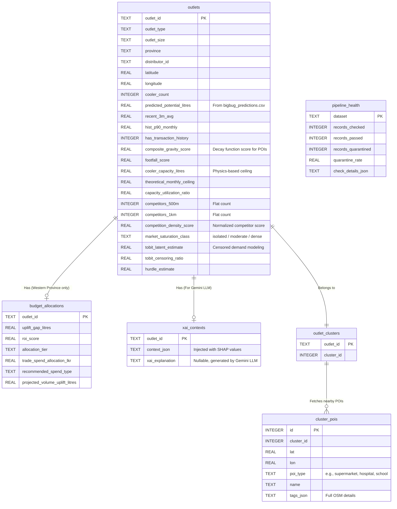

# Spec 05: Phase 2 - Real Data Migration & Feature Upgrade Master Plan

This specification outlines the exhaustive, step-by-step master plan to transition the BigBugDataStorm web application from using static, mock JSON data to rendering live, production-grade ML models and geospatial data (Round 2 outputs).

By the end of this implementation, the dashboard will cater specifically to Sales Managers and C-Suite executives, highlighting advanced analytics (Physics-based Cooler Ceilings, Censored Tobit Demand, and Spatial Market Saturation) while strictly preserving all existing Budget Allocation components.

### 1. Executive Summary & Core Decisions

1. **Preserve the Budget UI**: Although we are shifting focus to capacity and spatial metrics, we will absolutely **not** delete any existing code related to the Western Province 5M LKR budget distribution. We will populate it gracefully so it continues to function.
2. **Automated SQLite Generation**: We will retire the old mock data script and build a robust Pandas-based Python script (`populate_real_db.py`). This script will parse `.parquet`, `.csv`, and `.json` cache files to build the native SQLite `data/outlets.db` from scratch.
3. **Interactive 2km Spatial Mapping**: The `SingleMap.tsx` on the Outlet Details page will be upgraded. By mining the `poi_raw_cache` JSON files, the app will dynamically draw a 2km radius around any selected outlet and plot precise coordinates for competitors and footfall drivers (schools, hospitals, etc.) alongside their full metadata.

### 2. Comprehensive Database Architecture (SQLite)

We are expanding the database schema to handle all Round 2 outputs. The data ingestion script will drop the old mock database and recreate the tables exactly as outlined below.

#### Entity-Relationship Diagram

#### Table Specifications & Data Sources

1. **`outlets` table**: The master record for all 20,000 stores. 
   - *Source*: `Data/Gold/master_features.parquet` joined with `outputs/round2/bigbug_predictions.csv`.
2. **`budget_allocations` table**: Strictly populated for Western Province to ensure backwards compatibility with the UI. 
   - *Source*: `outputs/budget_diagnostics.csv`.
3. **`xai_contexts` table**: Feeds context directly to the Gemini LLM. 
   - *Source*: `Data/Gold/shap_values.parquet` serialized into JSON.
4. **`pipeline_health` table**: Feeds the Data Quality page.
   - *Source*: Dynamically calculated by parsing `Data/Quarantine/rejected_outlet_coordinates.parquet` and `Data/Quarantine/rejected_transactions.parquet` against the master features.
5. **`outlet_clusters` & `cluster_pois` tables (NEW)**: The engine for the Interactive Spatial Mapping.
   - *Source*: Parsing the `elements` array inside all 400 JSON files located in `Data/Gold/poi_raw_cache/`.

### 3. Data Ingestion Implementation (`populate_real_db.py`)

A new Python script will be engineered to perform the ETL (Extract, Transform, Load) automatically.

**Step-by-Step Execution of the Script:**
1. **Initialize DB**: Connect to `data/outlets.db`, drop existing tables to prevent stale data, and execute the `CREATE TABLE` SQL definitions.
2. **Merge Master Features**: Load `master_features.parquet` via pandas, merge it with `bigbug_predictions.csv` on `outlet_id`. Insert the resulting rows into the `outlets` table.
3. **Migrate Budget Data**: Load `budget_diagnostics.csv`. Select only the required columns (`uplift_gap_litres`, `roi_score`, `allocation_tier`, etc.), rename them to match our schema, and insert into `budget_allocations`.
4. **Build XAI Context**: Load `shap_values.parquet`. For each outlet, serialize the top contributing features and SHAP values into a tight JSON string and insert it into `xai_contexts`.
5. **Parse POI JSON Cache**: Iterate through `poi_raw_cache/*.json`. For each file:
   - Extract `cluster_id`.
   - Map every `outlet_id` in that file to the `cluster_id` and insert into `outlet_clusters`.
   - Loop through the `elements` array. Extract `lat`, `lon`, and `tags`. Insert them into `cluster_pois`.

### 4. Frontend Web App Upgrades

We will gracefully expand the Next.js UI to incorporate the new dimensions of data. **No existing UI components will be deleted.**

#### A. Dashboard Enhancements (`DashboardClient.tsx`)
1. **New KPI Card**: We will add a 5th card at the top displaying "Avg Capacity Utilization %", bringing physics-based metrics to the immediate attention of the C-Suite.
2. **Market Saturation Filter**: We will add a dropdown filter alongside the Province filter, allowing users to filter the entire app by "Isolated", "Moderate", or "Dense" saturation classes.
3. **Data Table Column**: Add a "Saturation" column to the main data grid.

#### B. Outlet Details Enhancements (`OutletDetailClient.tsx`)
1. **Cooler & Capacity Ceiling Panel**: A new visual card showing the physical cooler capacity in litres, the theoretical mathematical ceiling, and a progress bar showing their current utilization ratio.
2. **Market & Catchment Panel**: A card visualizing their `competition_density_score`, their `market_saturation_class`, and the statistical Hurdle/Tobit demand estimates. *(Note: Labels were refactored for C-Suite readability, e.g., 'True Demand Est.' instead of 'Tobit Latent' and 'Footfall Impact' instead of 'Gravity')*.

#### C. The 2km Interactive Spatial Map (`SingleMap.tsx` & API)
This is the flagship UI upgrade.
1. **API Endpoint (`/api/outlets/[id]/pois`)**: We will create a new backend route. When called, it looks up the outlet's `cluster_id`, fetches all POIs for that cluster, calculates the geodesic distance from the outlet, and returns **only the POIs within a 2,000-meter (2km) radius**.
2. **Map Rendering (`SingleMap.tsx`)**: 
   - The map will render the central store as a pulsing marker.
   - It will render surrounding **Competitors** (Supermarkets/Markets) using distinct red/orange icons.
   - It will render **Footfall Drivers** (Schools, Hospitals, Temples, Transport) using distinct green/blue icons.
3. **Interactive Popups**: Clicking on any POI marker will open a tooltip displaying its name and metadata (e.g., Religion, School type, Market name) derived from the `tags_json` field.

#### D. AI Explanation Prompt (`route.ts`)
The `SYSTEM_PROMPT` provided to the Gemini LLM will be upgraded. It will be instructed to analyze and explain the new Tobit/Hurdle metrics, the DBSCAN spatial context, and the Cooler capacity constraints in plain, business-friendly English to support Sales Managers in decision-making.

### 5. Verification & Testing

Upon completion of the code, we will execute the following verification steps:
1. Run `python App/scripts/populate_real_db.py`. Verify it completes without error and that the database file is populated.
2. Run `npm run dev`. Verify the web app compiles and the Dashboard loads real data with the new 5th KPI.
3. Test the "Market Saturation" filter on the Dashboard.
4. Click into an Outlet and visually confirm the new Capacity and Catchment panels.
5. Verify the `SingleMap.tsx` correctly plots surrounding POI markers and that the 2km radius filtering functions perfectly.
6. Click the "Generate Explanation" button to ensure the LLM gracefully handles the new context.
